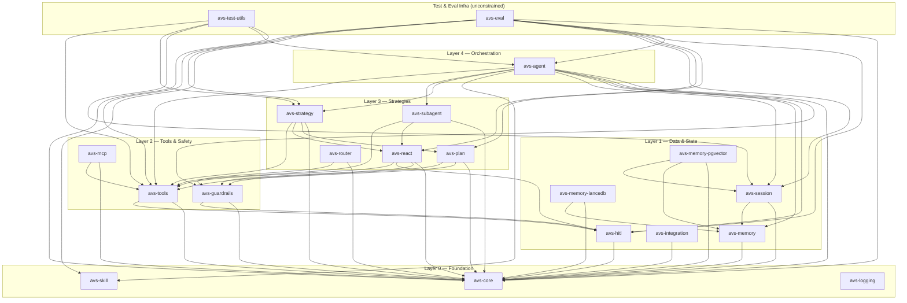

# AgentVerse Internal Wiki

AgentVerse is a modular Rust framework, organized as a 20-crate Cargo
workspace, for building LLM agents. `avs-agent` is the composition root:
its `AgentBuilder` is the only place an `Agent` gets assembled, wiring
together an `LlmRunner`, a reasoning strategy, a `SessionManager`, memory
tiers, and an optional `SkillConfig` into one `Arc<Agent>`. Everything
below that root is layered — foundation crates (`avs-core`, `avs-skill`,
`avs-logging`) at the bottom, then data/state (`avs-memory`, `avs-session`,
`avs-integration`, ...), then tools and safety (`avs-tools`,
`avs-guardrails`, `avs-mcp`), then the reasoning strategies
(`avs-react`, `avs-plan`, `avs-router`, `avs-subagent`, `avs-strategy`),
with `avs-agent` at the top consuming all of it. `scripts/check-layering.sh`
enforces that a crate may only depend on its own layer or a lower one;
there is no cycle back up.

Behavior above the strategy layer is operator-driven rather than
hard-coded: skills (`SKILL.md` files routed by `avs-skill`'s
`SkillRouter`) select what an agent knows how to do, HITL policies
(`avs-hitl`) gate risky actions, and guardrails (`avs-guardrails`)
constrain input/output — all configured, not recompiled, per deployment.
This wiki documents that system from the inside: each subsystem's
architecture, the runtime flows that cross it, and the decisions that
shaped it, so the next person changing a crate can find out why it looks
the way it does before they change it.

This wiki is for developers **of** AgentVerse — its subsystem internals, runtime flows, and the decisions behind them. If you are building agents **on top of** AgentVerse, read [DEVELOPMENT.md](../DEVELOPMENT.md) instead.

## Crate Dependency Graph

Derived from `scripts/check-layering.sh`'s layer map and each crate's
`Cargo.toml` `path` dependencies (`examples/*` excluded — library crates
only).

## Page Index

| Page | Covers | One-line summary |
|------|--------|-------------------|
| [core-runtime.md](core-runtime.md) | `avs-core` | Foundational traits, config, and provider abstraction every other crate builds on. |
| [agent.md](agent.md) | `avs-agent` | The composition root: `AgentBuilder` wires runner, strategy, memory, and skills into an `Agent`. |
| [memory.md](memory.md) | `avs-memory`, `avs-memory-lancedb`, `avs-memory-pgvector` | Working, session, and long-term memory tiers plus their vector-store backends. |
| [session.md](session.md) | `avs-session` | Session lifecycle, `SessionManager`, and message/session retention. |
| [skill.md](skill.md) | `avs-skill` | `SKILL.md` parsing, `SkillRegistry`, `SkillRouter`, and skill routing modes. |
| [strategy.md](strategy.md) | `avs-strategy` | The `build()` factory and `StrategyKind` enum selecting a reasoning strategy. |
| [subagent.md](subagent.md) | `avs-subagent` | `SubAgentExecutor`, `SubAgentSpec`, and budget-bounded multi-agent delegation. |
| [hitl.md](hitl.md) | `avs-hitl` | Human-in-the-loop policies, approval queues, and checkpoint tooling. |
| [tools.md](tools.md) | `avs-tools` | Built-in tools (Calculator, HttpClient, WebSearch, ShellTool, ...) and the `Tool` trait. |
| [mcp.md](mcp.md) | `avs-mcp` | MCP client integration for external tool servers. |
| [observability.md](observability.md) | `avs-logging` | Structured logging/tracing init and cross-cutting observability conventions. |
| [eval-and-test-infra.md](eval-and-test-infra.md) | `avs-eval`, `avs-test-utils` | Deterministic + judge-based eval harness and shared test/conformance helpers. |
| [guardrails.md](guardrails.md) | `avs-guardrails` | Prompt-injection defense, output filtering, and rate limiting. |
| [integration.md](integration.md) | `avs-integration` | `IntegrationRuntime` and external connectors (Slack, console). |
| [http-sidecar.md](http-sidecar.md) | `avs-agent` (`http` feature) | Optional HTTP sidecar server exposing an `Agent` over HTTP. |

## Maintenance Convention

Every page ends with **Source Anchors** — the files and crates it documents. **Rule:** a PR that changes files under a page's anchors either updates that page or states why not in the PR body. Drift check: `git log --since=<page's last commit> -- <anchors>` lists pages whose sources moved without them. There is deliberately no CI gate on this.
