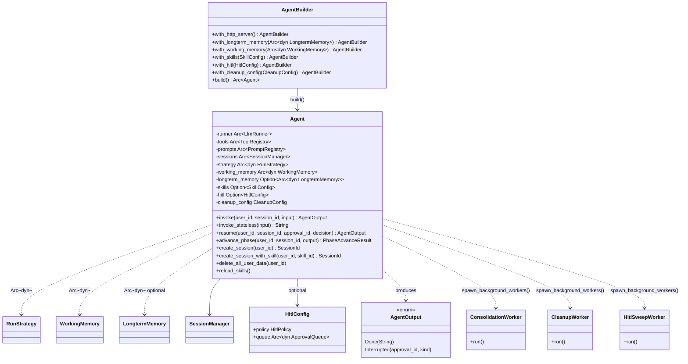

# Agent

## Purpose

`avs-agent` is the composition root: the one crate that wires every other
subsystem — model runtime, memory tiers, session storage, skills, tools, and
human-in-the-loop — into a single callable `Agent`. It owns no domain logic of
its own beyond orchestration: `invoke`/`resume` sequence calls into the
subsystems in the right order, `AgentBuilder` assembles the dependency graph
with sensible defaults for anything not supplied, and three supervised
background workers (`ConsolidationWorker`, `CleanupWorker`, `HitlSweepWorker`)
keep session/memory state healthy without the caller having to drive them. It
exists as a separate crate because it sits at the top of the workspace's
layering (`scripts/check-layering.sh` places `agentverse-agent` alone in Layer
4): every other `avs-*` crate is built to be usable independently of it, and
`avs-agent` is where they are finally forced to agree with each other.

## Position in the System

`avs-agent` consumes, directly, nearly every other library crate in the
workspace: [Core Runtime](core-runtime.md) (`avs-core`, for `LlmRunner`,
`PromptRegistry`, and the `RunStrategy`/`StrategyOutcome` contract), `avs-hitl`
for `HitlPolicy`/`ApprovalQueue`/`HitlContext`/`InterruptKind`, the memory
tiers in [Memory](memory.md) (`WorkingMemory`, `CacheMemory`,
`LongtermMemory`, `LongtermRecord`), [Session](session.md) (`SessionManager`,
`SessionMemory`, `Session`, `SessionId`, `InterruptedState`), [Skill](skill.md)
(`SkillConfig`, `SkillContext`, `SkillRouter`, `SkillRegistry`), and
[Tools](tools.md) (`ToolRegistry`). A strategy implementation (produced by
[Strategy](strategy.md)'s `build(StrategyKind, ...)`) is handed in as
`Arc<dyn RunStrategy>` rather than constructed here. With the optional `http`
feature, it also consumes `avs-guardrails` (`RateLimiter`) to expose an axum
HTTP surface — see [HTTP Sidecar](http-sidecar.md). Nothing in the workspace's
library graph consumes `avs-agent` back (it is Layer 4, the top); it is
consumed only by the top-level `examples/*` binaries and by the two test-infra
crates, [Eval and Test Infra](eval-and-test-infra.md) (`avs-eval`,
`avs-test-utils`), which build real `Agent`s to exercise end-to-end behavior.

## Architecture

`Agent` (defined in `avs-agent/src/agent/mod.rs`) is a plain struct holding
`Arc`/`Option<Arc<..>>` handles to every subsystem it orchestrates; its fields
are private, so construction only happens through `AgentBuilder`
(`avs-agent/src/agent/builder.rs`) — there is no `Agent::new`. `AgentBuilder`
takes five required constructor arguments (`runner`, `tools`, `prompts`,
`session_memory`, `strategy`) and exposes optional `.with_*()` chain methods
for everything else; `AgentBuilder::build` wraps the assembled `Agent` in an
`Arc`, calls `spawn_background_workers` on it, and — only with the `http`
feature and `.with_http_server()` — spawns the axum server from
`avs-agent/src/http/mod.rs`. The crate's behavior is decomposed across small
modules under `avs-agent/src/agent/`: `sessions.rs` (session lifecycle:
`create_session`, `get_session`, `end_session`, `list_sessions`,
`delete_all_user_data`, `load_messages`), `invoke.rs` (the main turn-taking
path, `assemble_system`/`assemble_messages_with_context`,
`get_cache_memory`/`update_cache_memory`), `routing.rs` (skill
routing/phase-transition parsing, `parse_phase_transition`, `advance_phase`,
`reload_skills`), `resume.rs` (`handle_tool_interrupt`, `resume`, and the
per-`InterruptedState`-variant resumption logic), and `workers.rs`
(`spawn_supervised`, `Agent::spawn_background_workers`). The top-level
`avs-agent/src/workers.rs` (distinct from `agent/workers.rs`) holds the worker
implementations themselves — `ConsolidationWorker`, `CleanupWorker`,
`HitlSweepWorker` — plus their `ConsolidationConfig`/`CleanupConfig`/
`HitlSweepConfig` structs, each with a `Default` impl.

`Agent` composes three memory tiers without owning any of their storage: L1 is
`working_memory: Arc<dyn WorkingMemory>` (an in-process TTL cache, defaulting
to `CacheMemory::new(Duration::from_secs(300))` when the builder isn't given
one explicitly), L2 is `sessions: Arc<SessionManager>` wrapping the injected
`Arc<dyn SessionMemory>`, and L3 is the optional
`longterm_memory: Option<Arc<dyn LongtermMemory>>`. Skills are optional
(`skills: Option<SkillConfig>`); when absent, `invoke` runs with no skill
context and all registered tools active. HITL is likewise optional
(`hitl: Option<HitlConfig>`, a plain struct pairing a `HitlPolicy` with an
`Arc<dyn ApprovalQueue>`); when configured, `invoke`/`resume` wrap each
strategy call in an `agentverse_hitl::HitlContext` and call
`strategy.run_hitl` instead of `strategy.run_with_active_tools`.

## Runtime Flows

**`invoke(user_id, session_id, input)` end-to-end:**
1. `self.sessions.assert_owner(user_id, session_id)` — rejects the call with
   `SessionMemoryError::NotFound` if the session doesn't belong to `user_id`.
2. If a phase-opening context is pending (`get_phase_opening_context`), the L1
   cache is evicted (`working_memory.evict`) and the context is cleared and
   combined with `input`; otherwise, `get_cache_memory` loads history — a hit
   reads L1 directly, a miss rehydrates from L2 (`sessions.load_messages`) and
   re-populates L1.
3. Skill context resolution: an already-bound skill context is deserialized
   as-is; otherwise, if skills are configured, `SkillRouter::route` attempts
   to match the input against eligible skills and, on a match, compiles and
   persists the new context via `sessions.set_skill_context`.
4. `active_tool_names` is computed as the skill's tool list intersected with
   the registry, or every registered tool name if no skill is active.
5. If `longterm_memory` is configured, `ms.retrieve(user_id, effective_input,
   5)` fetches up to five scored L3 memories (a retrieval failure is logged
   and treated as empty context, not a hard error).
6. `assemble_system`/`assemble_messages_with_context` build the full message
   list (skill instructions or skill summaries, base `system` template, L3
   context, L2 history, the new user message).
7. The assembled messages are passed to `strategy.run_hitl` (if HITL is
   configured) or `strategy.run_with_active_tools`.
8. On `StrategyOutcome::Interrupted`, control passes to `handle_tool_interrupt`
   (persists `InterruptedState`, marks the session `Interrupted`, returns
   `AgentOutput::Interrupted`). On `Done(text)`: `sessions.append_turn`
   persists to L2, `update_cache_memory` appends the turn to L1, and — if L3 is
   configured — a `LongtermRecord` is written asynchronously via
   `tokio::spawn` (fire-and-forget; does not block the response).
9. `agentverse::metrics::record_invoke_duration` is recorded on every exit
   path (`Done`, `Interrupted`, `Error`).

**`resume(user_id, session_id, approval_id, decision)` after HITL:**
1. `assert_owner` check, then `get_interrupted_state` is loaded and
   deserialized; the caller-supplied `approval_id` is checked against the
   stored one.
2. The stored state is cleared and the session marked `Active` again.
3. `InterruptedState::PendingPhaseGate` routes to `resume_phase_gate`: an
   `Approved`/`Modified` decision compiles the new skill's context and applies
   the transition via `sessions.apply_phase_transition`; `Rejected` returns a
   `Done` message without changing the session's skill.
4. Any other variant (`PendingToolCall`, `PendingCheckpoint`) routes to
   `resume_tool_call_or_checkpoint`: pending tool calls are executed directly
   via `self.tools.execute_many` (approved/modified) or answered with a
   rejection observation, the result is appended to history, and the
   augmented history is re-submitted to `strategy.run_hitl`/
   `run_with_active_tools` — which may itself interrupt again, recursing back
   into `handle_tool_interrupt`.

**Background worker ticks (`Consolidation`/`Cleanup`/`HitlSweep`):**
1. `AgentBuilder::build` calls `spawn_background_workers`, which spawns each
   worker inside `spawn_supervised` — a loop that awaits the worker's `run()`
   inside `tokio::spawn`, and on either a clean exit or a panic, records
   `agentverse::metrics::record_worker_restart` and restarts after a fixed 5s
   backoff. `CleanupWorker` is always spawned; `HitlSweepWorker` only if
   `hitl` is configured; `ConsolidationWorker` only if `longterm_memory` is
   configured.
2. `ConsolidationWorker::tick` calls
   `session_memory.list_sessions_needing_maintenance()`, and for each session
   with unconsolidated messages above the watermark, writes each to L3 via
   `longterm_memory.write` and advances the watermark
   (`advance_watermark`) after each successful write.
3. `CleanupWorker::tick` first deletes whole ended sessions past
   `session_retention` via `delete_ended_sessions_before` (cascading to their
   messages), then — for sessions still needing maintenance — purges
   individual expired messages via `cleanup_expired_messages` once they are
   both past `message_retention` and at/below the watermark.
4. `HitlSweepWorker::run` calls `queue.sweep_expired()` on each tick,
   discarding stale/timed-out approval requests from the `ApprovalQueue`.

## Key Decisions

### L1 promoted to a `WorkingMemory` trait in `avs-memory`
- **Decision** — the in-process turn cache (`CacheMemory`) is promoted from a
  private struct inside `avs-agent` to a public `WorkingMemory` trait plus
  `CacheMemory` implementation in `avs-memory`, with `AgentBuilder`
  `.with_working_memory(Arc<dyn WorkingMemory>)` overriding the default.
- **Context** — a memory-architecture refactor consolidated all three memory
  tiers (`working`, `session`, `longterm`) into `avs-memory` so the tier the
  agent actually uses (previously named inconsistently across crates) would
  live in the crate whose name says "memory."
- **Alternatives rejected** — no rationale for alternatives is recorded in PR
  #30's body or the referenced design spec; the move is described as a
  mechanical promotion ("semantics preserved exactly"), not a redesign.
- **Consequences** — `avs-agent`'s `Agent` struct field changed from a private
  concrete cache type to `Arc<dyn WorkingMemory>`; `AgentBuilder` gained
  `with_working_memory`; the PR's own follow-up list notes
  `WorkingMemory::evict_user` (an atomic whole-user L1 purge) was deliberately
  deferred, leaving `delete_all_user_data`'s per-session `evict` loop as a
  narrow, documented non-regression race rather than a single atomic call.
- **Ref** — 2026-07-05, PR #30.

### `delete_all_user_data` spans L1 + L2 only; L3 is permanently out of scope
- **Decision** — `Agent::delete_all_user_data(user_id)` deletes every L2
  session for the user (`sessions.delete_session`, cascading to messages) and
  evicts each from L1 (`working_memory.evict`); it never touches L3.
- **Context** — the 2026-07-02 architecture review asked for "a per-user
  deletion path spanning all three stores." Implementing it surfaced an
  explicit owner decision to exclude L3 rather than build it.
- **Alternatives rejected** — extending `LongtermMemory` with a delete method
  was rejected outright: L3 data may serve purposes beyond this agent's own
  runtime (e.g. training corpora), so its retention/deletion policy is treated
  as deliberately outside `avs-agent`'s responsibility; `LongtermMemory`'s
  `write`/`retrieve`-only interface is unchanged by this decision.
- **Consequences** — `delete_all_user_data` has no `assert_owner` check
  (unlike `end_session`/`get_session`) because it never takes a
  caller-supplied `session_id` to verify — every session it touches already
  comes from `list_sessions(user_id)`, scoped by the trusted `user_id`
  parameter itself; a successful call records
  `agentverse::metrics::record_session_deleted` with reason `UserRequest`.
- **Ref** — 2026-07-05, PR #29.

### Background workers scoped by pending work, not `status = 'active'`
- **Decision** — `ConsolidationWorker` and `CleanupWorker` both call
  `SessionMemory::list_sessions_needing_maintenance()`, which returns any
  session — regardless of status — with unconsolidated messages above its
  watermark or messages eligible for age-based pruning, replacing the old
  `list_all_active_sessions()`'s flat `WHERE status = 'active'`.
- **Context** — investigating the retention/deletion design surfaced a
  foundational bug: the instant a session transitioned to `Completed` or
  `Interrupted` — the normal end of every conversation, not an edge case — it
  dropped out of both workers' scope permanently, stranding any trailing
  unconsolidated messages in L2 forever with no path to L3 or cleanup. No
  design doc, comment, or commit message anywhere justified the
  active-only scoping; PR #29's body traces it to "an unexamined oversight in
  an early commit."
- **Alternatives rejected** — none recorded; this is a root-cause bug fix, not
  a design tradeoff between alternatives.
- **Consequences** — `list_all_active_sessions` was deleted outright (no
  deprecated shim); both of its only callers were updated in the same commit.
  A session that has been fully drained (everything consolidated, everything
  prunable pruned) simply stops appearing from the new query, making worker
  crashes/restarts/retries self-healing regardless of why or how a session
  left `Active`. A new `agentverse.session.maintenance_backlog` metric
  (recorded once per `list_sessions_needing_maintenance` call) makes a
  stuck/backlogged worker visible before it can silently strand data again.
- **Ref** — 2026-07-05, PR #29.

### `Agent::new` deleted for `AgentBuilder`
- **Decision** — the 9-positional-argument `Agent::new` constructor is
  removed entirely (not deprecated) and replaced by
  `Agent::builder(runner, tools, prompts, session_memory, strategy)` returning
  an `AgentBuilder` with chainable `.with_*()` methods for every optional
  dependency.
- **Context** — this shipped as part of decomposing `avs-agent`'s previously
  monolithic 1,829-line `agent.rs` into the current `agent/` module set, one
  of the architecture review's structural findings for this crate.
- **Alternatives rejected** — keeping `Agent::new` as a deprecated wrapper
  around the builder — rejected because there were no external consumers of
  the pre-1.0 internal API; PR #26's body states it was "deleted, not
  deprecated," with all 18 call sites across the repo updated in the same
  branch.
- **Consequences** — every one of the crate's own tests and every
  `examples/*` binary that constructed an `Agent` directly had to move to the
  builder; `AgentBuilder::build` gained responsibility for spawning background
  workers and, with the `http` feature, the HTTP server — work that previously
  had no single, obvious place to live.
- **Ref** — 2026-07-04, PR #26.

## Implementation Notes

- `invoke`'s skill-routing block takes the skill registry's read lock twice
  (once to route, once to compile context) rather than once, so that no lock
  guard is held across an `.await` point — this keeps a concurrent
  `reload_skills` write-lock from being blocked by in-flight I/O.
- `resume_tool_call_or_checkpoint` executes approved/modified tool calls
  directly via `self.tools.execute_many` rather than re-running them through
  `strategy.run_hitl`: the calls already passed HITL once, and the hook has no
  notion of "already approved," so re-checking them would turn every approval
  into an infinite interrupt loop.
- `invoke_stateless` is single-turn and skips session/memory/skill context
  entirely; it is not compatible with a session created via
  `create_session_with_skill` — session-bound skill flows must use the
  session-aware `invoke` path.
- Background workers' 5-second panic-restart backoff and unlimited retries are
  a deliberate default for process-lifetime services ("restart forever, don't
  hot-loop"), not currently configurable.
- Known follow-ups deliberately deferred out of scope (per PR #30's body, not
  yet implemented): `WorkingMemory::evict_user` for an atomic whole-user L1
  purge (would remove the narrow non-regression race documented in
  `delete_all_user_data`'s per-session eviction loop); session-transcript
  compaction.

## Source Anchors

- `avs-agent/src/agent/mod.rs`
- `avs-agent/src/agent/builder.rs`
- `avs-agent/src/agent/invoke.rs`
- `avs-agent/src/agent/sessions.rs`
- `avs-agent/src/agent/routing.rs`
- `avs-agent/src/agent/resume.rs`
- `avs-agent/src/agent/workers.rs`
- `avs-agent/src/workers.rs`
- `avs-agent/src/lib.rs`
- `avs-agent/` (crate)

## Related Pages

- [Core Runtime](core-runtime.md)
- [Memory](memory.md)
- [Session](session.md)
- [Skill](skill.md)
- [Strategy](strategy.md)
- [Tools](tools.md)
- [HITL](hitl.md)
- [HTTP Sidecar](http-sidecar.md)
- [Eval and Test Infra](eval-and-test-infra.md)
