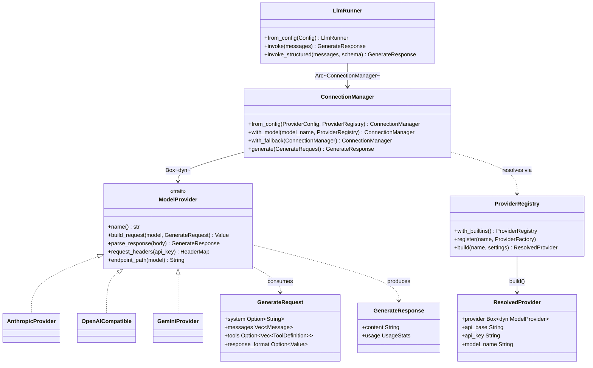

# Core Runtime

## Purpose

`avs-core` is the foundation crate: it owns the `ModelProvider` abstraction and
its three built-in implementations, the `ConnectionManager` that turns a
provider into a reliable HTTP client (retries, circuit breaker, fallback), the
`ProviderRegistry` that resolves a provider by name, `LlmRunner` as the
callable entry point strategies invoke, `PromptRegistry` for minijinja
template rendering, and the `Config`/`ProviderConfig`/`AgentError` types every
other crate builds on. It exists as a separate, dependency-free crate because
it sits at the bottom of the workspace's layering (`scripts/check-layering.sh`
places it in Layer 0): every other `avs-*` crate depends on it, and it depends
on none of them. Its job is to make one LLM call reliably and return a
structured response — everything above it (strategy loops, memory, tools) is
built in terms of the types it exports.

## Position in the System

`avs-core` consumes no other workspace crate — it is the dependency-free
foundation. It is consumed by essentially every other crate: the data/state
layer (`avs-hitl`, [memory](memory.md), [session](session.md),
`avs-integration`), the tools/safety layer ([tools](tools.md),
[guardrails](guardrails.md), [mcp](mcp.md)), the strategy layer
([strategy](strategy.md), `avs-react`, `avs-plan`, `avs-router`,
[subagent](subagent.md)), and the composition root, [agent](agent.md)
(`avs-agent`), which wires an `LlmRunner` into every `Agent` it builds.
[Subagent](subagent.md) additionally calls `ConnectionManager::with_model`
directly for per-subagent model overrides, and the strategy crates render
prompts through `PromptRegistry` and construct `GenerateRequest` values that
flow into `LlmRunner::invoke`/`invoke_structured`.

## Architecture

`ModelProvider` is a pure, synchronous protocol translator: `build_request`
turns a `GenerateRequest` into the provider's own wire JSON, and
`parse_response` turns a raw response body back into a `GenerateResponse`.
Neither method touches the network — that separation is deliberate, so each
provider's request/response shape is unit-testable without an HTTP mock.
`ConnectionManager` is the piece that actually owns the `reqwest::Client`, the
circuit breaker, retry/backoff state, and an optional boxed `fallback`
(`ConnectionManager::with_fallback`); it is constructed either directly
(`ConnectionManager::anthropic`/`openai`/`gemini` convenience constructors) or
via `ConnectionManager::from_config`, which asks a `ProviderRegistry` to
resolve a `ProviderConfig { name, settings }` into a `ResolvedProvider`
(provider instance plus `api_base`/`api_key`/`model_name`). `LlmRunner` is the
thin entry point strategy crates call: it holds an `Arc<ConnectionManager>`
and exposes `invoke`/`invoke_structured`, both implemented through a shared
`invoke_inner` that splits `System`-role messages out of the conversation and
assembles a `GenerateRequest`. `PromptRegistry` (in `prompt.rs`) is a separate,
decoupled subsystem: a minijinja `Environment` pre-loaded with default
templates (`system`, `react`, `strategies.*`, `router`), optionally extended
from a directory of `.j2`/`.toml` files or a `PromptConfig`. `LlmRunner` does
not use `PromptRegistry` itself — strategy crates render templates through it
to build the `system` string and `Example`s they pass into a `GenerateRequest`.

## Runtime Flows

**`invoke` (unstructured):**
1. Caller passes `Vec<Message>` to `LlmRunner::invoke`.
2. `invoke_inner` partitions messages: `MessageRole::System` entries are
   joined into `system`, the rest stay as `messages` in order.
3. A `GenerateRequest { system, messages, tools: None, response_format: None }`
   is built and passed to `ConnectionManager::generate`.
4. `generate` checks the circuit breaker, then calls
   `provider.build_request(model_name, request.clone())` to get the wire body,
   `provider.endpoint_path`/`provider.request_headers` for the URL and headers.
5. The retry loop (see below) sends the HTTP request; on success
   `provider.parse_response` produces a `GenerateResponse` with `UsageStats`.
6. `LlmRunner::invoke` returns `Result<GenerateResponse, AgentError>`,
   mapping `ModelError` into `AgentError::Model`.

**`invoke_structured` (schema-constrained):**
1. Caller passes `messages` plus a `serde_json::Value` JSON schema to
   `LlmRunner::invoke_structured`.
2. `invoke_inner` runs identically to the unstructured path, except
   `response_format` is `Some(schema)`.
3. Each provider encodes the schema differently at `build_request` time:
   `AnthropicProvider` emits `output_config.format` with
   `type: "json_schema"`; `OpenAICompatible` wraps it as
   `response_format: { type: "json_schema", json_schema: { name, schema } }`;
   `GeminiProvider`'s `GeminiRequest` has no `response_format` field at all, so
   the schema is silently not enforced server-side for Gemini.
4. The rest of `ConnectionManager::generate` (retry, circuit breaker,
   fallback, `parse_response`) is unchanged from the unstructured path.

**Retry, circuit breaker, and fallback inside `generate`:**
1. Before building the request, `generate` takes the circuit breaker lock; if
   `CircuitState::Open` and the timeout hasn't elapsed, and a `fallback` is
   configured, it recurses into `fallback.generate(request)`; otherwise it
   returns `ModelError::CircuitOpen`.
2. On each HTTP attempt: a transport error or non-2xx status calls
   `circuit_breaker.record_failure()`; a `429` uses `rate_limit_backoff_ms`
   (4x the normal exponential backoff) or the server's `Retry-After` header,
   clamped to 60s via `clamp_retry_after_ms`; other failures use `backoff_ms`
   (exponential, capped at a shift of 10).
3. If attempts remain, the loop sleeps and retries. If retries are exhausted
   or a non-429/5xx failure occurs and a `fallback` is configured, the request
   is retried once against the fallback's own `generate` (which runs the same
   circuit-breaker/retry logic independently). Otherwise the last `ModelError`
   is returned.
4. A successful parse calls `circuit_breaker.record_success()`, records
   `UsageStats` via `crate::metrics::record_llm_call` ([observability](observability.md)),
   and returns the `GenerateResponse`.

## Key Decisions

### Open `ProviderRegistry` replacing the closed `ProviderConfig` enum
- **Decision** — `ProviderConfig` becomes `{ name: String, settings: HashMap<String, String> }` with ergonomic constructors (`::anthropic`, `::openai`, `::gemini`, `::custom`); a new `ProviderRegistry` (name-keyed table of `ProviderFactory` closures, never global state) is the single dispatch point `ConnectionManager::from_config`/`with_model` call through.
- **Context** — the 2026-07-02 architecture review flagged the provider seam as the least open/closed part of the design: adding a provider meant editing the `ProviderConfig` enum, `LlmRunner::from_config`'s match, `ConnectionManager::from_config`'s match, and `with_model`'s string match, all in lockstep.
- **Alternatives rejected** — runtime `.so`/WASM plugin loading (registration stays compile-time Rust, a provider author writes and registers a factory function, but no `avs-core` edit); config-file-driven definition of a brand-new provider (a YAML file can select a registered provider by name, it cannot define a new one).
- **Consequences** — 61 call sites migrated across 24 files; `Config::validate()` no longer catches a missing `model_name`/`api_key` (that check moved into each factory as `ModelError::MissingSetting`/`InvalidApiKey`, surfacing at `ConnectionManager::from_config` time instead); `ConnectionManager::from_config`/`with_model` gained a `&ProviderRegistry` parameter (breaking, but `LlmRunner::from_config`'s own signature is unchanged since it builds `ProviderRegistry::with_builtins()` internally).
- **Ref** — 2026-07-04, PR #27.

### `with_model` returns `Result`, shares circuit breaker, and honors `Retry-After`
- **Decision** — `ConnectionManager::with_model` returns `Result<Self, ModelError>` (new `ModelError::UnknownProvider`) instead of panicking via `unreachable!()`; a `with_model`-derived instance shares its parent's `circuit_breaker` `Arc` rather than getting an independent one; `429` responses honor a server `Retry-After` header (clamped to 60s) with a 4x-backoff fallback when absent; API keys are validated as legal HTTP header values at construction (`ModelError::InvalidApiKey`).
- **Context** — a whole-branch architecture-review audit found `with_model` panicking on an unrecognized provider name, per-model overrides bypassing an already-open circuit breaker for the same endpoint/key, and rate-limit backoff not respecting server-provided delay hints.
- **Alternatives rejected** — leaving the panic behind a "should never happen" comment (an audit-level defect, not acceptable); independent circuit breakers per model override (would let one model's override keep hammering an endpoint whose circuit the primary model already tripped).
- **Consequences** — every `with_model` caller (`avs-subagent`'s `SubAgentExecutor`, this crate's own tests) must handle a `Result`; retry/backoff math is exercised directly by unit tests (`backoff_is_exponential_and_capped`, `rate_limit_backoff_is_4x`, `clamp_retry_after_ms_caps_at_60s`).
- **Ref** — 2026-07-03, PR #24.

### Server-enforced structured output, encoded per provider
- **Decision** — `GenerateRequest` gains `response_format: Option<serde_json::Value>`; `LlmRunner::invoke_structured(messages, schema)` is added alongside `invoke`, both sharing `invoke_inner`; each provider maps the schema to its own wire shape at `build_request` time, rather than the runner normalizing a single format.
- **Context** — strategies needed schema-constrained decoding (e.g. planning steps) without hand-rolling a different wire shape per provider at every call site. PR #23 introduced the field and the OpenAI-compatible encoding (`response_format: { type: "json_schema", json_schema: { name, schema } }`, the shape vLLM/llama.cpp constrained decoding expects); commit `e0720fb` followed with the Anthropic encoding (`output_config.format` with `type: "json_schema"`).
- **Alternatives rejected** — a single shared wire encoding across providers: Anthropic's API takes `output_config.format`, not OpenAI's `response_format` field (per commit `e0720fb`'s message), so the encoding has to live inside each provider's `build_request`.
- **Consequences** — `invoke` and `invoke_structured` share one code path with no duplicated request-splitting logic; existing `GenerateRequest { .. }` struct literals across the workspace needed `..Default::default()` once the struct gained a field. `GeminiProvider` does not consume `response_format` at all — `GeminiRequest` has no such field, so the schema is silently dropped for Gemini (DEVELOPMENT.md's structured-output table documents this as "Not supported — free text returned"). No PR or spec records a rationale for that gap; it is observed current state, not a documented scoping decision.
- **Ref** — 2026-06-24, PR #23 and commit `e0720fb`.

### `GenerateRequest`/`GenerateResponse` replace flat prompt strings; caching stays provider-internal
- **Decision** — `ModelProvider::build_request`/`parse_response` take/return structured `GenerateRequest` (`system`, `messages`, `tools`) and `GenerateResponse` (`content`, `usage`) instead of a flat `prompt: &str`; each provider applies its own caching strategy internally, invisible to callers.
- **Context** — the flat-string design made correct Anthropic `system`-field usage and prompt caching structurally impossible, and discarded message roles before they reached the provider.
- **Alternatives rejected** — exposing cache-control decisions to callers (rejected outright — the design's explicit goal was that "caching logic stays internal to each provider"); non-text content blocks (images, documents) — deferred as a non-goal for a later change.
- **Consequences** — `UsageStats` (`input_tokens`, `output_tokens`, `cache_write_tokens`, `cache_read_tokens`) is added, accumulates via `AddAssign`, and is surfaced to callers through `CycleResult.total_usage`; `AnthropicProvider` places `cache_control: ephemeral` on the last tool, the system block, and the penultimate conversation message; `DEFAULT_SYSTEM_TEMPLATE` gained a `{{ tools }}` block so the cached system prefix carries the tool list too.
- **Ref** — 2026-05-16, PR #1.

## Implementation Notes

- `ModelProvider` implementations must stay free of HTTP/IO — `build_request`
  and `parse_response` are synchronous and side-effect-free by design, which is
  what lets `provider_build_request_for_test` (a `#[doc(hidden)]` test-only
  method on `ConnectionManager`) exercise wire-format logic without a mock
  server.
- `ProviderRegistry` is a plain struct, not global state: every caller
  (production code and tests alike) constructs its own via `new()` or
  `with_builtins()`, so there is no shared mutable registry to leak state
  across parallel test execution.
- `Config::validate()` only checks that `provider.name` is non-empty; it
  cannot catch a missing `model_name`/`api_key` for an arbitrary registered
  provider, since it has no `ProviderRegistry` to consult. Real callers are
  unaffected because `LlmRunner::from_config` calls `validate()` immediately
  before `ConnectionManager::from_config` (which does the registry-backed
  check) in the same function — but calling `validate()` alone and treating
  success as "provider is fully configured" is a latent trap for a new caller.
- `PromptRegistry::has_react_template()` reflects whether a `react.j2` file
  was loaded from a prompts directory; this is a decoupling seam consumed by
  `avs-react`'s cycle logic to decide whether to prime a one-time preamble
  message, not something `avs-core` itself acts on.
- `OpenAICompatible::new()` reads `LLAMA_DISABLE_THINKING` once at
  construction (defaulting `disable_thinking` to `true`) to keep ReAct-style
  structured-text output reliable against reasoning-capable OpenAI-compatible
  backends; it is not re-read per request.
- Known follow-ups explicitly deferred out of scope (per PR #24's body):
  parsing `Retry-After` in HTTP-date form (only integer-seconds is handled
  today) and `--all-targets` on the CI clippy job. Per PR #27: registering a
  genuinely new provider still requires a Rust `ProviderFactory` function —
  there is no runtime plugin loading, and a YAML `Config` can only *select* an
  already-registered provider by name, not define one.

## Source Anchors

- `avs-core/src/model.rs`
- `avs-core/src/model/connection_manager.rs`
- `avs-core/src/model/registry.rs`
- `avs-core/src/model/anthropic_provider.rs`
- `avs-core/src/model/openai_compatible.rs`
- `avs-core/src/model/gemini_provider.rs`
- `avs-core/src/llm_runner.rs`
- `avs-core/src/prompt.rs`
- `avs-core/src/config.rs`
- `avs-core/src/builder.rs`
- `avs-core/src/example.rs`
- `avs-core/src/error.rs`

## Related Pages

- [Agent](agent.md)
- [Strategy](strategy.md)
- [Subagent](subagent.md)
- [Guardrails](guardrails.md)
- [Observability](observability.md)
- [Memory](memory.md)
- [Session](session.md)
- [Tools](tools.md)
- [MCP](mcp.md)
