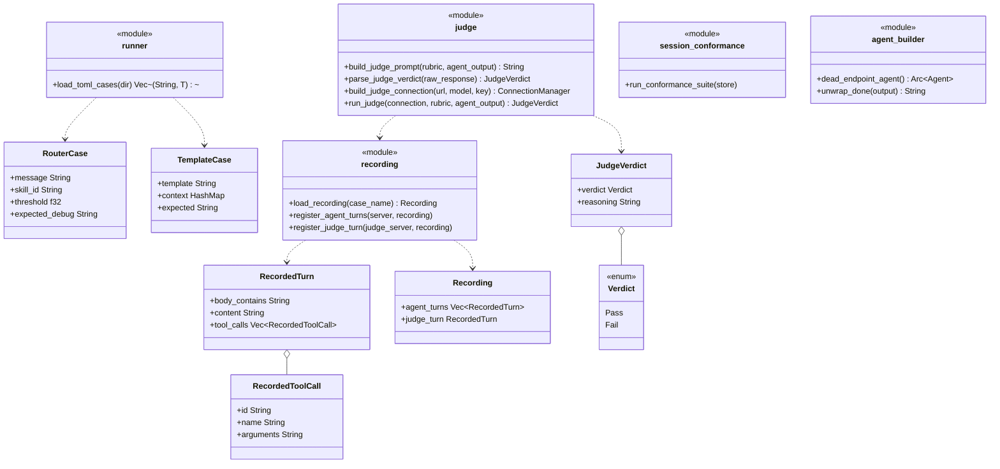

# Eval and Test Infra

## Purpose

`avs-eval` (crate `agentverse-eval`) and `avs-test-utils` (crate
`agentverse-test-utils`) are AgentVerse's own test infrastructure, not
runtime code shipped to a deployed agent. `avs-eval` holds two regression
harnesses for the reasoning stack: a deterministic scaffold harness (skill
router, prompt templates — zero LLM/network calls) and a
judge-based quality harness that runs the real `Agent`/`RunStrategy` stack
against recorded LLM responses and scores the output against a rubric via
a second, also-replayed model call. `avs-test-utils` holds a single
generic `SessionMemory` conformance suite plus small agent-construction
helpers, used to prove the SQLite and Postgres backends stay behaviorally
identical and to remove per-test LLM-runner boilerplate elsewhere in the
workspace. Both crates exist to let the workspace's own test suite catch
regressions and cross-backend drift without ever making a live LLM call
in CI.

## Position in the System

Both crates sit outside the layered dependency graph `scripts/check-layering.sh`
enforces for production crates — they are dev-dependency-only and consume
almost every layer beneath them rather than being consumed themselves.
`avs-eval` depends on [Core Runtime](core-runtime.md) (`avs-core`, for
`ConnectionManager`, `ProviderConfig`, `ProviderRegistry`, `PromptRegistry`,
`GenerateRequest`), [Agent](agent.md) (`avs-agent`, for `Agent` and
`AgentOutput`), [HITL](hitl.md) (`avs-hitl`, for `HitlConfig`,
`HitlPolicy`, `InMemoryQueue`), [Session](session.md) (`avs-session`, for
`SessionMemory`, `SqliteSessionMemory`), [Skill](skill.md) (`avs-skill`,
for `SkillConfig`, `KeywordOverlapRouter`, `RouteSkills`),
[Strategy](strategy.md) (`avs-strategy`/`avs-react`/`avs-plan`, for
`ReActStrategy`, `PlanStrategy`, `build`/`StrategyKind`), and
[Tools](tools.md) (`avs-tools`, for `ToolRegistry`) to construct and
drive the real production objects under test. `avs-test-utils` depends on
the same core/agent/session/strategy/tools set, minus HITL and skill,
since its `dead_endpoint_agent` helper builds only a bare ReAct agent.
Nothing in the main workspace graph depends on either crate — both appear
only as `[dev-dependencies]` and workspace members, including in
`avs-memory-pgvector`'s `Cargo.toml`, which pulls in `avs-test-utils` to
run the shared conformance suite against `PostgresSessionMemory`.

## Architecture

`avs-eval::runner` holds one function, `load_toml_cases<T: DeserializeOwned>`,
that reads every `*.toml` file in a directory and deserializes each into a
fixture type — `RouterCase` or `TemplateCase` — panicking on
any read/parse failure so a broken fixture is a hard error rather than a
silently-skipped test. A third fixture type, `ParserCase`, was deleted
outright (commit `185778a`) alongside the production-code parser deletion
covered in [Strategy](strategy.md). `avs-eval::recording` holds the judge harness's
replay machinery: `Recording` (deserialized from
`fixtures/recordings/<case>.toml`) is a sequence of `RecordedTurn`s for the
agent-under-test plus one `RecordedTurn` for the judge; `register_agent_turns`
registers one `httpmock` mock per turn against a `MockServer`, matched by
that turn's `body_contains` substring, and `register_judge_turn` registers
the judge's single unconditional response against a second `MockServer`.
Each `RecordedTurn` now also carries `tool_calls: Vec<RecordedToolCall>`
alongside its `content` string, which became `#[serde(default)]` (previously
required) — a recorded turn can now be tool-calls-only with no text, matching
a real tool-calling response. `RecordedToolCall { id, name, arguments }`'s
doc comment on `arguments` is precise: it's a "JSON-encoded arguments
string, exactly as the OpenAI-compatible wire format's `function.arguments`
expects — not a nested TOML table." `chat_completion_envelope` builds a real
OpenAI-compatible response shape from a `RecordedTurn`: `content` serializes
as JSON `null` when the turn's text is empty (matching how a real
tool-calling response often carries no text alongside `tool_calls`), and a
`tool_calls` array is always present (possibly empty), mapping each
`RecordedToolCall` to `{id, function: {name, arguments}}`. For example,
`react_tool_call.toml`'s tool-call turn replaced its free-text `content`
line with an empty `content` plus a `[[agent_turns.tool_calls]]` table
naming `echo` and its JSON arguments.
`avs-eval::judge` holds `build_judge_prompt` (the fixed, non-configurable
judge prompt template), `parse_judge_verdict` (strict JSON deserialization
into `JudgeVerdict { verdict: Verdict, reasoning: String }`, where `Verdict`
is a two-variant `Pass`/`Fail` enum), `build_judge_connection` (builds a
`ConnectionManager` for the judge model through `ProviderRegistry::with_builtins`
and `ConnectionManager::from_config`, never a hardcoded provider), and
`run_judge` (builds the prompt, calls the mocked judge connection, parses
the verdict). `avs-test-utils::session_conformance` holds one function,
`run_conformance_suite<S: SessionMemory>(store: &S)`, exercising the entire
`SessionMemory` contract against whatever backend is passed in.
`avs-test-utils::agent_builder` holds `dead_endpoint_agent` (an `Arc<Agent>`
wired to an unreachable endpoint, for tests that only need session/routing
infrastructure) and `unwrap_done` (unwraps `AgentOutput::Done`, panicking on
`Interrupted`).

## Runtime Flows

**Deterministic regression (router/template fixtures):**
1. `avs-eval/tests/deterministic_test.rs` calls `load_toml_cases::<RouterCase>("fixtures/router")`
   and `load_toml_cases::<TemplateCase>("fixtures/templates")`, which panics
   immediately on any unparseable fixture file or an empty directory.
2. For each `RouterCase`, the test constructs `KeywordOverlapRouter::with_threshold(case.threshold)`
   and a minimal `Skill`, then calls `RouteSkills::route` and compares the
   debug-formatted `Option<String>` result against `case.expected_debug`.
3. For each `TemplateCase`, the test registers `case.template` into a fresh
   `PromptRegistry` via `add_template`, converts the TOML context table to
   JSON, calls `render`, and asserts the exact rendered string against
   `case.expected`.

**Judge-based quality regression via httpmock replay:**
1. `avs-eval/tests/judge_test.rs` calls `load_recording(case_name)` to load
   `fixtures/recordings/<case>.toml`, then starts an `httpmock::MockServer`
   and calls `register_agent_turns` to register each recorded agent turn as
   its own mock, matched by request-body content. Each mocked response's
   JSON body now includes a `tool_calls` array built from that turn's
   `RecordedToolCall`s, parsed by the same provider code a live call uses
   into a real `ContentBlock::ToolUse`-bearing `Message` (see
   [Strategy](strategy.md) and [Core Runtime](core-runtime.md) for the
   parse/dispatch mechanics).
2. The test constructs the real strategy or `Agent` under test (`ReActStrategy`,
   `PlanStrategy`, or an `Agent` built via `avs_strategy::build` plus
   `SkillConfig`/`HitlConfig`), pointed at the mock server by passing
   `ProviderConfig::openai("test-model", ..., Some(agent_server.base_url()))`
   into `LlmRunner::from_config(Config { ... })`, and runs it against the
   scenario's input message(s), capturing the real `StrategyOutcome::Done`/
   `AgentOutput::Done` text.
3. A second `MockServer` is started and `register_judge_turn` registers that
   case's single recorded judge response against it; `build_judge_connection`
   builds a judge `ConnectionManager` through `ProviderRegistry`, and
   `run_judge` sends `build_judge_prompt(rubric, agent_output)` through it.
4. `parse_judge_verdict` deserializes the judge's raw text into a
   `JudgeVerdict`; a parse failure is a hard test failure. The test asserts
   `verdict.verdict == Verdict::Pass`, printing `verdict.reasoning` on
   failure so a developer sees why immediately.

**SessionMemory conformance suite run against both backends:**
1. `avs-test-utils/tests/sqlite_conformance.rs` builds a `SqliteSessionMemory`
   over `sqlite::memory:` and calls `run_conformance_suite(&store)`.
2. `avs-memory-pgvector/tests/pg_conformance.rs` reads `TEST_DATABASE_URL`
   from the environment — skipping with a message if unset — builds a
   `PostgresSessionMemory` against it, and calls the identical
   `run_conformance_suite(&store)`.
3. `run_conformance_suite` drives both instances through the same sequence:
   create/get/ownership, unknown-session lookup, `append_turn` ordering,
   watermark advance/read-back, skill-context set/get/clear, interrupted-state
   set/get plus `update_status`, `list_by_user` isolation,
   `list_sessions_needing_maintenance` visibility for an ended session with
   an unconsolidated tail versus a fully-drained one, `delete_session`'s
   cascade to messages, and `delete_ended_sessions_before`'s cutoff logic
   (future cutoff deletes, past cutoff spares a just-ended session, an
   active session is never deleted regardless of cutoff). Any divergence
   between the two backends surfaces as a failure in exactly one of the two
   call sites, not a hand-duplicated assertion someone forgot to update.

## Key Decisions

Newest first.

### Recorded-HTTP-fixture format upgraded to native `tool_calls`, replacing free-text `content`
- **Decision** — `RecordedTurn` gained `tool_calls: Vec<RecordedToolCall>`
  (each `{id, name, arguments}`) and its `content` field became
  `#[serde(default)]` (previously required); `chat_completion_envelope` now
  emits an OpenAI-compatible `tool_calls` array (always present, possibly
  empty) and serializes `content` as JSON `null` when a turn's text is
  empty, instead of always emitting a plain-text `content` field.
- **Context** — PR #35 deleted the free-text ReAct parser from production
  code in the same refactor (`avs-react/src/parse.rs`; see
  [Strategy](strategy.md)); the PR body states this crate's change exists
  "so eval tests exercise real tool calls instead of silently
  misinterpreting free text" — a mock still returning old-style
  `Thought:`/`Action:` text would drive every ReAct-tool-call judge case
  through a code path production no longer has.
- **Alternatives rejected** — none recorded; the commit message and PR body
  present the format upgrade as a direct, necessary consequence of the
  parser deletion, not a choice among options.
- **Consequences** — recording authors write `[[agent_turns.tool_calls]]`
  TOML tables instead of embedding `Action:`/`Action Input:` text in
  `content` (see the `react_tool_call.toml` excerpt in Architecture). The
  four `fixtures/parser/*.toml` fixtures and `ParserCase` were deleted
  outright in the same commit, not superseded — the deterministic harness
  no longer has a parser-testing path (see Architecture, Runtime Flows).
- **Ref** — 2026-08-02, commit `185778a`, PR #35 (Phase 6).

### Single shared `run_conformance_suite` is the mechanism proving SQLite/Postgres parity
- **Decision** — `avs-test-utils::session_conformance::run_conformance_suite<S: SessionMemory>`
  is one generic async function, called once against `SqliteSessionMemory`
  and once against `PostgresSessionMemory`, rather than two independently
  maintained backend test suites.
- **Context** — PR #24's body introduces it directly: "generic `SessionMemory`
  suite runs against SQLite (always) and Postgres (CI pgvector service). It
  already caught a real drift: `PostgresSessionMemory` was missing
  `interrupted_state` persistence (trait no-op defaults) — fixed in this
  branch."
- **Alternatives rejected** — none recorded; the shared suite is presented as
  the fix for the drift it caught, not a choice among alternatives.
- **Consequences** — PR #29 later extended this same function (not a parallel
  one) with the `list_sessions_needing_maintenance`/deletion assertions; its
  body states the retention work was "verified via the project's shared
  conformance suite," including "a cascade-delete assertion added during
  final review to prove `ON DELETE CASCADE` genuinely fires ... previously
  unverified." Every later `SessionMemory` contract change is validated
  through this one function against both backends, not duplicated per
  backend.
- **Ref** — 2026-07-03, PR #24 (extended 2026-07-05, PR #29).

### Judge harness drives the real `Agent`/`RunStrategy` stack, not a simulation
- **Decision** — each judge case constructs the actual production strategy
  or `Agent` (`ReActStrategy`, `PlanStrategy`, or `avs_strategy::build` plus
  `SkillConfig`/`HitlConfig`) and points it at a mocked LLM endpoint, rather
  than simulating agent behavior for the test.
- **Context** — the eval harness design spec (untracked) specifies "Build
  the real `Agent`/`RunStrategy` ... exactly the pattern already used in
  `avs-core/tests/connection_manager_test.rs`," then "Capture the real
  output (the agent's actual final answer / trajectory)."
- **Alternatives rejected** — none recorded in the spec; it presents driving
  the real stack as the only approach considered.
- **Consequences** — per PR #28's body, building the HITL interrupt-and-resume
  case this way caught a genuine, previously-undetected bug in already-merged
  code: `Agent::resume` on `ApprovalDecision::Approved` re-ran already-approved
  tool calls back through the stateless `HitlPolicy` hook, so any tool on
  its blocklist "would never actually execute after approval — every
  approval just re-armed a fresh interrupt." No existing test before this
  branch exercised `resume()` with `Approved` and a non-empty pending-calls
  list; the fix executes approved calls directly, matching the sibling
  `Modified`/`Rejected` branches.
- **Ref** — 2026-07-05, PR #28.

### Deterministic harness targets `avs-skill`'s `KeywordOverlapRouter`, not `avs-router`'s `StrategyRouter`
- **Decision** — the router fixtures in `fixtures/router/*.toml` exercise
  only `agentverse_skill::router::KeywordOverlapRouter`/`RouteSkills`, never
  `avs-router`'s `StrategyRouter`.
- **Context** — the design spec states the architecture review's "router
  thresholds" phrasing "can only mean" the former, "since only `avs-skill`'s
  router has a threshold concept at all"; `StrategyRouter` "decides between
  ReAct/Plan/Hierarchical strategies via an `Arc<LlmRunner>` call ... it's
  LLM-based, not deterministic — it belongs in the judge harness's
  territory if it's ever covered, not here."
- **Alternatives rejected** — covering `StrategyRouter` here was considered
  and rejected outright per the spec text above, since it wraps an LLM call
  rather than being a pure function.
- **Consequences** — `StrategyRouter`'s threshold/routing behavior has no
  deterministic regression coverage in `avs-eval`; only `KeywordOverlapRouter`
  does.
- **Ref** — 2026-07-05, PR #28.

### Both harnesses are offline-by-construction; recordings refresh only via a manual local script
- **Decision** — no automated path (CI job, scheduled workflow, or otherwise)
  ever makes a live LLM call for either harness; `fixtures/recordings/*.toml`
  is refreshed only by a developer running `scripts/refresh-judge-recordings.sh`
  locally with real API keys.
- **Context** — the design spec notes this "match[es] this codebase's
  established convention (confirmed: 7+ existing test files already use
  `httpmock`/closed-port patterns specifically to avoid live API calls in
  tests; zero existing use of API-key secrets or scheduled workflows in
  `.github/workflows/ci.yml`)," and lists as an explicit non-goal "Any
  automated (scheduled or CI-triggered) live-LLM call, for either recording
  refresh or judge scoring."
- **Alternatives rejected** — an automated recording-refresh job was
  considered and explicitly ruled out by the non-goals list above.
- **Consequences** — `scripts/refresh-judge-recordings.sh` does not rewrite
  any file itself; it documents a manual per-case procedure (temporarily
  point a case at a live provider, capture the real response text, copy it
  into the recording file by hand, revert, and re-run) that a human must
  read and approve before a refreshed recording is committed.
- **Ref** — 2026-07-05, PR #28.

### Judge verdict is a strict Pass/Fail, not a numeric or graded score
- **Decision** — `JudgeVerdict.verdict` is a two-variant `Verdict` enum
  (`Pass`/`Fail`); there is no continuous or graded score anywhere in the
  judge harness.
- **Context** — the design spec lists this as an explicit non-goal:
  "Numeric/continuous judge scoring — the judge always returns a strict
  Pass/Fail against a rubric, not a graded score."
- **Alternatives rejected** — no PR or spec records a rationale for choosing
  Pass/Fail over a graded score beyond stating it as the design; observed
  current state: `parse_judge_verdict` hard-errors on anything that doesn't
  deserialize into exactly `{"verdict": "pass"|"fail", "reasoning": "..."}`.
- **Consequences** — a judge case has no partial-credit outcome; any
  response the judge doesn't consider a clean rubric pass fails the test
  outright, and a malformed judge response is a hard `Err`, never a silent
  pass.
- **Ref** — 2026-07-05, PR #28.

## Implementation Notes

- `judge_test.rs`'s judge-case tests now assert the actual agent output
  text captured from the strategy run, not just an unconditional
  judge-verdict mock pass — a test-quality hardening from PR #35's Phase 6
  final review (commit `0d675d4`), not a structural change to the harness.
- `register_agent_turns`' `body_contains` matching is order-sensitive in a
  documented, non-obvious way: `httpmock` resolves ties between two turns'
  matching substrings by registration order (first-registered match wins),
  which the source comment notes is verified against `httpmock` 0.7's
  behavior but "not a documented public guarantee" — a future `httpmock`
  upgrade could silently change it. Recording authors should prefer
  mutually-exclusive `body_contains` substrings and, when that's impossible,
  order the more-specific marker first in the recording file.
- The judge harness ships four starter cases — one per major strategy path
  (ReAct tool-call, Plan multi-step, HITL interrupt/resume, skill-routed
  response). The design spec scopes growing this dataset as ongoing work,
  not a deliverable of the harness itself. Known debt/future work.
- `avs-eval`'s fixture loaders (`load_toml_cases`, `load_recording`) read
  relative paths (`fixtures/...`) assuming the test process's working
  directory is the crate root — `cargo test` guarantees this; other
  invocations would not.
- `dead_endpoint_agent` carries a source comment warning that
  `ToolRegistry::new()` already returns an `Arc<ToolRegistry>` and must not
  be wrapped in a second `Arc::new()` — an easy mistake to reintroduce when
  assembling the same scaffolding by hand elsewhere.
- The Postgres side of the conformance suite (`avs-memory-pgvector/tests/pg_conformance.rs`)
  silently skips (with an `eprintln!`) rather than failing when
  `TEST_DATABASE_URL` is unset, so a local `cargo test` run without a
  Postgres instance available exercises only the SQLite backend.

## Source Anchors

- `avs-eval/src/lib.rs`
- `avs-eval/src/runner.rs`
- `avs-eval/src/judge.rs`
- `avs-eval/src/recording.rs`
- `avs-eval/` (crate)
- `avs-test-utils/src/lib.rs`
- `avs-test-utils/src/agent_builder.rs`
- `avs-test-utils/src/session_conformance.rs`
- `avs-test-utils/` (crate)

## Related Pages

- [Agent](agent.md)
- [Session](session.md)
- [Strategy](strategy.md)
- [HITL](hitl.md)
- [Skill](skill.md)
- [Core Runtime](core-runtime.md)
