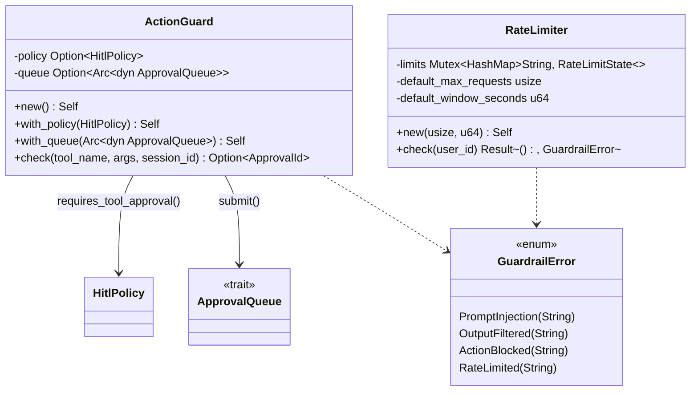

# Guardrails

## Purpose

`avs-guardrails` (crate `agentverse-guardrails`) holds the workspace's
content- and rate-safety checks: prompt-injection screening
(`check_prompt`), output PII filtering (`check_output`), a dangerous-tool
interception type (`ActionGuard`), and a per-user request throttle
(`RateLimiter`). It exists as its own crate so these checks are plain,
independently testable functions/types rather than logic embedded inside
each orchestration strategy — a strategy calls `check_prompt`/`check_output`
the same way regardless of whether it is `avs-react`, `avs-plan`, or
`avs-router`. The crate defines its own `GuardrailError` rather than reusing
`avs-core`'s error type of the same name, keeping its four failure modes
(prompt injection, output filtered, action blocked, rate limited) separate
from the two-variant `agentverse::GuardrailError` that callers translate
into.

## Position in the System

Per `scripts/check-layering.sh`, `agentverse-guardrails` sits in Layer 2,
alongside `agentverse-tools` and `agentverse-mcp`. Its `Cargo.toml` declares
two dependencies: [Core Runtime](core-runtime.md) (`avs-core`, crate name
`agentverse`) and [HITL](hitl.md) (`avs-hitl`, crate name `agentverse-hitl`,
for `ApprovalId`, `ApprovalQueue`, `ApprovalRequest`, `HitlPolicy`, and
`InterruptKind`, used only by `ActionGuard`). It is consumed by the layer-3
orchestration crates covered in [Strategy](strategy.md) — `avs-react`'s
`CycleSkeleton` calls `check_output`, and `avs-plan`'s `planner` module and
`avs-router`'s `StrategyRouter` both call `check_prompt` — and by
[Agent](agent.md) (`avs-agent`, Layer 4), which constructs one `RateLimiter`
for its optional `http`-feature axum surface. `avs-subagent` reaches
`check_output` only transitively, through `avs-react`'s
`CycleSkeleton::check_output_guardrail`; it does not depend on
`agentverse-guardrails` directly.

## Architecture

The crate has no `PromptGuard`/`OutputGuard` structs despite those names
appearing in the architecture design spec (untracked); `prompt_guard.rs` and
`output_guard.rs` each expose one plain function, `check_prompt(prompt: &str)`
and `check_output(output: &str)`, both returning `Result<(), GuardrailError>`.
`check_prompt` matches the input against a `LazyLock<Vec<Regex>>` of four
case-insensitive patterns (a "ignore/forget/disregard previous instructions"
family, a "you are now/from now on ... jailbroken/unrestricted" family, a
list of named jailbreak tokens including `DAN` and `developer mode`, and a
"roleplay/simulate/pretend ... without restrictions" family) and returns
`GuardrailError::PromptInjection` on the first match. `check_output` matches
against a `LazyLock<Vec<(Regex, &str)>>` of three PII patterns (SSN,
credit-card-shaped digit groups, email address) and returns
`GuardrailError::OutputFiltered` on the first match, naming the PII type in
the error string. Both are pure functions with no shared state beyond their
own static pattern lists.

`ActionGuard` holds an `Option<HitlPolicy>` and an `Option<Arc<dyn
ApprovalQueue>>`, set via the builder methods `with_policy`/`with_queue`;
`ActionGuard::new()`/`Default` leave both `None`. Its async `check` method
returns early with `None` (allowed) if either field is unset or if
`HitlPolicy::requires_tool_approval` returns `false` for the given
`tool_name`; otherwise it builds an `InterruptKind::ToolApproval` and an
`ApprovalRequest`, submits it through the queue, and returns
`Some(ApprovalId)` on success or on a submit failure (see Key Decisions).

`RateLimiter` holds a `Mutex<HashMap<String, RateLimitState>>` (the private
`RateLimitState` is a `Vec<Instant>` of recent request timestamps for one
user), plus a fixed `default_max_requests`/`default_window_seconds` pair
supplied at construction. `check(user_id)` prunes timestamps outside the
window, compares the remaining count against the limit, and either records
the new request and returns `Ok(())` or returns
`GuardrailError::RateLimited` without recording it.

## Runtime Flows

**Prompt-injection screening before a strategy calls the model:**
1. `StrategyRouter::route` (`avs-router/src/router.rs`) and
   `planner::generate_plan`/`planner::decompose_request`
   (`avs-plan/src/planner.rs`) each render a prompt template through
   `PromptRegistry::render`, embedding the user's conversation text into the
   rendered string.
2. Each caller passes that rendered `strategy_prompt` — not the raw user
   message — to `check_prompt` before invoking `LlmRunner::invoke`.
3. On `Err(GuardrailError::PromptInjection(msg))`, the caller maps it into
   `agentverse::AgentError::Guardrail(agentverse::GuardrailError::PromptInjection(msg))`
   and returns without calling the model; `ActionBlocked`/`RateLimited` (the
   two crate-level variants with no counterpart in `avs-core`'s
   `GuardrailError`) fall through a catch-all arm that also maps to
   `PromptInjection`. `avs-react`'s `ReActStrategy` does not call
   `check_prompt` on its own rendered prompt — only `avs-router` and
   `avs-plan` do.

**Output PII screening after a model response:**
1. `CycleSkeleton::check_output_guardrail` (`avs-react/src/cycle.rs`) wraps
   `check_output` with the same crate-error-to-core-error mapping described
   above.
2. `ReActStrategy::run`/`run_hitl` (`avs-react/src/react.rs`) call it on
   every model response before parsing it into a `CycleAction`;
   `avs-subagent`'s executor (`avs-subagent/src/executor.rs`) calls the same
   method on a subagent's final response.
3. `PlanStrategy::run_with_active_tools` (`avs-plan/src/plan.rs`) and
   `HierarchicalStrategy::run_with_active_tools`
   (`avs-plan/src/hierarchical.rs`) instead call `check_output` directly on
   their synthesis-call answer before returning `StrategyOutcome::Done`.

**Per-user throttling on the HTTP invoke path:**
1. `avs-agent`'s `build_router` (`avs-agent/src/http/mod.rs`, `http`
   feature only) constructs one `Arc::new(RateLimiter::new(100, 60))` and
   attaches it to the whole router as an `axum::Extension`.
2. Route handlers (`invoke`, and the session routes in
   `avs-agent/src/http/session_routes.rs`) pull the shared limiter via
   `Extension<Arc<RateLimiter>>` and call `limiter.check(&request.user_id)`
   as their first step.
3. On `Err(GuardrailError::RateLimited(..))` the handler returns
   `StatusCode::TOO_MANY_REQUESTS` with a JSON error body before touching
   the `Agent`; on `Ok(())` it proceeds to `agent.invoke_stateless(...)`.

`ActionGuard::check` has no equivalent flow: nothing in the workspace
outside its own crate constructs an `ActionGuard` or calls `check` (see
Implementation Notes).

## Key Decisions

Newest first.

### Fail-safe: `ActionGuard` blocks a tool call when queue submission fails
- **Decision** — `ActionGuard::check` returns `Some(sentinel Uuid)` (treated
  as intercepted/blocked by the caller) when `ApprovalQueue::submit` errors,
  instead of `None` (which the caller reads as "allowed").
- **Context** — PR #20's body lists this among its numbered fixes as
  "Queue submit failure → reject (was: fail-safe approve)." The code this
  replaced, added hours earlier in the same PR, returned `None` on `Err`
  behind a comment reading "conservative: block if queue fails" — the
  comment's stated intent and the actual returned value (`None`, which
  callers treat as "not intercepted") disagreed.
- **Alternatives rejected** — none recorded; the PR body states the fix
  directly.
- **Consequences** — a submit failure now produces a sentinel `ApprovalId`
  not present in any queue, so a subsequent resume attempt surfaces the
  queue failure as a `NotFound` error rather than silently letting the tool
  run. The same commit applies the identical fix to
  `avs-hitl`'s `HitlContext::submit_for_approval`.
- **Ref** — 2026-06-12, commit `3ba7403` (PR #20).

### `ActionGuard` rewired to `HitlPolicy` + `ApprovalQueue`, replacing the MVP auto-approve stub
- **Decision** — `ActionGuard::check` now takes a `tool_name`, `args`, and
  `session_id`, consults an injected `HitlPolicy::requires_tool_approval`,
  and submits an `ApprovalRequest` to an injected `Arc<dyn ApprovalQueue>`,
  returning `Option<ApprovalId>`.
- **Context** — the code it replaced held a hardcoded `DANGEROUS_TOOLS`
  `HashSet` and an `ApprovalCallback` closure type; per its own doc comment,
  "For MVP, consume the receiver (approve by default with logging)" — a
  dangerous tool call with a callback configured was always approved. PR
  #20's body describes this commit as wiring `ActionGuard` "to real
  ApprovalQueue (replaced MVP mpsc auto-approve stub)."
- **Alternatives rejected** — none recorded; the stub was replaced outright,
  not extended.
- **Consequences** — `ActionGuard` gained a dependency on `agentverse-hitl`
  (added to `Cargo.toml` in this commit); the `DANGEROUS_TOOLS` allowlist
  and `ApprovalCallback` type were removed. As of this page, nothing
  constructs the resulting `HitlPolicy`/`ApprovalQueue`-backed `ActionGuard`
  outside its own crate's tests.
- **Ref** — 2026-06-12, commit `ec76bbd` (PR #20).

### `avs-guardrails` created as its own crate from the start
- **Decision** — record honestly, per this page's sourcing instructions: no
  PR or spec records a rationale for the crate boundary beyond the
  commit that created it.
- **Context** — observed current state: the architecture design spec
  (untracked) lists `avs-guardrails` in its crate table as
  "Prompt/Output/Action filtering, rate limiting, cost control," depending
  only on `avs-core`. The commit that created it, `b12d3c3`, added all four
  of its current modules (`action_guard.rs`, `output_guard.rs`,
  `prompt_guard.rs`, `rate_limiter.rs`) and `lib.rs` in one change, alongside
  a second, unrelated new crate (`avs-integration`, Slack/Webhook adapters)
  in the same commit — it was not split out of a pre-existing crate.
- **Alternatives rejected** — none recorded.
- **Consequences** — the crate has kept the same four-module shape since
  creation; `ActionGuard`'s internals were rewritten twice afterward (the
  two entries above), but the crate boundary itself has not changed.
- **Ref** — 2026-05-09, commit `b12d3c3`.

## Implementation Notes

- Known debt: `ActionGuard` is not called from anywhere in the invoke path.
  A workspace-wide search (`grep -rn "ActionGuard" --include="*.rs" .`)
  finds no construction or `.check()` call outside `avs-guardrails/src/action_guard.rs`
  itself. The architecture design spec (untracked) describes `ActionGuard`
  as part of a "default-integrated" security layer that suspends the
  strategy loop on a dangerous call, but the tool-approval interception that
  actually ships runs through a separate mechanism: `avs-hitl`'s
  `HitlContext` (which implements `avs-core`'s `HitlHook` trait directly)
  and `avs-tools`'s `ToolRegistry::execute_many_hitl`, entirely bypassing
  `avs-guardrails`. `ActionGuard` is exercised only by its own three unit
  tests.
- Two distinct `GuardrailError` enums exist: `agentverse_guardrails::GuardrailError`
  (four variants, defined in `prompt_guard.rs`) and `agentverse::GuardrailError`
  (`avs-core`, two variants: `PromptInjection`, `OutputFiltered`). Every
  caller of `check_prompt`/`check_output` (`avs-router/src/router.rs`,
  `avs-plan/src/planner.rs`, `avs-plan/src/plan.rs`,
  `avs-plan/src/hierarchical.rs`, `avs-react/src/cycle.rs`) hand-maps the
  crate-level error into the core one, with `ActionBlocked` and
  `RateLimited` falling through a catch-all arm to `PromptInjection` since
  the core enum has no matching variants for them.
- `RateLimiter` is purely in-process: its `Mutex<HashMap<String, RateLimitState>>`
  is not persisted and is not shared across replicas, so limits reset on
  restart and are tracked independently per running instance.
- `check_prompt`'s and `check_output`'s pattern lists are fixed at compile
  time (`LazyLock<Vec<Regex>>` / `LazyLock<Vec<(Regex, &str)>>`) — there is
  no runtime API to add, remove, or configure a pattern.
- `avs-guardrails/Cargo.toml` declares a dependency on `agentverse`
  (`avs-core`), but no file under `avs-guardrails/src` references it
  (`grep -rn "agentverse::" avs-guardrails/src` finds nothing); only
  `agentverse_hitl` types are used, and only by `action_guard.rs`.

## Source Anchors

- `avs-guardrails/src/lib.rs`
- `avs-guardrails/src/prompt_guard.rs`
- `avs-guardrails/src/output_guard.rs`
- `avs-guardrails/src/action_guard.rs`
- `avs-guardrails/src/rate_limiter.rs`
- `avs-guardrails/` (crate)

## Related Pages

- [HITL](hitl.md)
- [Strategy](strategy.md)
- [Agent](agent.md)
- [Core Runtime](core-runtime.md)
