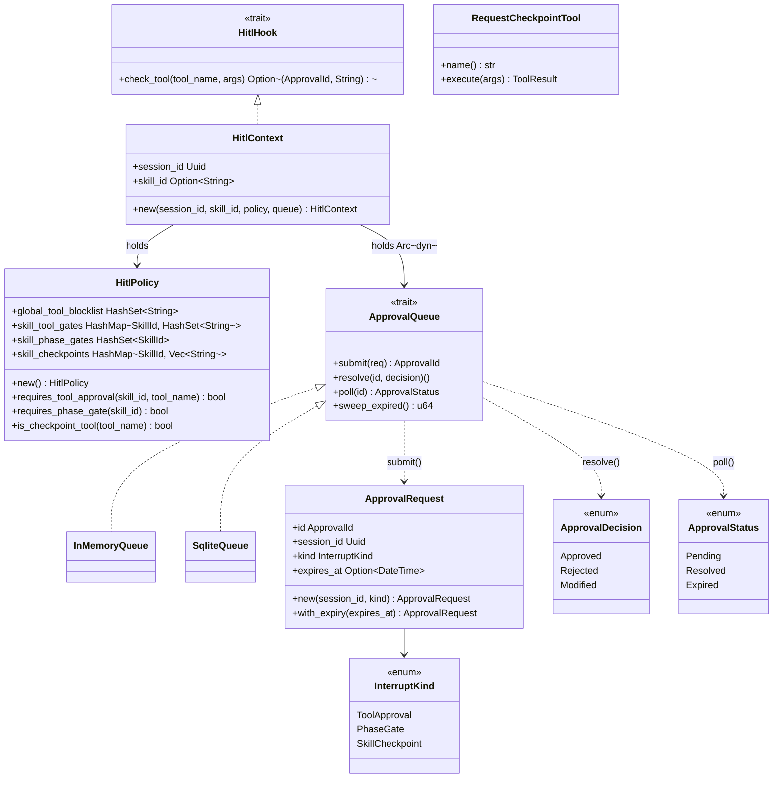

# HITL

## Purpose

`avs-hitl` owns the human-in-the-loop approval contract: the types, policy,
and durable queue that let an agent pause mid-execution and wait for an
out-of-band human decision instead of running to completion unattended. It
covers two distinct concerns declared in the HITL design spec (untracked):
Type 1 "security HITL" (a fixed, system-owned blocklist of dangerous tool
calls) and Type 2 "workflow HITL" (business-process gates a skill author
declares — phase-boundary sign-off and named mid-skill checkpoints). It
exists as its own crate, at the bottom of the dependency graph alongside
`avs-session` and `avs-memory` (`scripts/check-layering.sh` places
`agentverse-hitl` in Layer 1), so that every consumer — `avs-agent`,
`avs-guardrails`, `avs-tools` — can depend on the approval contract without
`avs-hitl` depending back on any of them. `avs-hitl` does not execute or
resume anything itself; it only decides *whether* a call needs approval and
records the outcome once one arrives.

## Position in the System

`avs-hitl` consumes only `avs-core` (`agentverse`), for the `HitlHook` trait
and `HitlInterrupt`/`ApprovalId` types that keep the approval contract
decoupled from `RunStrategy`'s signature — this is the one adapter boundary
the crate crosses. Three crates consume `avs-hitl` directly: [Tools](tools.md)
(`avs-tools`)'s `ToolRegistry::execute_many_hitl` takes a
`&Arc<dyn agentverse::hitl::HitlHook>` and returns `HitlInterruptResult` on
interception; [Guardrails](guardrails.md) (`avs-guardrails`)'s deprecated
`ActionGuard` remains only as a compatibility API and is not part of the
runtime interception path; and [Agent](agent.md)
(`avs-agent`) is the top-level orchestrator — it holds a `HitlConfig`
(`HitlPolicy` + `Arc<dyn ApprovalQueue>`), constructs a `HitlContext` per
invocation, and drives the persistence and resume machinery that lives in
`avs-agent`'s own `agent/resume.rs` and `agent/routing.rs` (see
[Agent](agent.md)'s Runtime Flows for that side of the handoff — it is not
repeated here). `avs-hitl` itself never touches [Session](session.md)
(`avs-memory`'s session store) or the strategy loop in [Strategy](strategy.md)
directly; it only produces the data (`ApprovalRequest`, `InterruptKind`,
approval IDs) that those crates persist and act on.

## Architecture

`HitlPolicy` (`avs-hitl/src/policy.rs`) is the immutable, three-tier ruleset
described in the design spec: Tier 1, `global_tool_blocklist`, is populated
by `HitlPolicy::new()` with a fixed default set (`file_delete`,
`exec_command`, `system_shutdown`, `database_delete`) and always wins; Tiers
2/3, `skill_tool_gates`/`skill_phase_gates`/`skill_checkpoints`, start empty
under `Default` and are additive on top of Tier 1. `requires_tool_approval`
checks the blocklist first, then the skill-scoped gate map only if a
`skill_id` is given. `HitlPolicy::from_system_skills` builds all three tiers
from a caller-selected trusted collection. `SkillConfig::load` supplies that
collection to `AgentBuilder` as a synchronous snapshot captured after loading
`system/` and before loading or applying any `user/` shadows. When no explicit
`HitlConfig` was supplied, the builder installs the resulting policy with an
`InMemoryQueue` only if the snapshot declares at least one `hitl_tools`,
`phase_gate`, or `checkpoints` value. Ordinary configured skills therefore do
not activate the Tier 1 blocklist by themselves. An explicit `with_hitl`
configuration remains authoritative and is used unchanged. `ApprovalQueue`
(`avs-hitl/src/queue.rs`) is the four-method durable-storage trait —
`submit`, `resolve`, `poll`, `sweep_expired` — with two implementations:
`InMemoryQueue` (`avs-hitl/src/memory.rs`, a `Mutex<HashMap<ApprovalId,
Entry>>`, non-durable, used in tests/examples) and `SqliteQueue`
(`avs-hitl/src/sqlite.rs`, backed by a `hitl_approvals` table via `sqlx`,
running its own `sqlx::migrate!` on construction). Both implementations
record the same `agentverse::metrics` calls (`record_approval_event`,
`approvals_pending_delta`) on submit/resolve/expire, so queue choice doesn't
change observability. `HitlContext` (`avs-hitl/src/context.rs`) is the sole
implementor of `avs-core`'s `HitlHook` trait shipped in this crate: its
`check_tool` first checks whether the call is to the special
`request_checkpoint` tool (via `HitlPolicy::is_checkpoint_tool`) — if so it
always intercepts as `InterruptKind::SkillCheckpoint`, regardless of policy —
otherwise it consults `HitlPolicy::requires_tool_approval` for an
`InterruptKind::ToolApproval`. On a policy hit it builds an `ApprovalRequest`
and calls `self.queue.submit`; if the queue itself fails, `check_tool` still
returns `Some` with a freshly generated sentinel `ApprovalId` that was never
inserted into the queue — a deliberate fail-safe documented at the call site,
so a queue outage blocks the tool call rather than silently letting it
through, and any resume attempt against that sentinel ID surfaces
`HitlError::NotFound` to make the outage visible. `RequestCheckpointTool`
(`avs-hitl/src/checkpoint.rs`) is a normal `agentverse::Tool` implementation
whose `execute` body is a fallback that should never run in production — the
whole point of `request_checkpoint` is that `HitlContext::check_tool`
intercepts it before the tool registry ever calls `execute`.

## Runtime Flows

`ActionGuard` is deprecated. When HITL is configured, the supported default
agent runtime path is `Agent::invoke` constructing a `HitlContext`, ReAct
passing its `HitlHook` to `ToolRegistry::execute_many_hitl`, and `avs-agent`
persisting any resulting interrupt for resume.

**Tool-call gate fires mid-invoke (ties into [Agent](agent.md)'s `invoke`):**
1. `avs-react`'s `ReActStrategy::run_hitl` dispatches tool calls via
   `ToolRegistry::execute_many_hitl(calls, &hook)` instead of
   `execute_many`, where `hook` is the `Arc<dyn HitlHook>` `Agent::invoke`
   built from a `HitlContext`.
2. `execute_many_hitl` calls `hook.check_tool` for every call before
   executing any of them; the first `Some((approval_id, kind_json))` short-
   circuits the whole batch (all-or-nothing) and returns
   `Err(HitlInterruptResult)` up through the strategy as
   `StrategyOutcome::Interrupted(HitlInterrupt)`.
3. `Agent::handle_tool_interrupt` (`avs-agent/src/agent/resume.rs`) decodes
   `HitlInterrupt::kind_json` back into an `avs-hitl::InterruptKind`,
   persists an `agentverse_session::InterruptedState` (`PendingCheckpoint`
   for `SkillCheckpoint`, `PendingToolCall` otherwise) via
   `sessions.set_interrupted_state` — see [Session](session.md) for that
   store — marks the session `Interrupted`, and returns
   `AgentOutput::Interrupted { approval_id, kind }` to the caller.
4. Out-of-band, whatever channel the deployed `ApprovalQueue` represents
   (console prompt, Slack, webhook — the framework ships only `InMemoryQueue`
   and `SqliteQueue`) calls `ApprovalQueue::resolve(approval_id,
   ApprovalDecision)`, transitioning the stored entry from `Pending` to
   `Resolved`.
5. The caller invokes `Agent::resume(user_id, session_id, approval_id,
   decision)`; `avs-agent` reloads the `InterruptedState`, checks the
   `approval_id` matches, clears the state, and — for `PendingToolCall`/
   `PendingCheckpoint` — executes the pending calls directly (bypassing
   `HitlHook` a second time, since they already cleared it once) and
   re-submits the augmented history to `strategy.run_hitl`, which may
   interrupt again. Full detail is [Agent](agent.md)'s `resume` flow.

**Phase gate at a skill boundary:**
1. `Agent::advance_phase` (`avs-agent/src/agent/routing.rs`) parses a
   `NEXT_SKILL:`/`SUMMARY:` transition out of the model's output and, before
   applying it, checks `HitlPolicy::requires_phase_gate` against the
   session's current skill.
2. If the gate applies, it submits an `ApprovalRequest` with
   `InterruptKind::PhaseGate { from_skill, to_skill, deliverable }` directly
   to the `ApprovalQueue` (no `HitlHook` involved — phase gates are checked
   by `avs-agent`'s routing code, not intercepted by a tool call), persists
   `InterruptedState::PendingPhaseGate`, marks the session `Interrupted`, and
   returns `PhaseAdvanceResult::Pending { approval_id }` instead of applying
   the transition.
3. On `resume` with `Approved`/`Modified`, `avs-agent` applies the skill
   transition it had already parsed; on `Rejected`, the session stays on its
   current skill and the rejection reason is returned as `AgentOutput::Done`.

**`sweep_expired` (background reaping of stale approvals):**
1. `avs-agent`'s `HitlSweepWorker` (one of three supervised background
   workers `AgentBuilder::build` spawns when `HitlConfig` is present) calls
   `queue.sweep_expired()` once per tick.
2. Both `InMemoryQueue` and `SqliteQueue` scan for entries still `Pending`
   whose `ApprovalRequest::expires_at` is in the past, flip their status to
   `Expired`, and record one `ApprovalEvent::Expired` metric plus a negative
   `approvals_pending_delta` per entry swept.
3. An expired approval is not resolved as `Rejected` by the queue itself —
   it becomes a terminal `ApprovalStatus::Expired` that a subsequent `resolve`
   or `poll` call will observe; no code path in `avs-hitl` automatically
   drives the owning session out of `Interrupted` when this happens (see
   Implementation Notes).

## Key Decisions

### Typed `HitlInterrupt`/`StrategyOutcome` transport replaces the base64 error-channel encoding
- **Decision** — the interrupt payload (`ApprovalId`, `kind_json`, message
  history, pending tool calls, active tool names) crosses from `avs-react`
  into `avs-agent` as the typed `agentverse::hitl::HitlInterrupt` struct
  inside `StrategyOutcome::Interrupted`, not as a colon-delimited,
  base64-encoded string smuggled through `AgentError`.
- **Context** — PR #20's original implementation encoded the interrupt as a
  hand-rolled base64 string carried through the error channel (its body
  describes `ReActStrategy::run_hitl` encoding "history + pending calls into
  [the] error message"). PR #24 (commit `5476582`) consolidated the three
  independent hand-rolled base64 encodings across `avs-react`/`avs-agent`
  into one shared, fail-loud `HitlWire`/`HitlWireError` codec in `avs-core` —
  but that codec still overloaded the error channel to carry a
  successful-but-suspended result.
- **Alternatives rejected** — keeping `HitlWire` as a shared codec on top of
  the error channel was rejected: PR #26's body describes it and the
  now-unused `base64` workspace dependency as deleted outright, "fully
  superseded, not left as unused scaffolding."
- **Consequences** — `avs-hitl` itself is unaffected (it never touched the
  wire format), but every consumer matching on the interrupt path
  (`Agent::invoke`, `resume`, `ReActStrategy::run_hitl`) now matches
  `StrategyOutcome`/`HitlInterrupt` fields directly; PR #26 adds new tests
  asserting the `Interrupted` path in both `avs-react` and `avs-agent`
  because, per the PR body, the typed-transport work "found a design-spec
  requirement [the] plan had omitted."
- **Ref** — 2026-07-04, PR #26.

### Durable suspend/resume over blocking waits
- **Decision** — a HITL gate suspends execution by persisting
  `InterruptedState` to the session store and returning control to the
  caller (`AgentOutput::Interrupted`), rather than blocking the invoking
  task until an approval arrives.
- **Context** — the HITL design spec (untracked) frames this as a
  requirement from the start: approval workflows are business-process steps
  that can take hours or days (invoice sign-off, compliance review), and the
  prior `ActionGuard` MVP's auto-approve stub was explicitly called out as
  insufficient for real workflows.
- **Alternatives rejected** — an in-process blocking wait (e.g. an mpsc
  channel held open until resolution) was the shape of the pre-PR-#20
  `ActionGuard` stub; PR #20's body describes replacing it with wiring to a
  real `ApprovalQueue` as one of its changes, not merely extending the stub.
- **Consequences** — every gate type (tool approval, phase gate, checkpoint)
  round-trips through `agentverse_session::InterruptedState` and a distinct
  `resume` call; no HITL interrupt in this codebase holds a task or thread
  open while waiting.
- **Ref** — 2026-06-12, PR #20.

### Policy declared in SKILL.md frontmatter
- **Decision** — `hitl_tools`, `phase_gate`, and `checkpoints` are parsed
  from a skill's `[agentverse]` frontmatter by `avs-skill`'s parser
  (`parse_skill_file`) and carried as fields on the `Skill` struct, rather
  than being expressed only in application code that constructs a
  `HitlPolicy` by hand.
- **Context** — the HITL design spec (untracked) frames the three-tier
  policy (global blocklist, system-skill gates, ignored user-skill gates) as
  closing two attack vectors: a "removal attack" (a user skill weakening
  Tier 1/2 gates) and an "addition attack" (a user skill flooding the
  approval queue with spurious gates) — both premised on system-skill
  frontmatter being authoritative and user-skill frontmatter being inert for
  HITL purposes.
- **Alternatives rejected** — no PR or spec records an alternative to
  parsing these fields directly on `Skill`; PR #20 introduced the parser
  support for all three fields in a single commit alongside the rest of the
  HITL types.
- **Consequences** — runtime shadowing is unchanged: a same-ID user skill still
  replaces system instructions, documents, and tool declarations in the live
  registry. `SkillConfig`, however, retains the original system-slot skills in
  a separate construction-time snapshot. `AgentBuilder` passes only that
  snapshot to `HitlPolicy::from_system_skills`, so a user shadow cannot erase
  a system gate and user-only HITL fields cannot add one. The policy constructor
  intentionally trusts its input; callers that supply an explicit
  `with_hitl` configuration remain responsible for that policy.
- **Ref** — 2026-06-12, PR #20 (frontmatter parsing); 2026-06-13, PR #21
  (policy assembly in the example).

## Implementation Notes

- `HitlContext::check_tool`'s sentinel-ID fallback on queue-submit failure is
  a deliberate fail-closed choice: the tool is blocked either way, and the
  operator learns about the queue outage only indirectly, the next time
  someone tries to resolve that approval and gets `HitlError::NotFound`.
- `ApprovalQueue::sweep_expired`'s doc comment says it is "Called by
  `HitlSweepWorker`," matching the current `avs-agent` wiring. The comment
  predates PR #26's worker split and was not updated until this correction.
- Sweeping an approval to `Expired` does not, by itself, move the owning
  session out of `Interrupted` or clear its `InterruptedState` — that only
  happens when something calls `Agent::resume` against that approval and
  observes the `Expired` status via a subsequent `poll`. A session whose
  approval expired and is never resumed stays `Interrupted` indefinitely;
  no code path in `avs-hitl` or `avs-agent` currently reaps those sessions.
  (Future work, not yet scheduled.)
- `SqliteQueue::row_to_status` treats an unrecognized `status` column value
  as a hard `HitlError::Database` ("corrupt approval row"), and a `resolved`
  row whose `decision` JSON fails to parse falls back to a synthetic
  `Rejected { reason: "data integrity error: ..." }` rather than panicking or
  silently treating it as approved — both are fail-closed choices for
  reading corrupted state, not documented in any PR or spec.
- `execute_many_hitl` checks every call in a batch before executing any of
  them, so a single approval-requiring call in a multi-tool-call turn blocks
  the whole batch rather than executing the safe calls and leaving only the
  gated one pending.
- The trusted system snapshot is captured when `SkillConfig` is loaded and is
  read synchronously by `AgentBuilder::build`; construction never blocks on
  the live registry's Tokio `RwLock`. Skill hot-reload still replaces runtime
  routing content, but it does not mutate the already-built immutable HITL
  policy.

## Source Anchors

- `avs-hitl/src/lib.rs`
- `avs-hitl/src/types.rs`
- `avs-hitl/src/policy.rs`
- `avs-hitl/src/queue.rs`
- `avs-hitl/src/memory.rs`
- `avs-hitl/src/sqlite.rs`
- `avs-hitl/src/context.rs`
- `avs-hitl/src/checkpoint.rs`
- `avs-hitl/src/error.rs`
- `avs-core/src/hitl.rs`
- `avs-skill/src/registry.rs`
- `avs-skill/src/config.rs`
- `avs-agent/src/agent/builder.rs`
- `avs-hitl/` (crate)

## Related Pages

- [Agent](agent.md)
- [Strategy](strategy.md)
- [Session](session.md)
- [Memory](memory.md)
- [Tools](tools.md)
- [Guardrails](guardrails.md)
- [Skill](skill.md)
- [Eval and Test Infra](eval-and-test-infra.md)
- [Observability](observability.md)
