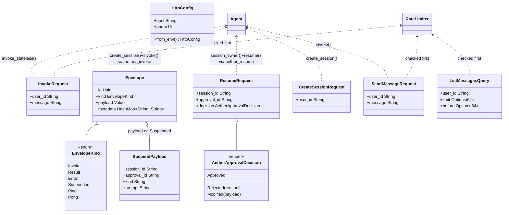

# HTTP Sidecar

## Purpose

`avs-agent`'s optional `http` feature is an axum-based HTTP surface that turns
a running `Agent` into a network service: stateless single-turn invocation
(`POST /invoke`), per-user session CRUD and message history, health/readiness
probes, and an inbound Aether adapter (`/aether/invoke`, `/aether/resume`)
that lets an external Aether-compatible orchestrator drive a session through
a shared `Envelope` wire format — including suspending on a HITL interrupt
and resuming it later. `POST /invoke` remains genuinely stateless
(`invoke_stateless`); `/aether/invoke` is not — it creates and drives a real
session so that a `Suspended` envelope has a session to resume. It
lives inside `avs-agent` rather than as a standalone crate or binary because
it has nothing to serve without an already-constructed `Agent` —
`AgentBuilder::with_http_server()` only sets a flag, and the axum listener is
spawned from inside `AgentBuilder::build()` once the `Agent` already exists as
an `Arc`, so the sidecar's runtime lifetime is strictly bounded by the
agent's. Both the compile-time (`#[cfg(feature = "http")]`) and runtime
(`with_http_server()` must be called explicitly) gates are opt-in: an `Agent`
built without either exposes no network surface at all.

## Position in the System

The `http` feature is not a separate crate — it is an optional compile-time
feature of `avs-agent` itself, declared in `avs-agent/Cargo.toml`
(`http = ["dep:axum", "dep:tower", "dep:tower-http",
"dep:agentverse-guardrails"]`) and gated behind `#[cfg(feature = "http")] mod
http;` in `avs-agent/src/lib.rs`. Enabling it adds exactly one workspace
dependency beyond what [Agent](agent.md) already needs:
[Guardrails](guardrails.md) (`agentverse-guardrails`, for `RateLimiter`) — per
`scripts/check-layering.sh`, `agentverse-agent` remains alone in Layer 4
regardless, since `avs-guardrails` is already a Layer 2 dependency of the
crate. The module also reaches into its own crate's `Agent`/`AgentError`
(`avs-agent/src/agent/mod.rs`) for every route handler, and into
[Session](session.md)'s `agentverse_session::SessionMemoryError` to translate
storage errors into HTTP status codes. Nothing in the workspace's library
graph consumes `avs-agent::http` — the module is declared `mod http;`, not
`pub mod http;`, so it has no visibility outside the crate at all. It is
reached only through `AgentBuilder::with_http_server()`
(`avs-agent/src/agent/builder.rs`), which in turn only `examples/http-agent`
calls.

## Architecture

The module splits across eight files under `avs-agent/src/http/`. `mod.rs`
holds `build_router` (assembles the axum `Router`), `spawn_server` (the entry
point `AgentBuilder::build` calls), and the startup security guard
(`validate_bind_security`, `is_loopback_host`, `api_key_configured`).
`config.rs` defines `HttpConfig` (`host`/`port`, populated from `HOST`/`PORT`
env vars by `from_env`, defaulting to `0.0.0.0:3000`). `auth.rs` defines
`auth_middleware`, an axum `middleware::from_fn` handler that gates every
route behind a bearer token when one is configured. `envelope.rs` defines the
`Envelope`/`EnvelopeKind` pair plus the aether suspend/resume wire types
(`SuspendPayload`, `AetherApprovalDecision`, `ResumeRequest`). `routes.rs`
holds the non-session, non-aether handlers — `health`, `ready`, `invoke`
(stateless) — and `InvokeRequest`. `aether.rs` holds the Aether adapter:
`aether_invoke` and `aether_resume` (the two route handlers), and their
shared helpers `finish` (maps an `AgentOutput` to a response `Envelope`),
`map_decision` (`AetherApprovalDecision` → `agentverse_hitl::ApprovalDecision`),
`interrupt_to_kind_and_prompt` (renders an `InterruptKind` into the
`SuspendPayload`'s `kind`/`prompt` strings), and `error_envelope`. Commit
`69b7150` split this module out of `routes.rs` after a merge with main (PR
#32's `aether_invoke` rework) pushed `routes.rs` past the workspace's 600-line
file-size cap; the same commit made `finish`/`error_envelope` thread the
caller's `metadata` onto every response envelope. `session_routes.rs` holds the five session-lifecycle
handlers (`create_session`, `send_message`, `list_messages`, `get_session`,
`end_session`) and their request/query types, plus `store_err_status`, which
maps `SessionMemoryError` variants to HTTP status codes shared by several
handlers. `openapi.rs` holds `openapi_json`, a hand-written OpenAPI 3.1 document served at
`/openapi.json`.

`build_router` constructs one `Arc<RateLimiter>` (`RateLimiter::new(100,
60)`, from [Guardrails](guardrails.md)) and attaches it as an
`axum::Extension` shared across the whole router. Routes are declared twice:
once nested under `/v1` (`v1_router`, itself nesting `v1_session_router`
under `/sessions`), and again at the router root for backward compatibility
(`/health`, `/ready`, `/invoke`, `/aether/invoke`, `/aether/resume`, plus
`/openapi.json` which exists only at the root). Both trees share the same handler functions and
both take `State<Arc<Agent>>` directly — there is no intermediate
`AppState`/`SessionState` wrapper struct. Three layers wrap the whole router,
applied in this order: `Extension(rate_limiter)`, then
`CorsLayer::permissive()`, then `middleware::from_fn(auth::auth_middleware)`.

## Runtime Flows

**Startup: `with_http_server()` → `spawn_server` lifecycle:**
1. `Agent::builder(...).with_http_server()` only sets
   `AgentBuilder.enable_http_server = true`; no I/O happens yet.
2. `AgentBuilder::build()` constructs the `Agent`, wraps it in `Arc`, calls
   `spawn_background_workers`, and only then — behind `#[cfg(feature =
   "http")]` and gated on `enable_http_server` — calls
   `crate::http::spawn_server(Arc::clone(&agent))`.
3. `spawn_server` reads `HttpConfig::from_env()` and the `API_KEY`/
   `ALLOW_INSECURE` env vars, then calls `validate_bind_security`
   synchronously; a violation panics immediately, before `build()` returns —
   a fatal HTTP configuration error surfaces at agent-construction time, not
   on the first incoming request.
4. `build_router(agent)` assembles the `Router`; `spawn_server` then
   `tokio::spawn`s a task that binds a `TcpListener` (panicking on a bind
   failure) and runs `axum::serve(listener, router)`. `spawn_server` itself
   returns immediately, so `AgentBuilder::build()` hands back a live
   `Arc<Agent>` while the listener keeps running in the background for as
   long as the process holds that `Arc` and the tokio runtime is alive.

**A request through a session route → `Agent::invoke` → response:**
1. `POST /v1/sessions/:session_id/messages` dispatches to `send_message`,
   which pulls `Extension<Arc<RateLimiter>>` and calls
   `limiter.check(&req.user_id)` before touching the request body; a
   rate-limit error short-circuits with `StatusCode::TOO_MANY_REQUESTS`.
2. An empty `message` (after `.trim()`) returns `StatusCode::BAD_REQUEST`;
   otherwise `send_message` calls `agent.invoke(&req.user_id, session_id,
   &req.message)` — [Agent](agent.md)'s full turn-taking path (skill
   routing, memory assembly, strategy execution, HITL interception if
   configured).
3. `Ok(reply)` maps to `200 OK` with `{ session_id, reply }`. `Err(AgentError)`
   is matched by variant: `AgentError::Session` goes through
   `store_err_status` (`SessionMemoryError::NotFound` → `404`, `Database` →
   `500`), `AgentError::Llm` → `502 BAD_GATEWAY`, `AgentError::Skill`/
   `AgentError::Json` → `500`.
4. The stateless sibling (`POST /invoke` → `invoke` in `routes.rs`) runs the
   same rate-limit-then-empty-check sequence but calls
   `agent.invoke_stateless(&request.message)`, skipping session/memory/skill
   context entirely — this is the sidecar's only genuinely stateless request
   path (see Key Decisions for why `/aether/invoke` is not another one).

**Aether adapter: `/aether/invoke` → `Suspended` → `/aether/resume` (`aether.rs`):**
1. `aether_invoke` rejects any envelope whose `kind != EnvelopeKind::Invoke`
   with `400`, then derives the session owner from `env.metadata["user_id"]`
   (default `"aether"`) — never a trusted caller identity, since the Aether
   wire format carries no auth of its own. It never consults the
   `RateLimiter` (unlike `invoke` and `send_message`).
2. It calls `agent.create_session(&owner)`, then `agent.invoke(&owner,
   session_id, &input)` — the full session-aware turn-taking path, not
   `invoke_stateless`. A `create_session` failure short-circuits through
   `error_envelope` before `invoke` is ever called.
3. On `Ok(out)`, `finish` maps the `AgentOutput` to a response `Envelope`,
   echoing the request's `id`/`metadata`: `Done(text)` best-effort ends the
   session (`agent.end_session`, result ignored) and returns
   `EnvelopeKind::Result{output: text}`; `Interrupted{approval_id, kind}`
   leaves the session alive and returns `EnvelopeKind::Suspended` carrying a
   `SuspendPayload` built by `interrupt_to_kind_and_prompt`. On `Err(e)`,
   `aether_invoke` itself (not `finish`) best-effort ends the session and
   returns an `EnvelopeKind::Error` via `error_envelope`.
4. The Aether orchestrator surfaces the `Suspended` envelope's `prompt` for a
   human decision, then `POST`s a `ResumeRequest` to `/aether/resume`.
   `aether_resume` parses `session_id`/`approval_id` as UUIDs (`400` on
   failure) and resolves the owner via `agent.session_owner` (`404` if the
   session doesn't exist) rather than trusting any field on the request —
   `ResumeRequest` carries no user field at all. `map_decision` converts the
   wire-level `AetherApprovalDecision` to `agentverse_hitl::ApprovalDecision`,
   and `agent.resume(&owner, session_id, approval_id, decision)` runs through
   the same `finish` as step 3, so a resume can itself return another
   `Suspended` envelope on a second interrupt. Unlike `aether_invoke`,
   `aether_resume` has no request envelope to echo `metadata` from, so its
   response carries an empty `metadata` map.

**Auth decision: `API_KEY` / `ALLOW_INSECURE` / loopback rule:**
1. At startup, `spawn_server` calls `validate_bind_security(host,
   api_key_set, allow_insecure)`: it returns `Ok(())` immediately if
   `api_key_set`, `allow_insecure`, or `is_loopback_host(host)` is true, and
   otherwise returns an `Err` that `spawn_server` turns into a panic — a
   non-loopback bind cannot start without an explicit `API_KEY` or
   `ALLOW_INSECURE=true`.
2. `is_loopback_host` treats `"localhost"` (case-insensitively) and any
   address whose `IpAddr::is_loopback()` is true as loopback; an unparseable
   hostname is conservatively treated as non-loopback.
3. `api_key_configured` (startup guard) and `get_api_key` (per-request check,
   `auth.rs`) both apply the same rule independently: `API_KEY` counts as set
   only if present and non-empty after `.trim()`, so `API_KEY=""` behaves as
   unset in both places.
4. Per request, `auth_middleware` — installed as the outermost of the three
   router layers — reads `get_api_key()` (cached in a `OnceLock`, read once
   per process): if a key is configured, the `Authorization` header must be
   exactly `Bearer <key>` (trimmed) or the request gets `401 UNAUTHORIZED`
   before reaching routing; if no key is configured, every request passes
   through unauthenticated.

## Key Decisions

Newest first.

### `GET /sessions/:id/messages` returns `content: Vec<ContentBlock>`, not a flat string — a deliberate breaking change
- **Decision** — `list_messages` now serializes `msg.content` directly, which
  is a `Vec<ContentBlock>` (tagged block objects — `{"type":"text",...}` /
  `{"type":"tool_use",...}` / `{"type":"tool_result",...}`, see
  [Core Runtime](core-runtime.md)) — not the flat string the endpoint
  returned before.
- **Context** — the doc comment above the `content` field in
  `session_routes.rs` states this directly: `content` "is a
  `Vec<ContentBlock>`... not a flat string, as of the native tool-calling
  refactor — a deliberate 'clean break' API shape change, not an oversight,"
  citing the native-tool-calling HTTP design doc (untracked) for the full
  rationale.
- **Alternatives rejected** — none recorded in the cited source; the comment
  states the break was chosen deliberately but does not enumerate rejected
  alternatives.
- **Consequences** — any client parsing this endpoint's `content` field as a
  string breaks and must switch to reading the tagged block array; no
  versioned route split or content-negotiation was added, so `/v1/sessions/:id/messages`
  and its unversioned alias both return the new shape unconditionally.
- **Ref** — 2026-08-02, commit `a3ea41d`, PR #35 (`avs-agent/src/http/session_routes.rs`).

### Session-based Aether suspend/resume replaces the stateless `/aether/invoke` stub; new `/aether/resume`
- **Decision** — `/aether/invoke` now calls `agent.create_session(&owner)`
  then `agent.invoke(&owner, session_id, &input)` — the full HITL-capable
  turn-taking path — instead of `invoke_stateless`; a new `POST /aether/resume`
  accepts a `ResumeRequest` and calls `agent.resume`, closing the round-trip
  for a `Suspended` envelope.
- **Context** — per PR #34's summary, this "closes the HTTP-translation gap
  in the Aether durable-executions design (§9.1)," exposing "AgentVerse's
  existing agent-level HITL suspend/resume over the built-in HTTP server, so
  an Aether orchestrator can drive a remote agent that pauses for human
  approval and resumes from the exact checkpoint." The PR body describes the
  prior `/aether/invoke` as "the old `invoke_stateless` stub that errored on
  any interrupt."
- **Alternatives rejected** — none recorded; the PR body describes the
  rework directly rather than weighing alternatives.
- **Consequences** — owner/security model, quoted from the PR body: "**Invoke**
  owner = `metadata["user_id"]` if present, else `"aether"`." / "**Resume**
  owner is resolved from the stored session via `session_owner`, so
  `Agent::resume`'s internal `assert_owner` is a guaranteed-pass no-op — a
  forged `session_id` for a session the caller doesn't own still fails the
  existing not-found checks." A four-fixture golden-fixture drift guard under
  `avs-agent/tests/fixtures/` keeps this crate's wire types byte-identical to
  a separate `aether-core` repo's copies (Implementation Notes).
- **Ref** — 2026-07-19, PR #34 (commits `9ee9833`, `dedc23a`; file layout
  reconciled in `69b7150`).

### Fail-closed non-loopback bind; empty `API_KEY` counts as unset everywhere
- **Decision** — `validate_bind_security` refuses to start the server on a
  non-loopback host unless `API_KEY` is non-empty or `ALLOW_INSECURE=true`
  is set; `api_key_configured` and `get_api_key` both treat a present-but-empty
  or whitespace-only `API_KEY` as unset.
- **Context** — the 2026-07-02 architecture-review design spec's "Secure-by-default
  HTTP" section specifies exactly this rule: "If bind host is non-loopback
  **and** `API_KEY` is unset **and** `ALLOW_INSECURE != "true"` → panic at
  startup with an actionable message," plus "Loopback detection: parse host
  as `IpAddr` and use `is_loopback()`; treat `"localhost"` as loopback;
  unparseable hostnames are treated as non-loopback (conservative)." PR #24's
  body adds the empty-key motivation: "empty `API_KEY` now counts as unset in
  both the guard and the auth middleware (previously `API_KEY=""` half-enabled
  auth that `Bearer ` bypassed)."
- **Alternatives rejected** — none recorded.
- **Consequences** — `HttpConfig::from_env`'s default host is `0.0.0.0`
  (non-loopback), so out of the box `spawn_server` panics unless an operator
  sets `API_KEY`, `ALLOW_INSECURE=true`, or binds explicitly to a loopback
  `HOST`; PR #24's Breaking-changes section lists exactly this: "HTTP
  sidecar refuses unauthenticated non-loopback binds".
- **Ref** — 2026-07-03, PR #24 (commit `9cb41d6`).

### `/v1`-prefixed routes with backward-compatible root aliases; per-user rate limiting; `/openapi.json`
- **Decision** — `build_router` registers every route twice: nested under
  `/v1` and again at the router root, sharing the same handlers; a shared
  `Arc<RateLimiter>` is attached as a router-wide `Extension` and checked
  first by `invoke`, `send_message`, and `list_messages`; a hand-written
  OpenAPI 3.1 document is served at `/openapi.json`.
- **Context** — PR #22's body lists this as one of its architecture changes:
  "HTTP API: `/v1` prefix with backward-compat root aliases, 429 rate
  limiting, `/openapi.json` endpoint" and "Session routes: `list_messages`
  handler; `send_message` enforces rate limit."
- **Alternatives rejected** — none recorded.
- **Consequences** — the versioned and legacy route trees are two separate
  `Router` values built from identical `.route(...)` calls rather than one
  tree mounted at two paths, so adding a new route while preserving the root
  alias means updating both call sites in `build_router`; a rate-limited
  request returns `429` before the request body is validated or the `Agent`
  is touched at all.
- **Ref** — 2026-06-14, PR #22 (commits `34a80d9`, `6b3d731`).

### `avs-server` absorbed into `avs-agent`'s `http` feature; the `Agent` owns the sidecar
- **Decision** — the standalone `avs-server` binary crate is deleted; all
  HTTP capability moves into `avs-agent/src/http/` behind the optional `http`
  Cargo feature, route handlers take `State<Arc<Agent>>` directly, and the
  server is spawned from inside `AgentBuilder::build()` — after the `Agent`
  already exists as an `Arc` — rather than the reverse.
- **Context** — the commit's own message states the change directly: "Routes
  now take `Arc<Agent>` directly as axum state (no `AppState`/`SessionState`
  wrappers). `avs-server` crate deleted; all HTTP capability lives in
  `avs-agent/src/http/` behind the optional `http` cargo feature." This is
  consistent with the http registry design spec (untracked)'s framing that
  "An agent runs without aether" — an `Agent` must be constructible and
  runnable with no HTTP surface at all, which the feature-gate plus explicit
  `with_http_server()` opt-in preserves.
- **Alternatives rejected** — none recorded; the commit describes the
  refactor directly rather than weighing options.
- **Consequences** — `spawn_server` has no lifecycle of its own: it is called
  exactly once, inside `build()`, after the `Agent` already exists, and
  returns immediately after handing a `tokio::spawn`ed task a clone of
  `Arc<Agent>`. Nothing in current source constructs the router or binds the
  listener independently of `AgentBuilder::build()`, so the sidecar cannot
  outlive or be built before its owning `Agent` — the spawned task holds only
  a strong `Arc` clone, keeping the `Agent` alive for as long as the listener
  runs, never the other way around.
- **Ref** — 2026-05-25, commit `2529eb3`.

### Aether inbound compatibility is envelope-only
- **Decision** — `/aether/invoke` accepts an `Envelope{kind: Invoke}` and
  returns an `Envelope{kind: Result | Error}` carrying the same `id` and
  `metadata`.
- **Context** — the endpoint is a compatibility boundary for callers that
  exchange Aether envelopes. It invokes the already-constructed `Agent`
  through `invoke_stateless`; no registry lifecycle client is part of this
  HTTP module.
- **Consequences** — both `/aether/invoke` and `/v1/aether/invoke` remain
  available. A successful invocation returns an `EnvelopeKind::Result`; an
  agent failure returns `500` with an `EnvelopeKind::Error`.
- **Ref** — `avs-agent/src/http/routes.rs` (`aether_invoke`).
- **Superseded for session-based invoke by PR #34 — see the newer entry above.**

## Implementation Notes

- Commit `6420a3f` removes the unused outbound Aether client and its optional
  `reqwest` dependency while retaining and directly testing the inbound
  legacy and `/v1` Aether-compatible routes.
- Layer order in `build_router` matters: `Extension(rate_limiter)` is applied
  first, then `CorsLayer::permissive()`, then
  `middleware::from_fn(auth::auth_middleware)` — the last `.layer()` call
  becomes the outermost layer in axum/tower's composition, so
  `auth_middleware` runs first on every request, ahead of CORS. A CORS
  preflight (`OPTIONS`) request with no `Authorization` header is therefore
  rejected with `401` by `auth_middleware` before `CorsLayer::permissive()`
  ever sees it, whenever `API_KEY` is set.
- `auth_middleware` is one blanket layer over the entire router — both the
  `/v1` and legacy route trees, plus `/openapi.json` — so `/health` and
  `/ready` are also gated behind the bearer token whenever `API_KEY` is set;
  there is no per-route auth exemption.
- `spawn_server` panics rather than returning a `Result` on a
  `validate_bind_security` failure or a `TcpListener::bind` failure; its own
  comment states the tradeoff: "Deliberate startup panic: `Agent::new` has no
  error channel (until the builder lands), and failing loudly beats silently
  serving unauthenticated." `AgentBuilder` has since landed (PR #26), but
  `spawn_server`'s panic-on-failure behavior was not revisited afterward.
- `auth.rs` opens with the header comment `// avs-server/src/auth.rs`, a
  leftover from before the `avs-server` → `avs-agent` absorption; the file no
  longer lives at that path.
- `list_messages`'s `before` cursor filters against `sequence_num`, an index
  computed by `enumerate()` over the full history returned by
  `agent.load_messages`, not a persisted column — pagination correctness
  depends on that method returning a stable, gap-free ordering across calls.
- PR #34's cross-repo wire-contract guard: four golden JSON fixtures under
  `avs-agent/tests/fixtures/` (`suspend_payload.json`,
  `resume_request_approved.json`, `resume_request_rejected.json`,
  `resume_request_modified.json`) are round-tripped by `envelope.rs`'s tests
  (`assert_fixture_roundtrip`) against `SuspendPayload`/`ResumeRequest`.
  Byte-identical copies live in a separate `aether-core` repo's own test
  suite, so a wire-shape change on either side fails that side's tests
  without the two repos sharing a build or a schema crate.

## Source Anchors

- `avs-agent/src/http/mod.rs`
- `avs-agent/src/http/auth.rs`
- `avs-agent/src/http/config.rs`
- `avs-agent/src/http/envelope.rs`
- `avs-agent/src/http/routes.rs`
- `avs-agent/src/http/aether.rs`
- `avs-agent/src/http/session_routes.rs`
- `avs-agent/src/http/openapi.rs`
- `avs-agent/src/agent/builder.rs`
- `avs-agent/Cargo.toml`
- `avs-agent/` (crate)

## Related Pages

- [Agent](agent.md)
- [Guardrails](guardrails.md)
- [Session](session.md)
- [Core Runtime](core-runtime.md)
