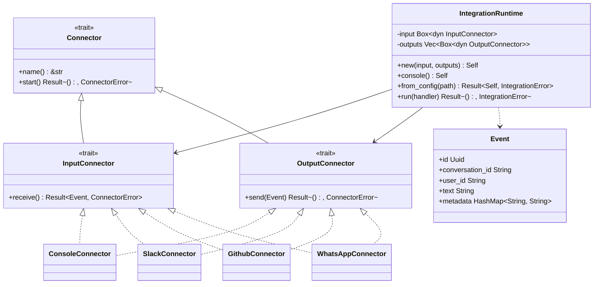

# Integration

## Purpose

`avs-integration` (crate `agentverse-integration`) is the platform I/O
layer: it normalizes inbound messages from external systems (Slack,
GitHub, WhatsApp, or a local console) into a single `Event` type, and
routes agent responses back out to one or more of those same platforms.
It exists as its own crate so an agent binary can swap or combine
platforms — Slack in, Slack and GitHub out — by editing a TOML config
file, without any platform-specific code inside the agent or strategy
layers. The crate owns connection lifecycle and wire-format translation
only; it has no knowledge of `RunStrategy`, tools, or memory — the caller
supplies a plain `async` handler closure that maps one `Event` to another.

## Position in the System

`agentverse-integration` sits in Layer 1 per `scripts/check-layering.sh`,
alongside `agentverse-hitl`, `agentverse-session`, and `agentverse-memory`.
Its `Cargo.toml` declares a dependency on [Core Runtime](core-runtime.md)
(`avs-core`, crate `agentverse`), but no file under `avs-integration/src`
references the `agentverse::` namespace (`grep -rn "agentverse::"
avs-integration/src` finds nothing) — the dependency is currently unused
by the crate's own code.

No workspace crate depends on `agentverse-integration`: it does not appear
as a dependency of [Agent](agent.md) (`avs-agent`) or any other layered
crate (`grep -rl agentverse-integration --include=Cargo.toml .` finds only
`avs-integration/Cargo.toml` itself and one example). The only consumer is
the `example-slack-hr-assistant` binary (`examples/slack-hr-assistant`),
which constructs an `agentverse_agent::Agent` independently and wires it to
`IntegrationRuntime::run` through a handler closure — the two are combined
only at the example's `main`, never inside either crate.

## Architecture

`Connector` is the base trait (`name`, plus an optional `start` lifecycle
hook that defaults to a no-op); `InputConnector` and `OutputConnector`
each extend it with one async method, `receive` and `send`. A concrete
type may implement one or both — `ConsoleConnector`, `SlackConnector`,
`GithubConnector`, and `WhatsAppConnector` all implement both, which lets
the same instance serve as input and output when wrapped in `Arc`
(`connector.rs` provides blanket `Connector`/`InputConnector`/
`OutputConnector` impls for `Arc<T>`). `Event` is the single normalized
message type: `conversation_id` carries the thread/channel identity an
output connector needs to route a reply, and platform-specific extras go
in `metadata`.

`IntegrationRuntime` is the crate's only orchestration type. It holds one
boxed `InputConnector` and a `Vec` of boxed `OutputConnector`s and offers
three constructors: `new` for explicit wiring (tests, programmatic use),
`console()` for a stdin/stdout-only runtime, and `from_config` for
TOML-driven wiring. Internally, `from_config`'s parsing path
(`from_parsed_config`) builds each `[connector.*]` section into a private
`BuiltConnector` enum (`Slack`/`Github`/`Whatsapp`, each wrapping an
`Arc<...Connector>`) keyed by name in a `HashMap`, resolves the
`[integration] input`/`outputs` names against that map, and calls
`BuiltConnector::input()`/`output()` to produce the trait objects
`IntegrationRuntime` stores — `BuiltConnector` never leaves `runtime.rs`.

`SlackConnector` and `GithubConnector` share one shape: each holds an
`mpsc::Sender<Event>`/`Mutex<mpsc::Receiver<Event>>` pair, and `start`
spawns an `axum::Router` with a single webhook route
(`/slack/events`, `/github/events`) that verifies an HMAC-SHA256 signature
(`verify_slack_signature`, `verify_github_signature`) before pushing a
parsed `Event` onto the channel; `receive` reads from that channel.
`WhatsAppConnector` implements both traits but every method returns
`ConnectorError::Connection("WhatsAppConnector is not yet implemented")` —
it is a stub with no working I/O.

## Runtime Flows

**`IntegrationRuntime` startup → connector event → agent handler →
response send** (the example-slack-hr-assistant path):
1. `IntegrationRuntime::from_config(config_path)` reads the TOML file. If
   it is missing, `from_config` returns `Self::console()` (a `ConsoleConnector`
   wrapped in `Arc` and boxed as both input and the sole output); if present,
   it deserializes an `IntegrationConfig` and calls `from_parsed_config`,
   which resolves each configured connector's secrets via `std::env::var`
   against the `*_env` field names in the TOML (e.g. `bot_token_env`) and
   fails with `IntegrationError::Config` on the first missing variable.
2. The caller calls `IntegrationRuntime::run(handler)`, where `handler` is
   an `async` closure `Fn(Event) -> Future<Output = Result<Event, E>>`. `run`
   first calls `self.input.start()` (a no-op for `ConsoleConnector`, an
   axum-server spawn for `SlackConnector`/`GithubConnector`), then loops.
3. Each iteration calls `self.input.receive()`. `Err(ConnectorError::Eof)`
   returns `Ok(())` (clean shutdown); any other `Err` returns
   `Err(IntegrationError::Input(..))` and stops the loop; `Ok(event)`
   proceeds.
4. `run` awaits `handler(event)`. In the example, the handler clones an
   `Arc<Agent>` and calls `agent.invoke_stateless(&event.text)`, mapping
   the agent's `AgentError` into the handler's own error type before
   returning a new `Event` with the answer in `text` and the rest of the
   original event's fields preserved via `..event`.
5. On `Ok(response)`, `run` calls `send` on every output connector in
   turn; a failed send is logged via `tracing::warn!` and skipped — it does
   not stop the loop or affect the other outputs. On `Err` from the
   handler itself, `run` logs and reads the next event instead of
   returning.

**Console fallback with no config file:**
1. `IntegrationRuntime::from_config` sees `std::io::ErrorKind::NotFound`
   from `tokio::fs::read_to_string` and returns `Self::console()`.
2. `ConsoleConnector::receive` flushes stdout (so a prompt appears before
   blocking), reads one line from a `Mutex<BufReader<Stdin>>`, and returns
   `ConnectorError::Eof` for a blank line (which `run` treats as clean
   shutdown, not an error to propagate).
3. `ConsoleConnector::send` writes `event.text` followed by a newline to
   stdout and flushes — the same handler code path used for Slack/GitHub
   output runs unchanged against the console.

**Slack event ingestion:**
1. `SlackConnector::start` spawns an `axum::Router` bound to the
   connector's configured `port`, routing `POST /slack/events` to
   `slack_event_handler`.
2. `slack_event_handler` calls `verify_slack_signature` against the
   `X-Slack-Request-Timestamp`/`X-Slack-Signature` headers and the raw
   body, returning `StatusCode::UNAUTHORIZED` on mismatch before any
   payload is parsed.
3. For a `type: "message"` event without a `bot_id` (filtering out the
   bot's own messages), it builds an `Event` and sends it on the
   connector's internal `mpsc` channel; `SlackConnector::receive` (called
   from the `IntegrationRuntime::run` loop) reads from the paired
   `Mutex<mpsc::Receiver<Event>>`.

## Key Decisions

Newest first.

### `IntegrationRuntime` replaces `Integration`/`AgentInvoker`/`StrategyInvoker` — agent owns the integration, not the other way around
- **Decision** — the runtime is a library the agent's `main` constructs
  and drives (`IntegrationRuntime::from_config` + `run(handler)`), instead
  of an `Integration` struct that owned an `AgentInvoker`/`StrategyInvoker`
  and drove the agent from inside its own loop.
- **Context** — the integration redesign spec (untracked,
  `2026-05-20-integration-redesign-design`) states the goal directly:
  "Invert the ownership of `avs-integration`: the agent starts, reads its
  integration config, and connects to external platforms. The integration
  layer is a library the agent uses, not a container that drives the
  agent."
- **Alternatives rejected** — the prior design (`Integration::new(input,
  invoker, outputs)` owning a boxed `AgentInvoker`, with a
  `StrategyInvoker<S: RunStrategy>` adapter bridging to `PlanStrategy`/
  `ReActStrategy`) is listed in the same spec under "What goes away," with
  no alternative retained.
- **Consequences** — `Integration`, `AgentInvoker`, `StrategyInvoker`, and
  `InvokerError` were deleted from the crate (commit `ca36025`) the same
  day `IntegrationRuntime` was added (commit `6def75d`); `IntegrationError`
  lost its `Invoker` variant, keeping only `Input` and `Output`. Callers
  now pass a plain closure to `run` instead of implementing a trait, and
  the crate has no compile-time link to any strategy type — `RunStrategy`
  (proposed in the prior, 2026-05-19 spec as a new `avs-core` trait for
  `StrategyInvoker` to bridge to) was never added.
- **Ref** — 2026-05-20, commits `6def75d` and `ca36025`.

### Console mode is an automatic, silent fallback rather than an explicit connector choice
- **Decision** — `IntegrationRuntime::from_config` falls back to
  `Self::console()` when the config file is not found, rather than
  requiring the caller to opt into console mode explicitly.
- **Context** — the integration redesign spec (untracked,
  `2026-05-20-integration-redesign-design`) defines three operating modes
  (console fallback, integration, Aether-managed) and states: "Config file
  found → integration mode ... Config file missing → console fallback
  (stdin/stdout)," with the same `from_config` call site used "whether
  running locally or in production."
- **Alternatives rejected** — none recorded.
- **Consequences** — a missing `agent.toml` is not an error; it is
  operationally indistinguishable from an explicit request for console
  mode. `ConsoleConnector` was added in commit `1b1679d`, and
  `ConnectorError::Eof` was added in commit `fe42c2d` specifically so
  `ConsoleConnector::receive` could signal end-of-input without the
  runtime treating it as a failure.
- **Ref** — 2026-05-20, commits `1b1679d` and `fe42c2d`.

### `IntegrationAdapter`/`WebhookAdapter` dropped in favor of platform-specific `Connector` implementations
- **Decision** — the crate's original `adapter.rs` (`IntegrationAdapter`
  trait) and `webhook.rs` (`WebhookAdapter`) were removed, replaced by the
  `Connector`/`InputConnector`/`OutputConnector` hierarchy and concrete
  per-platform types.
- **Context** — the integration redesign spec (untracked,
  `2026-05-19-integration-redesign`) lists this under "What Gets Dropped,"
  giving the reason for `WebhookAdapter` as "Duplicates `avs-server`; real
  platforms are their own connectors" and for `adapter.rs` as "Replaced by
  the `Connector` hierarchy."
- **Alternatives rejected** — none recorded.
- **Consequences** — `SlackConnector`, `GithubConnector`, and
  `WhatsAppConnector` each own their platform's wire format and transport
  directly (webhook verification, REST calls) instead of going through a
  generic adapter; `avs-server` remains untouched and unrelated, per the
  same spec's "What Is Unchanged" section.
- **Ref** — 2026-05-19, commit `02b78e1`.

## Implementation Notes

- Known debt: `WhatsAppConnector` is a stub. Every `InputConnector`/
  `OutputConnector` method returns `ConnectorError::Connection` with a
  "not yet implemented" message; it is exercised only by its own crate's
  tests (`avs-integration/tests/whatsapp_test.rs`) and is never constructed
  outside `avs-integration` except through `IntegrationConfig`'s
  `[connector.whatsapp]` section, which nothing in the workspace populates
  today.
- Known debt / unwired: no crate outside `avs-integration` itself depends
  on `agentverse-integration` (`grep -rl agentverse-integration
  --include=Cargo.toml .` finds only its own `Cargo.toml` and
  `examples/slack-hr-assistant/Cargo.toml`). `avs-agent`'s `Agent` has no
  method or field referencing `IntegrationRuntime`, `Connector`, or `Event`
  — the two are combined only in the example's `main`, by hand, via a
  closure. There is no reusable "wire an `Agent` to an `IntegrationRuntime`"
  helper anywhere in the workspace.
- `avs-integration/Cargo.toml` depends on `agentverse` (`avs-core`), but no
  source file under `avs-integration/src` references the `agentverse::`
  namespace — the dependency is currently unused by the crate's own code.
- `IntegrationRuntime::run`'s output fan-out is best-effort by design: a
  failed `OutputConnector::send` is logged via `tracing::warn!` and does
  not stop delivery to the remaining outputs, and does not stop the loop.
  A failed `InputConnector::receive` (other than `ConnectorError::Eof`)
  does stop the loop, returning `IntegrationError::Input`.
- `SlackConnector::start` and `GithubConnector::start` each call
  `.expect(...)` if `TcpListener::bind` or `axum::serve` fails inside their
  spawned task — a bind failure (e.g. port already in use) panics that
  background task rather than surfacing as a typed `ConnectorError`.
- `IntegrationConfig`'s TOML shape mirrors the field names in the
  integration redesign spec (untracked, `2026-05-20-integration-redesign-design`)
  exactly: `[integration] input`/`outputs`, and one `[connector.<name>]`
  section per platform with `*_env` fields naming — never containing —
  the environment variables that hold credentials.

## Source Anchors

- `avs-integration/src/lib.rs`
- `avs-integration/src/runtime.rs`
- `avs-integration/src/connector.rs`
- `avs-integration/src/event.rs`
- `avs-integration/src/config.rs`
- `avs-integration/src/console.rs`
- `avs-integration/src/slack.rs`
- `avs-integration/src/github.rs`
- `avs-integration/src/whatsapp.rs`
- `avs-integration/` (crate)

## Related Pages

- [Core Runtime](core-runtime.md)
- [Agent](agent.md)
