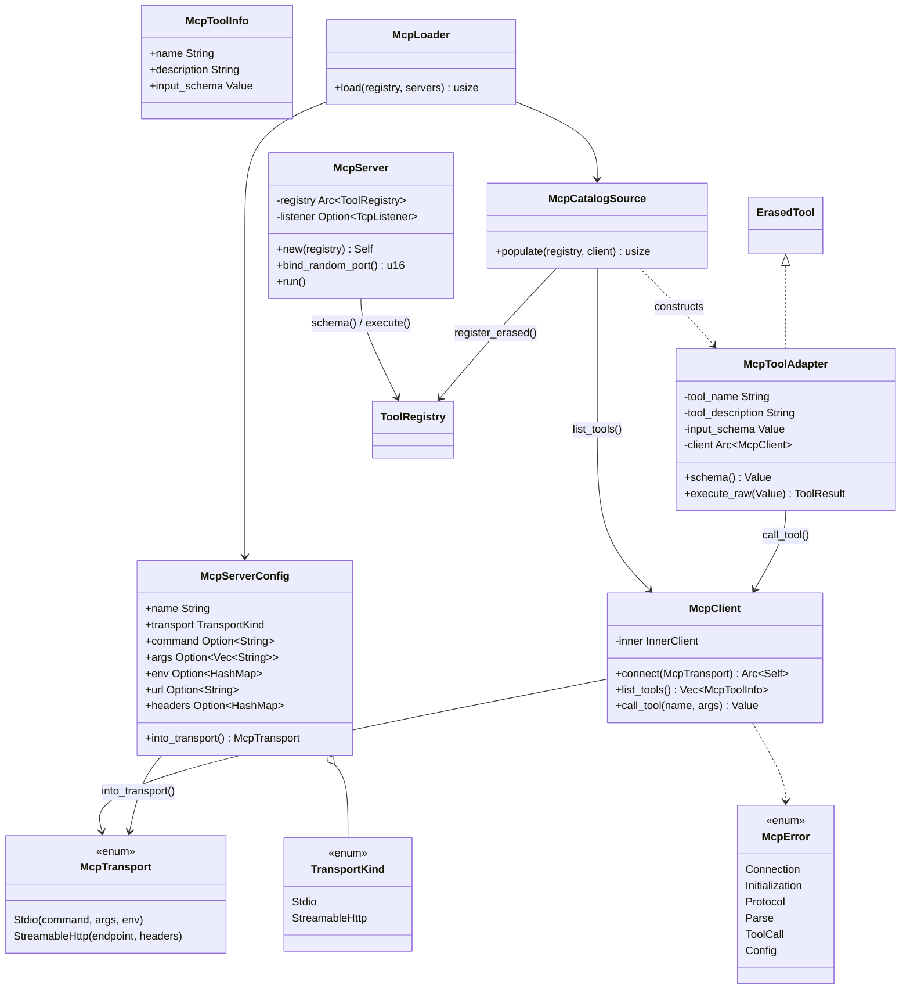

# MCP

## Purpose

`avs-mcp` (crate `agentverse-mcp`) implements both sides of the Model
Context Protocol: a client that connects to an external MCP server and
turns its tools into locally callable ones, and a server that exposes an
AgentVerse `ToolRegistry` as an MCP endpoint for external clients (Claude
Desktop, Cursor, VS Code, or another AgentVerse process) to call. It exists
as its own crate so that MCP's transport framing (stdio subprocess,
Streamable HTTP) and JSON-RPC method handling stay separate from
`avs-tools`' registry mechanics and `avs-core`'s `Tool` trait — this crate
is a protocol adapter, not a tool implementation. On the client side it
turns a remote tool into an `McpToolAdapter` that plugs into the same
`ToolRegistry` as any built-in tool, so a reasoning strategy runs against
MCP-sourced tools with no special-casing. On the server side it turns an
existing `ToolRegistry` into a spec-compliant MCP endpoint without
requiring the registry's own tools to know they are being served remotely.

## Position in the System

`avs-mcp` consumes [Core Runtime](core-runtime.md) (`avs-core`, via the
`agentverse` crate name) for `ErasedTool`, `ToolError`, and `ToolResult`,
and [Tools](tools.md) (`avs-tools`, via `agentverse_tools`) for
`ToolRegistry` and `ToolOptions` — `McpCatalogSource` registers adapters
into a registry via `ToolRegistry::register_erased`, and `McpServer` reads
a registry's `schema()` and drives its `execute()` to answer MCP requests.
It depends on nothing else in the workspace; it sits at the same
architectural layer as `avs-tools` and `avs-guardrails` per
`scripts/check-layering.sh`.

No non-example runtime crate currently depends on `agentverse-mcp` —
`avs-agent`, `avs-react`, `avs-strategy`, and the rest of the reasoning stack
are unaware MCP exists. The runtime-owned maintained call path is
`examples/mcp-demo`: it constructs `McpServerConfig` and calls
`McpLoader::load` to populate its client registry. `McpClient`,
`McpTransport`, and `McpCatalogSource` remain public for advanced callers
that need to manage connection or discovery themselves.

## Architecture

`McpTransport` (`transport.rs`) is a two-variant enum: `Stdio` (a command,
args, and env map for a subprocess) and `StreamableHttp` (a `reqwest::Url`
endpoint plus headers), corresponding to the two transports in the MCP
2025-03-26 specification. `McpClient` (`client.rs`) wraps either a
`reqwest::Client` or a pair of `Mutex`-guarded child `stdin`/`stdout`
handles behind a private `InnerClient` enum, and exposes only
JSON-RPC-shaped operations: `connect` (spawn or dial, then run the
`initialize`/`notifications/initialized` handshake), `list_tools`, and
`call_tool`. `McpToolAdapter` (`adapter.rs`) is the client-side bridge into
`avs-tools`: it implements `ErasedTool` directly — not `Tool` — because its
`schema()` returns the JSON the remote server supplied at discovery time
rather than one derived from a Rust `Args` type, and its `execute_raw`
forwards the raw `Value` straight to `McpClient::call_tool`.
`McpCatalogSource` (`catalog.rs`) is the glue that calls `list_tools` and
registers one `McpToolAdapter` per result into a `ToolRegistry` via
`register_erased`, tagged with `ToolOptions { category: Some("mcp"), .. }`.

`McpServer` (`server.rs`) is the reverse direction: it owns an
`Arc<ToolRegistry>` and an optional `TcpListener`, and its `run` serves a
single-route `axum::Router` (`POST /mcp`) whose handler dispatches on the
JSON-RPC `method` field to answer `initialize`, `notifications/initialized`,
`tools/list`, and `tools/call`. `McpServerConfig` and `TransportKind`
(`config.rs`) describe one `[[mcp_servers]]` TOML entry and convert it to
an `McpTransport` via `into_transport`, expanding `${VAR}` placeholders
from the process environment. `McpLoader` (`loader.rs`) iterates a slice of
`McpServerConfig`, connects an `McpClient` to each, and calls
`McpCatalogSource::populate` for each, summing the discovered tool count.
`McpError` (`error.rs`) is the crate's single error enum, covering
connection, handshake, protocol, parsing, tool-call, and config failures.

## Runtime Flows

**Client-side discovery: catalog → `McpToolAdapter` → `ToolRegistry`:**
1. `McpClient::connect(transport)` spawns a subprocess (`Stdio`) or holds a
   `reqwest::Client` and endpoint (`StreamableHttp`), then sends an
   `initialize` request (`protocolVersion: "2025-03-26"`) followed by a
   `notifications/initialized` notification.
2. `McpCatalogSource::populate(registry, client)` calls
   `client.list_tools()` (a `tools/list` JSON-RPC request) and, for each
   `McpToolInfo` returned, constructs an `McpToolAdapter` carrying the
   server-supplied `name`/`description`/`input_schema` and a shared
   `Arc<McpClient>`.
3. Each adapter is registered into the `ToolRegistry` via
   `register_erased` — not `register`, since `McpToolAdapter` has no static
   `Args` type for the blanket `Tool` → `ErasedTool` impl to apply to.
4. When a strategy calls the tool by name, `ToolRegistry::execute`
   dispatches to `McpToolAdapter::execute_raw`, which forwards the args to
   `McpClient::call_tool` (a `tools/call` request), extracts the first text
   content block from the response, and wraps any transport failure as
   `ToolError::Execution`.

**Server-side exposure: serving agent tools over MCP:**
1. `McpServer::new(registry)` wraps an existing `Arc<ToolRegistry>`;
   `bind_random_port` binds a `TcpListener` on `127.0.0.1:0`, and `run`
   serves it behind a single `POST /mcp` route (`handle_mcp`).
2. `handle_mcp` matches the request's `method` field: `initialize` returns
   `protocolVersion`/`capabilities`/`serverInfo`; `notifications/initialized`
   returns `204 No Content`; `tools/list` calls `registry.schema()`,
   filters out the entry named `find_tools`, and remaps each schema's
   `input_schema` key to `inputSchema`; `tools/call` reads
   `params.name`/`params.arguments` and calls `registry.execute(name,
   args)`, returning a `content` array with one text block on success or a
   JSON-RPC error object on failure.
3. A second `McpClient::connect` against that same endpoint runs the
   identical `initialize`/`tools/list`/`tools/call` sequence as the client
   flow above, so a `ToolRegistry` populated in one process becomes
   visible — minus `find_tools` — to a client in any other process. This
   is exactly the round trip `examples/mcp-demo` runs in a single binary:
   a server registry holding `Calculator` and `DateTimeTool` is served by
   `McpServer`, then loaded into a separate client registry by
   `McpLoader` before an agent runs against it.

**Config-driven loading: MCP config → `McpServerConfig` → `McpLoader`:**
1. An operator declares one or more MCP servers as `[[mcp_servers]]` TOML
   entries, each deserialized into an `McpServerConfig` with `transport`
   selecting `TransportKind::Stdio` or `TransportKind::StreamableHttp`.
2. `McpServerConfig::into_transport` validates the fields required for the
   chosen kind (`command` for stdio, `url` for Streamable HTTP), expands
   any `${VAR}` placeholder in `command`/`args`/`env`/`url`/`headers` from
   the process environment, and returns the corresponding `McpTransport`;
   an undefined variable produces `McpError::Config`.
3. `McpLoader::load(registry, servers)` iterates the config slice, calls
   `into_transport` then `McpClient::connect` for each entry, and hands
   the resulting client to `McpCatalogSource::populate`, summing the
   discovered tool count across every configured server. The maintained
   `examples/mcp-demo` path constructs this config for its in-process
   endpoint and calls `McpLoader::load`; manual composition stays available
   for advanced integrations.

## Key Decisions

Newest first.

### `find_tools` excluded from `McpServer`'s `tools/list`
- **Decision** — the `tools/list` handler in `handle_mcp` filters out any
  schema entry named `find_tools` before returning results to an MCP
  client.
- **Context** — `ToolRegistry::new()` auto-registers `FindToolsTool` as a
  local meta-tool for BM25 search; before this fix `McpServer` advertised
  it too, so "MCP clients ... discover 3 tools when only 2 were actually
  registered by the user," because `find_tools` "searches the server's
  local registry — it's meaningless to an MCP client and should never
  cross the MCP boundary."
- **Alternatives rejected** — none recorded; the PR body states the fix
  directly.
- **Consequences** — in `examples/mcp-demo`, the client-side registry sees
  `discovered == 2` after `McpCatalogSource::populate` against a
  two-tool server registry, even though both the server-side and
  client-side `ToolRegistry` each independently auto-register their own
  `find_tools` for local use.
- **Ref** — 2026-06-02, PR #6.

### `McpToolAdapter` implements `ErasedTool` directly instead of `Tool`
- **Decision** — `McpToolAdapter` is one of the only types outside the
  blanket `impl<T: Tool> ErasedTool for T` to implement `ErasedTool`
  itself, and registers via `ToolRegistry::register_erased` rather than
  `register`.
- **Context** — `Tool`'s schema is derived automatically from a Rust
  `Args: JsonSchema` type; an MCP-discovered tool has no such type, only a
  JSON schema supplied by the remote server at `tools/list` time. The
  README added in this PR states you "never need to implement `ErasedTool`
  directly (except for MCP adapters that use server-supplied schemas)."
- **Alternatives rejected** — none recorded; this is presented as the
  mechanism, not chosen among alternatives.
- **Consequences** — an MCP-sourced tool's `schema()` echoes the remote
  server's JSON unmodified rather than being regenerated locally, so a
  malformed or unexpected remote schema propagates as-is into the calling
  strategy's prompt; `ToolRegistry::execute`/`execute_many` treat the
  adapter identically to any locally-defined tool once registered.
- **Ref** — 2026-05-27, PR #5.

### Stdio and Streamable HTTP replace the prior SSE-only client
- **Decision** — `McpTransport` supports exactly two transports, `Stdio`
  (spawned subprocess) and `StreamableHttp`, and the crate's previous
  SSE-only client is fully replaced.
- **Context** — the tools-architecture-refactor design spec (untracked)
  records that `avs-mcp` "exists with SSE-only transport and
  `McpToolAdapter`, but it is never wired into any agent example or test,"
  and that "the MCP spec has also moved on — the 2025-03-26 revision
  deprecated SSE as a standalone transport."
- **Alternatives rejected** — retaining SSE support was not carried
  forward; the spec frames this as the protocol itself deprecating the
  transport rather than a trade-off AgentVerse weighed independently.
- **Consequences** — `McpClient::connect` runs the same
  `initialize`/`notifications/initialized` handshake over either
  transport, and every MCP-consuming test in the crate
  (`server_test.rs`, `client_test.rs`) exercises only these two variants.
- **Ref** — 2026-05-27, PR #5.

### MCP servers declared as `[[mcp_servers]]` TOML, mirroring Claude Desktop's config convention
- **Decision** — `McpServerConfig` deserializes one `[[mcp_servers]]` TOML
  entry (`name`, `transport`, plus stdio- or Streamable-HTTP-specific
  fields), and `into_transport` expands `${VAR}` placeholders from process
  environment variables at load time.
- **Context** — the design spec states MCP servers are declared this way
  "mirroring the convention established by Claude Desktop," so operators
  familiar with that ecosystem's config shape can reuse it.
- **Alternatives rejected** — none recorded.
- **Consequences** — an undefined referenced variable surfaces as a
  load-time `McpError::Config` rather than failing later inside a spawned
  tool call; `avs-mcp/tests/config_test.rs`'s
  `missing_env_var_returns_error` test pins this behavior.
- **Ref** — 2026-05-27, PR #5.

## Implementation Notes

- The undeclared pre-rewrite adapter was removed in `603c612`; the maintained
  config-driven loader path and its in-process integration coverage landed in
  `baf68ff`, with its example-backed ownership clarified in `1ee517c`.
- `McpClient::call_tool` reads only the first text content block out of a
  `tools/call` response (`content.iter().find_map(|c| c["text"].as_str())`)
  and wraps it in `Value::String`; a server returning image/resource
  content blocks, multiple content blocks, or non-text-only results has no
  representation past that first text block. This is intentional deferred
  debt; the loader wiring follow-up did not change response-content modeling.
- `examples/mcp-demo` is the maintained configuration-driven loading path:
  it constructs `McpServerConfig` for its local endpoint and calls
  `McpLoader::load`. Lower-level `McpClient`, `McpTransport`, and
  `McpCatalogSource` APIs remain public for advanced integrations.
- `McpServer::run` panics (`.expect("call bind_random_port before run")`)
  if called before `bind_random_port`, and `axum::serve(...).await.unwrap()`
  propagates a server-startup failure as a panic rather than a `Result`.
- The stdio transport's `send`/`send_notification` write one JSON-RPC
  message per line and read exactly one response line per request under a
  `Mutex`-held `stdin`/`stdout` pair — requests are strictly sequential
  per `McpClient`; there is no support for concurrent in-flight requests
  over a single stdio connection.

## Source Anchors

- `avs-mcp/src/lib.rs`
- `avs-mcp/src/client.rs`
- `avs-mcp/src/adapter.rs`
- `avs-mcp/src/catalog.rs`
- `avs-mcp/src/server.rs`
- `avs-mcp/src/config.rs`
- `avs-mcp/src/loader.rs`
- `avs-mcp/src/transport.rs`
- `avs-mcp/src/error.rs`
- `avs-mcp/` (crate)

## Related Pages

- [Core Runtime](core-runtime.md)
- [Tools](tools.md)
