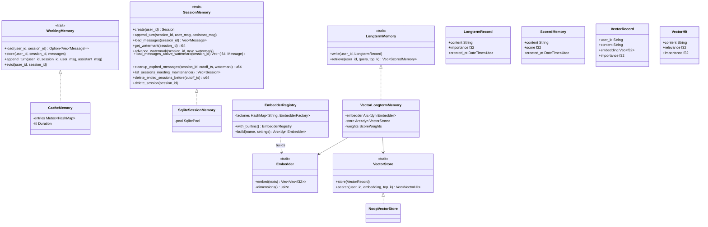

# Memory

## Purpose

`avs-memory` is the framework's single crate for everything an agent
remembers, organized as three tiers with deliberately different lifetimes and
keys: an in-process, TTL-evicted working buffer (L1, keyed by `(user_id,
session_id)`), a durable session transcript (L2, same key, time-bounded), and
a cross-session distilled long-term store (L3, keyed by `user_id` alone,
retained indefinitely). It exists as one crate — rather than split across
`avs-core`/`avs-session`/`avs-memory` as it was before the 2026-07 refactor —
so that whichever tier a developer is looking for is discoverable by name
instead of buried in a crate that doesn't say "memory." The crate defines the
`WorkingMemory`, `SessionMemory`, and `LongtermMemory` traits plus one
batteries-included implementation of each (`CacheMemory`,
`SqliteSessionMemory`, `VectorLongtermMemory`) so `avs-agent` gets working
memory out of the box; production-grade backends (Postgres, LanceDB) live in
sibling crates that depend on `avs-memory`, never the reverse. Session
**lifecycle** — creating, ending, and authorizing a session — deliberately
does not live here; see [Session](session.md) for that half of the boundary.

## Position in the System

`avs-memory` (Layer 1 per `scripts/check-layering.sh`) consumes only
`agentverse` (`avs-core`, Layer 0) — `Message`/`MessageRole` (the transcript
payload type shared with the LLM runner) and `MemoryError`. It consumes
nothing else in the workspace: `SessionId` is `uuid::Uuid` used directly, not
imported from `avs-session`, keeping the dependency direction
`avs-session → avs-memory` and never the reverse.

It is consumed by: `avs-session` (also Layer 1), which re-exports
`SessionMemory`, `SqliteSessionMemory`, `SessionMemoryError`,
`InterruptedState`, `Session`, `SessionId`, and `SessionStatus` so every
pre-existing `agentverse_session::*` import keeps compiling, while itself
owning only lifecycle (`SessionManager`) — see [Session](session.md);
`avs-memory-lancedb` and `avs-memory-pgvector` (also Layer 1), which
implement `VectorStore` (`LanceDbVectorStore`, `PgVectorStore`) and, for
pgvector, `SessionMemory` (`PostgresSessionMemory`); and [Agent](agent.md)
(`avs-agent`, Layer 4), the only Layer-4 crate holding these types directly —
`Arc<dyn WorkingMemory>`, `Arc<SessionManager>` wrapping `Arc<dyn
SessionMemory>`, and `Option<Arc<dyn LongtermMemory>>`.

## Architecture

`WorkingMemory` (`avs-memory/src/working.rs`) is the L1 trait; `CacheMemory`
is its only implementation, holding a `Mutex<HashMap<(String, SessionId),
Entry>>` where each `Entry` tracks its `messages` and a `last_used: Instant`
checked against a fixed `ttl` on every `load`. `SessionMemory`
(`avs-memory/src/session/store.rs`) is the L2 trait; `SqliteSessionMemory`
(`avs-memory/src/session/sqlite.rs`, migrations under `avs-memory/migrations/`)
is its bundled dev/default implementation, with retention/consolidation
methods split into `sqlite_maintenance.rs` as free functions (Rust cannot
split one trait `impl` block across two `impl` blocks). Both
`SqliteSessionMemory` and `PostgresSessionMemory` JSON-encode each message's
`content: Vec<ContentBlock>` (see [Core Runtime](core-runtime.md)) via a
`pub(crate) encode_content`/`decode_content` pair; `decode_content` falls
back to a single `Text` block for pre-refactor plain-string rows — see Key
Decisions. `Session`,
`SessionId`, `SessionStatus` (`session/types.rs`) are plain data types the
trait's signatures depend on; despite living here, they are conceptually
owned by [Session](session.md), which re-exports them. `InterruptedState`
(`store.rs`) is the enum HITL persists as JSON in the `interrupted_state`
column while a session awaits approval.

`LongtermMemory` (`avs-memory/src/longterm/mod.rs`) is the L3 trait;
`VectorLongtermMemory` (`longterm/adapter.rs`) is its only implementation,
composing an injected `Arc<dyn Embedder>` and `Arc<dyn VectorStore>` with a
`ScoreWeights` (α/β/γ + `half_life`). `Embedder` (`longterm/embedder.rs`)
turns text into vectors; `EmbedderRegistry` is a plain name→factory table
(`with_builtins` registers `"openai"` and `"gemini"`, built in
`embedder_openai.rs`/`embedder_gemini.rs`) — no global registry state, every
caller builds its own, mirroring `avs-core`'s `ProviderRegistry`.
`VectorStore` (`longterm/vector.rs`) is the storage-only trait `Embedder`'s
output flows into; `NoopVectorStore` is a no-op test double bundled here,
while the two real implementations — `LanceDbVectorStore`
(`avs-memory-lancedb`) and `PgVectorStore` (`avs-memory-pgvector`) — live in
sibling crates so `avs-memory` itself has no database/vector-engine
dependency. `avs-memory-pgvector` additionally provides
`PostgresSessionMemory` (`session_store.rs`), the production `SessionMemory`
implementation, with its own maintenance functions in
`session_store_maintenance.rs` mirroring `sqlite_maintenance.rs`'s split, and
its own `encode_content`/`decode_content` pair mirroring `sqlite.rs`'s.

## Runtime Flows

**Working-memory hit/miss/TTL** (L1, driven by `avs-agent`'s per-turn read —
see agent.md's `invoke` flow):
1. The caller calls `WorkingMemory::load(user_id, session_id)`. `CacheMemory`
   looks up the `(String, SessionId)` key; if present and
   `entry.last_used.elapsed() <= self.ttl`, it returns
   `Some(entry.messages.clone())` — a fresh hit, no L2 access.
2. On a miss (key absent, or past `ttl`), the caller rehydrates from L2 via
   `SessionMemory::load_messages(session_id)` and repopulates L1 with
   `WorkingMemory::store`, which sweeps every other TTL-expired entry out of
   the map (`entries.retain(...)`) before inserting the fresh one.
3. Each turn, `WorkingMemory::append_turn` pushes the user/assistant
   `Message` pair onto the existing entry and resets `last_used`; if the key
   was evicted mid-call, it inserts a minimal 2-message entry instead of
   erroring.
4. `WorkingMemory::evict` removes the key outright (used on phase
   transitions and per-session/per-user deletion).

**Long-term write and retrieve** (L3, via `VectorLongtermMemory`):
1. **Write:** `LongtermMemory::write(user_id, record)` calls
   `Embedder::embed(&[record.content])` (a one-element batch) through
   whichever `Embedder` `EmbedderRegistry::build` resolved, wraps the
   returned vector plus `user_id`/`content`/`importance`/`created_at` into a
   `VectorRecord`, and calls `VectorStore::store`. `LanceDbVectorStore::store`
   appends a row (creating the table via `open_or_create_table` on first
   write); `PgVectorStore::store` inserts into `agent_memory`, serializing
   the embedding to pgvector's `[v1,v2,...]` literal.
2. **Retrieve:** `LongtermMemory::retrieve(user_id, query, top_k)` embeds
   `query` the same way, then calls `VectorStore::search(user_id, embedding,
   top_k * 4)` — over-fetching 4x so rescoring can reorder beyond the raw ANN
   cut. Both backends return `VectorHit`s already scoped to `user_id`
   (LanceDB via an `only_if("user_id = ...")` prefilter, pgvector via
   `WHERE user_id = $1`) and already carrying `relevance = 1/(1+distance)`.
3. `VectorLongtermMemory::retrieve` combines each hit into
   `score = α·recency + β·importance + γ·relevance` (recency is an
   exponential decay, `0.5^(age_seconds / half_life_seconds)`), sorts
   descending (`f32::total_cmp`, NaN-safe), truncates to `top_k`, and maps to
   `ScoredMemory { content, score, created_at }`.

**Session-transcript watermark lifecycle** (L2, driven by `avs-agent`'s
background workers — see agent.md's worker-tick flow):
1. `SessionMemory::get_watermark`/`advance_watermark` track a per-session
   `consolidation_watermark`; `advance_watermark`'s SQL uses
   `MAX(consolidation_watermark, ?)`, so repeated or out-of-order calls only
   ever move it forward.
2. `list_sessions_needing_maintenance` returns every session — regardless of
   `SessionStatus` — with messages above the watermark (unconsolidated) or
   below-watermark messages old enough to prune; `load_messages_above_watermark`
   returns the exact `(sequence_num, Message)` tuples a consolidation worker
   needs to write to L3 before calling `advance_watermark`.
3. `cleanup_expired_messages(session_id, cutoff_ts, watermark)` deletes only
   messages where `created_at < cutoff_ts AND sequence_num <= watermark`,
   re-reading the stored watermark to cap the caller-supplied one
   (`effective_watermark = watermark.min(stored_wm)`) so a stale
   caller-supplied watermark can never purge an unconsolidated message.
4. `delete_ended_sessions_before(cutoff_ts)` deletes whole sessions with
   `status != 'active'` past the cutoff, cascading to their messages;
   `delete_session(session_id)` deletes one session unconditionally — used
   only by the per-user, on-demand deletion path, never a background worker.

## Key Decisions

### Legacy plain-string session rows decode as a lossless `Text`-block fallback, not a hard error
- **Decision** — `decode_content` (identical `pub(crate)` free function in
  both backends) tries `serde_json::from_str::<Vec<ContentBlock>>` first,
  falling back to a single `ContentBlock::Text` block on failure instead of
  erroring.
- **Context** — PR #35 Phase 1 changed `Message.content` from `String` to
  `Vec<ContentBlock>` (see [Core Runtime](core-runtime.md)); every
  pre-refactor `messages.content` row holds a bare plain string, which is
  invalid JSON for a sequence type.
- **Alternatives rejected** — hard-failing decode, the choice
  [Agent](agent.md) documents for this PR's HITL-resume path, was rejected
  here: the doc comment calls the fallback lossless ("a legacy row only ever
  held plain text, so a single `Text` block is a faithful, complete
  representation of it"), unlike a HITL row missing a `ToolCall.id`, which
  would desynchronize correlation per [Agent](agent.md).
- **Consequences** — old rows "keep working, they just aren't retroactively
  upgraded to carry structure (ToolUse/ToolResult) they never had," per the
  doc comment, which ties this to "this project's 'no migration for
  persisted session data' decision" (also stated in PR #35's body). Each
  backend keeps its own copy of `encode_content`/`decode_content` (see
  Implementation Notes).
- **Ref** — 2026-08-02, PR #35 (commits `70ba9f5`, `68cb4df`).

### All three memory tiers consolidated into `avs-memory`
- **Decision** — `avs-memory` becomes the sole home for working (L1), session
  (L2), and long-term (L3) memory; `avs-session` is reduced to lifecycle
  (`SessionManager`) plus re-exports.
- **Context** — PR #30's body states the problem plainly: `ShortTermMemory`/
  `SimpleMemory`/`AgentMemory` "were dead code never wired into the agent,"
  and "the real durable tier lived in a crate whose name doesn't say
  'memory'" (`avs-session`); the same bullet list credits `WorkingMemory`/
  `CacheMemory` as "promoted from avs-agent's private cache."
- **Alternatives rejected** — none recorded in PR #30's body or the
  referenced design spec; the PR describes the session-code move as
  mechanical ("SQL byte-identical") and the working-memory move as
  "semantics preserved exactly," not an alternatives-weighed redesign.
- **Consequences** — `avs-session` gains a dependency on `avs-memory` (both
  stay Layer 1 per `check-layering.sh`) and its `lib.rs` becomes almost
  entirely re-exports/module aliases; `avs-memory-pgvector`'s
  `PostgresSessionMemory` imports `SessionMemory` from `avs-memory` instead
  of `avs-session`.
- **Ref** — 2026-07-05, PR #30.

### `LongtermMemory` is `write`/`retrieve`-only — no deletion capability
- **Decision** — the `LongtermMemory` trait (and `VectorLongtermMemory`)
  exposes no delete operation; L3 records are retained indefinitely
  regardless of session or user deletion.
- **Context** — PR #29's body states this was an explicit product decision
  reached while building `Agent::delete_all_user_data`, not an oversight.
- **Alternatives rejected** — extending `LongtermMemory` with a delete method
  was rejected: per PR #29's body, "L3 data may serve purposes beyond this
  agent's own runtime (e.g. training corpora)," so its retention/deletion
  policy is treated as outside the framework's responsibility; the PR states
  this was "verified via grep across the whole branch" to confirm the
  interface was left untouched.
- **Consequences** — `Agent::delete_all_user_data` only ever spans L1+L2 (see
  agent.md); an operator who needs L3 deletion must go around the trait
  directly to a backend's own helpers (e.g. `PgVectorStore::purge_old`),
  which are not part of the `LongtermMemory` surface and are not called by
  any shipped worker.
- **Ref** — 2026-07-05, PR #29.

### Cosine distance + `1/(1+d)` relevance, made consistent across both backends
- **Decision** — both `LanceDbVectorStore` and `PgVectorStore` compute
  `VectorHit.relevance` as `1.0 / (1.0 + distance)`, with `distance` being
  cosine distance in both cases (LanceDB via `distance_type(Cosine)`,
  pgvector via the `<=>` operator).
- **Context** — the original design spec's Problem section recorded that
  `LanceDBBackend::search` "ignores the query embedding entirely (returns
  first-k rows in table order)"; PR #30's body lists "LanceDB cosine
  distance_type" among the branch's must-fix review items.
- **Alternatives rejected** — none recorded beyond making the two backends
  agree on a metric; `ScoredMemory`'s pre-existing `γ·relevance` doc comment
  already assumed a `[0,1]` similarity.
- **Consequences** — `VectorHit.relevance`'s doc comment states the
  cross-backend invariant explicitly; a third-party `VectorStore` using a
  different metric would need to renormalize into `[0,1]`.
- **Ref** — 2026-07-05, PR #30.

### `Embedder` mirrors `ProviderRegistry`; local dev = keyless `base_url`
- **Decision** — `EmbedderRegistry` (name→factory table, `register`/`build`)
  is structured like `avs-core`'s `ProviderRegistry`; the built-in
  `"openai"` factory allows an empty `api_key` when `base_url` is set, the
  same rule as `openai_factory` in `avs-core/src/model/registry.rs`.
- **Context** — PR #30's body states local/dev embedding is "openai provider
  + keyless base_url (Ollama/llama.cpp); prod = API key, same registry
  pattern as the LLM providers."
- **Alternatives rejected** — a bundled local embedder (ONNX/fastembed) was
  rejected in favor of reusing the LLM side's provider convention.
- **Consequences** — the only two builtin embedders are `"openai"`
  (OpenAI-compatible `/embeddings`) and `"gemini"` (`batchEmbedContents`);
  both require `dimensions` as an explicit setting, validated against each
  response rather than queried from the provider.
- **Ref** — 2026-07-05, PR #30.

### Dead `SimpleMemory`/`AgentMemory` tier deleted, not wired
- **Decision** — the pre-existing `SimpleMemory`/`AgentMemory`/`Summarizer`/
  `LongTermBackend` code is deleted outright rather than connected to the new
  `WorkingMemory`/`LongtermMemory` traits.
- **Context** — PR #30's body describes these types as "dead code never
  wired into the agent," while the real in-production working tier was
  `avs-agent`'s private `CacheMemory` struct, unrelated to either (per the
  same PR's "promoted from avs-agent's private cache").
- **Alternatives rejected** — wiring `AgentMemory`'s lazy-summarization logic
  into `CacheMemory` was rejected; PR #30's body describes `CacheMemory`'s
  promotion as preserving its TTL semantics "exactly," and lists
  session-transcript compaction (what `AgentMemory`'s summarizer did) as a
  separate follow-up needing its own design.
- **Consequences** — `Summarizer`/`NoopSummarizer` and the old synchronous,
  single-text `Embedder` no longer exist anywhere in the workspace; the
  async, batch `Embedder` in `longterm/embedder.rs` is a new design, not a
  promotion of the deleted one.
- **Ref** — 2026-07-05, PR #30.

### Three-layer memory model established; strategies made memory-agnostic
- **Decision** — PR #4 introduced the L1 (`CacheMemory`)/L2
  (`SessionMemory`)/L3 (`LongtermMemory`) naming and boundary the current
  architecture still uses, and dropped the `memory` parameter from every
  strategy so strategies became pure `Vec<Message> -> String`.
- **Context** — PR #4's body describes removing the "dead `memory` param
  from all strategies" and the "dead `memory: Arc<Mutex<dyn Memory>>` field
  and param from `Agent` and all call sites" — the prior `Memory` trait was
  carried through every strategy but never called.
- **Alternatives rejected** — none recorded in PR #4's body; per the
  2026-05-25 research spec mined for context (not the PR itself), keeping
  memory as a per-strategy concern was set aside in favor of Agent-owned
  tiers keyed by `(user_id, session_id)` for L1/L2 and `(user_id)` for L3.
- **Consequences** — every strategy constructor lost its `memory` parameter
  permanently; `Agent` became sole owner of retrieval, prompt assembly, and
  post-turn persistence across all three tiers, the shape agent.md's
  `invoke` flow still follows.
- **Ref** — 2026-05-26, PR #4.

## Implementation Notes

- `LongtermRecord::now` clamps `importance` to `[0.0, 1.0]` (and maps `NaN`
  to `0.0`), logging a `tracing::warn!` rather than returning an error — an
  out-of-range importance is silently corrected, not rejected.
- `VectorLongtermMemory::retrieve` always over-fetches `top_k * 4` raw ANN
  hits before rescoring; a `VectorStore` returning fewer than `top_k * 4`
  candidates (e.g. a near-empty store) is not an error, it just yields fewer
  final results.
- `SessionMemory`'s skill-context, phase-opening-context, and
  interrupted-state methods (`set_skill_context`, `set_phase_opening_context`,
  `set_interrupted_state`, and their getters) all ship with no-op default
  trait-method bodies "so existing impls compile unchanged" — a new
  `SessionMemory` backend that doesn't override them will silently no-op
  skill/HITL persistence rather than fail to compile.
- `sqlite_maintenance.rs` and `session_store_maintenance.rs` (pgvector) exist
  as free functions rather than a second `impl SessionMemory for ...` block
  because Rust cannot split one trait implementation across multiple `impl`
  blocks.
- `encode_content`/`decode_content` are separate `pub(crate)` free functions
  in `avs-memory/src/session/sqlite.rs` and
  `avs-memory-pgvector/src/session_store.rs` — parallel, independently-tested
  copies of the same logic, not a shared helper; `930d2ac` added
  `avs-memory`'s tests and `0d675d4`'s commit message says it "ported" them
  "from avs-memory's tested equivalent." `encode_content`'s `.expect(...)` is
  justified by its own doc comment: `ContentBlock`'s `Serialize` impl "is
  total ... so this cannot fail in practice."
- Open follow-ups, all deliberately deferred per PR #30's body (not yet
  implemented): (1) session-transcript compaction — LLM-summarize below the
  watermark and rewrite the durable transcript, needs its own design; (2)
  `WorkingMemory::evict_user` for an atomic whole-user L1 purge, would
  replace `delete_all_user_data`'s per-session `evict` loop; (3) `longterm`
  module visibility cleanup (`pub mod vector`/`embedder_*` → private,
  re-exported instead); (4) Gemini key sent via `x-goog-api-key` header
  instead of the current URL query string; (5) `LanceDbVectorStore::purge_old`
  is currently a no-op ("LanceDB time-based deletion is a follow-up ticket,"
  per its own source comment) — `PgVectorStore::purge_old` is implemented,
  but neither is called by any shipped worker.

## Source Anchors

- `avs-memory/src/working.rs`
- `avs-memory/src/session/`
- `avs-memory/src/longterm/`
- `avs-memory/src/lib.rs`
- `avs-memory-lancedb/src/backend.rs`
- `avs-memory-pgvector/src/backend.rs`
- `avs-memory-pgvector/src/session_store.rs`
- `avs-memory/` (crate)
- `avs-memory-lancedb/` (crate)
- `avs-memory-pgvector/` (crate)

## Related Pages

- [Agent](agent.md)
- [Session](session.md)
- [Core Runtime](core-runtime.md)
- [HITL](hitl.md)
