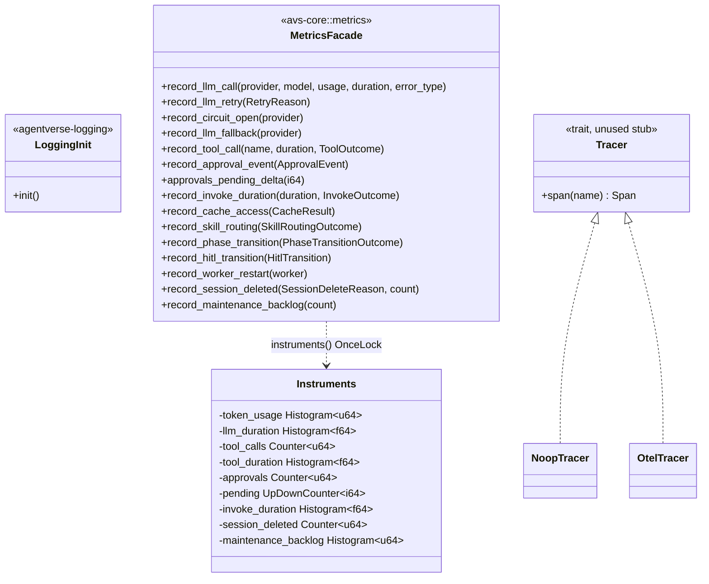

# Observability

## Purpose

Observability spans two independent, deliberately small subsystems bundled
onto one page because both exist to give every other crate a way to report
what it is doing without taking on a heavyweight dependency. `avs-logging`
(crate `agentverse-logging`) is a one-function crate that installs a
`tracing` subscriber so structured `tracing::info!`/`debug!`/`warn!` calls
scattered across the workspace actually produce output. `avs-core`'s metrics
facade (`avs-core/src/metrics.rs`) is the single place OpenTelemetry
instruments are created and named, exposing domain-shaped `record_*` helper
functions so call sites never touch the `opentelemetry` API directly.
`avs-core` also carries a `tracing/` module — a `Tracer` trait plus
`NoopTracer`/`OtelTracer` implementations — that predates the metrics facade
and remains an unused stub (see Implementation Notes). Both real subsystems
follow the same no-op-until-installed shape: logging and metrics cost nothing
until a binary opts in, so library crates can instrument liberally without
forcing an export pipeline on every consumer.

## Position in the System

`avs-logging` and `avs-core`'s `metrics` module are both Layer 0 — the
workspace's foundation layer per `scripts/check-layering.sh` — so neither has
an in-workspace dependency. `avs-logging` depends only on the external
`tracing`/`tracing-subscriber` crates; the metrics facade's own code depends
only on the external `opentelemetry` API crate, and `opentelemetry_sdk` is a
dev-dependency only. `opentelemetry-otlp 0.15` is a separate story: it
remains a default-on optional dependency of `avs-core` itself
(`tracing = ["opentelemetry-otlp"]`, enabled by the crate's own
`default = ["tracing"]`), unrelated to the metrics facade — it exists only to
satisfy the dead `OtelTracer` scaffolding (see Implementation Notes), not
because any `record_*` call site needs it.

It is consumed by every layer above. Every binary (all `examples/*`
crates) calls `agentverse_logging::init()` once at startup, before
constructing an agent. [Core Runtime](core-runtime.md)'s own
`ConnectionManager::generate` records LLM-call metrics through the facade it
hosts. [Tools](tools.md)'s `ToolRegistry` records tool-call metrics at three
dispatch sites — documented there, not repeated here. [HITL](hitl.md)'s
`InMemoryQueue` and `SqliteQueue` record approval-lifecycle metrics
identically across both backends. [Agent](agent.md) records invoke duration,
cache hit/miss, skill-routing outcomes, phase transitions, HITL transitions,
worker restarts, and session deletion/maintenance-backlog counts. This page
covers the facade and the logging initializer themselves; the surrounding
call-site logic at each boundary is documented on the page that owns it.

## Architecture

`avs-logging/src/lib.rs` is a single public function, `init()`: it builds an
`EnvFilter` from `RUST_LOG` (defaulting to `"info"` if unset or invalid), then
installs either `tracing_subscriber::fmt().json()` (when `LOG_FORMAT=json`) or
the plain `fmt()` builder, calling `try_init()` rather than `init()` so a
second call — a test calling it per-test, or a binary invoking it
defensively — never panics. Library crates never call it; only binaries do.

`avs-core/src/metrics.rs`'s module doc comment states its own contract:
"the ONLY place instruments are created and named," a cardinality rule
("attributes must be bounded sets... Never user/session IDs or free text"),
and the global-meter caveat (below). `instruments()` lazily builds a single
`Instruments` struct through a `std::sync::OnceLock`, calling
`opentelemetry::global::meter("agentverse")` once and constructing all
seventeen instruments — histograms, counters, and one `UpDownCounter`
(`agentverse.hitl.pending`) — against that meter. Every `record_*` function
takes typed, domain-specific arguments (never a raw `Counter`/`Histogram`) and
an enum for any label with a bounded set of values — `RetryReason`,
`ToolOutcome`, `ApprovalEvent`, `InvokeOutcome`, `CacheResult`,
`SkillRoutingOutcome`, `PhaseTransitionOutcome`, `HitlTransition`,
`SessionDeleteReason` — so a call site can never accidentally attach
unbounded-cardinality text as an attribute.

`avs-core/src/tracing/` is a separate, older module unrelated to the metrics
facade: `Tracer` (a trait with one method, `span(&self, name: &str) -> Span`),
a `Span` struct whose `set_attribute` is a no-op builder method, `NoopTracer`
(always returns an empty `Span`), and `OtelTracer` (identical behavior to
`NoopTracer` today — its `span()` also just returns `Span`). `DefaultTracer`
is a type alias selecting `OtelTracer` when the crate's `tracing` feature is
enabled (the default) or `NoopTracer` otherwise. `avs-core/src/lib.rs`
re-exports `Tracer` and `NoopTracer`, but nothing in the workspace constructs
a `Tracer`, calls `.span()`, or references `DefaultTracer`/`OtelTracer`
outside this module — see Implementation Notes.

## Runtime Flows

**Metrics facade lazy init and OTel SDK wiring (no-op by default):**
1. The first call to any `avs-core::metrics::record_*` function anywhere in
   the process triggers `instruments()`, which calls
   `OnceLock::get_or_init` and, on that first call only, invokes
   `opentelemetry::global::meter("agentverse")` to build the `Instruments`
   struct.
2. If no `SdkMeterProvider` has been installed via
   `opentelemetry::global::set_meter_provider` before this first call,
   `global::meter` returns OTel's built-in no-op meter — every subsequent
   `record_*` call is silently a no-op for the rest of the process, since the
   global meter does not delegate or retrofit once instruments exist.
3. `examples/http-agent`'s `init_otel_metrics` is the one place in the
   workspace that installs a real provider: it checks
   `OTEL_EXPORTER_OTLP_ENDPOINT` for a non-empty value, builds an OTLP/gRPC
   `MetricExporter`, wraps it in a periodic-export `SdkMeterProvider`, and
   calls `set_meter_provider` before constructing the `Agent` — guaranteeing
   the provider is live before any instrumented code path runs.

**Boundary instrumentation at the LLM connection (metric + log from one call site):**
1. `ConnectionManager::generate` starts timers before its retry loop (see
   [Core Runtime](core-runtime.md) for the retry/circuit-breaker/fallback
   logic itself).
2. Each terminal outcome records metrics exactly once: an open circuit
   records `record_circuit_open`; a fallback dispatch (on a non-success
   status or on retries-exhausted) records `record_llm_fallback` instead of
   `record_llm_call` (the fallback's own `generate` call then independently
   records its own outcome); a `429` with retries remaining records
   `record_llm_retry(RateLimited)`; other retryable failures record
   `record_llm_retry(Transport)`; a response-body read failure, a non-429
   non-success status with no fallback configured, a parse failure, and
   retries-exhausted with no fallback configured each record `record_llm_call`
   with `error_type` set (`"api_error"`, `"invalid_response"`, or
   `"rate_limited"` depending on the path); and a successful parse records all
   four `UsageStats` token counts plus `llm_duration` with `error_type: None`.
3. The same call site emits `tracing::info!`/`debug!` independently of the
   facade — `"LLM call complete"` at `info` with token/`elapsed_ms` fields,
   and the full prompt/response bodies at `debug` — so one boundary produces
   two independent observability signals (an OTel metric and a structured
   log event) from the same code path, each read by a different backend.

**Boundary instrumentation at memory/session lifecycle (cache hit/miss, session deletions, maintenance backlog):**
1. `Agent::get_cache_memory` (`avs-agent/src/agent/invoke.rs`) records
   `record_cache_access(CacheResult::Hit)` when `working_memory.load` returns
   messages, and `record_cache_access(CacheResult::Miss)` on the fallthrough
   path that rehydrates from session memory instead — see [Agent](agent.md)
   for the surrounding invoke lifecycle.
2. `Agent::delete_all_user_data` (`avs-agent/src/agent/sessions.rs`) records
   `record_session_deleted(SessionDeleteReason::UserRequest, count)` once per
   call, only when the deleted-session list is non-empty.
3. `CleanupWorker::tick` (`avs-agent/src/workers.rs`) records
   `record_session_deleted(SessionDeleteReason::EndedTtl, count)` after
   `delete_ended_sessions_before` removes whole expired sessions, then
   `record_maintenance_backlog(count)` for the sessions its own
   `list_sessions_needing_maintenance` call still finds needing per-message
   cleanup.
4. `ConsolidationWorker::tick` (same file) independently calls
   `record_maintenance_backlog(count)` after its own
   `list_sessions_needing_maintenance` call — the two workers poll on
   separate intervals, each reporting its own view of the backlog.

**`avs-logging::init()` and structured event propagation:**
1. A binary calls `avs_logging::init()` once, before constructing an agent.
2. `init()` reads `LOG_FORMAT`: a value of `"json"` installs
   `tracing_subscriber::fmt().json().with_target(true)`; anything else
   installs the human-readable `fmt()` with `with_target(false)`. Both read
   `RUST_LOG` through `EnvFilter`, defaulting to `"info"`.
3. Once the subscriber is installed, `tracing::info!`/`debug!`/`warn!` calls
   already present throughout the workspace — the LLM prompt/response logs in
   `ConnectionManager`, `iteration`/`action` fields in `avs-react`'s cycle,
   `tool_name`/truncated `args`/`result` in `ToolRegistry` — start producing
   output. None of this propagation is mediated by the metrics facade or by
   `avs-logging` beyond the one-time subscriber install; `avs-logging` itself
   has no further runtime role after `init()` returns.

## Key Decisions

Newest first.

### `agentverse.session.*` instruments extend the facade's established naming, not a new scheme
- **Decision** — PR #29 added `agentverse.session.deleted` (counter, by reason
  `EndedTtl`/`UserRequest`) and `agentverse.session.maintenance_backlog`
  (histogram) to the same `Instruments` struct and `agentverse.*` namespace
  PR #25 established, rather than introducing a separate metrics surface for
  the retention feature.
- **Context** — PR #29 frames these additions as making "a stuck/backlogged
  worker — exactly the class of bug this branch fixes — ... now visible in
  telemetry before it can silently strand data again," reusing the same
  visibility goal #25 set for tools and HITL.
- **Alternatives rejected** — none recorded; the PR body does not discuss
  alternatives to extending the existing facade module.
- **Consequences** — [Agent](agent.md) documents what these two instruments
  observe (worker backlog, deletion reasons); this page remains the single
  naming-scheme authority every other page's metrics references link back to.
- **Ref** — 2026-07-05, PR #29.

### Facade lives in `avs-core`; every other crate depends on the OTel API, never an SDK
- **Decision** — `avs-core/src/metrics.rs` is the sole place instruments are
  created and named; consuming crates (`avs-tools`, `avs-hitl`, `avs-agent`)
  call `agentverse::metrics::record_*` helpers and never touch
  `opentelemetry::metrics` types directly. `opentelemetry_sdk` is confined to
  dev-dependencies and `examples/http-agent`'s own `Cargo.toml`.
  `opentelemetry-otlp` is not: `avs-core/Cargo.toml` still carries it as a
  default-on optional dependency (`tracing = ["opentelemetry-otlp"]`,
  `default = ["tracing"]`), left over from the pre-facade `OtelTracer` stub —
  known debt this decision did not remove (see Implementation Notes).
- **Context** — PR #25, describing what that PR itself added, states:
  "`opentelemetry` (API only, no-op unless a provider is installed) is a
  runtime dependency of `avs-core` alone; `opentelemetry_sdk` is
  dev-dependency-only everywhere; `opentelemetry-otlp` is confined to the
  example," matching the no-op-until-installed model the crate already used
  for `tracing`. That description held for what PR #25 added but did not
  account for the pre-existing `opentelemetry-otlp` optional dependency
  already sitting in `avs-core/Cargo.toml`'s `tracing` feature, which PR #25
  did not remove and which is still present today.
- **Alternatives rejected** — none recorded; the design presents this as the
  intended shape rather than a choice among alternatives.
- **Consequences** — adding a metric anywhere in the workspace never adds an
  OTel SDK dependency to a library crate's own dependency tree; only a binary
  that installs a real `SdkMeterProvider` incurs SDK/export weight.
- **Ref** — 2026-07-04, PR #25.

### Instrument names follow GenAI semantic conventions where they exist, `agentverse.*` otherwise
- **Decision** — the two LLM-usage instruments (`gen_ai.client.token.usage`,
  `gen_ai.client.operation.duration`) reuse OTel's GenAI semantic-convention
  names; every other instrument (tools, HITL, agent, worker, session) uses an
  `agentverse.*` name, per the module's own doc comment.
- **Context** — PR #25 describes this as "GenAI semantic-convention names...
  plus `agentverse.*` for tools/HITL," giving an operator on any OTel backend
  legible token/latency data under names their existing GenAI dashboards
  likely already recognize, while framework-specific concepts (tool calls,
  HITL approvals) get a namespaced name of their own.
- **Alternatives rejected** — none recorded.
- **Consequences** — `avs-core/src/metrics.rs`'s top-of-file doc comment is
  the naming-scheme spec in practice; any new instrument must follow this
  split or update that comment.
- **Ref** — 2026-07-04, PR #25.

### `InMemoryQueue` and `SqliteQueue` instrumented identically, not just one backend
- **Decision** — both HITL queue implementations record the same
  `record_approval_event`/`approvals_pending_delta` calls at the same
  lifecycle points (submit, resolve, `sweep_expired`).
- **Context** — PR #25: "deliberate symmetry, learned from a prior branch
  where only one backend getting a fix caused silent drift."
- **Alternatives rejected** — instrumenting only the production backend
  (`SqliteQueue`) and treating `InMemoryQueue` as test-only is what this
  symmetry requirement rules out.
- **Consequences** — [HITL](hitl.md)'s queue choice is fully
  observability-neutral: switching backends never changes what a metrics
  backend sees.
- **Ref** — 2026-07-04, PR #25.

### A whole-branch review closed a silent metrics gap on `ConnectionManager`'s body-read failure path before merge
- **Decision** — `generate`'s body-read failure branch records
  `record_llm_call` with `error_type: Some("api_error")` before returning,
  matching every other terminal-failure path.
- **Context** — PR #25: "A body-read failure in `ConnectionManager::generate`
  was silently escaping all metrics recording, unlike every other
  terminal-failure path," found during "a whole-branch review (after all 5
  tasks individually passed spec + quality review)."
- **Alternatives rejected** — none; this is a bug closed pre-merge, not a
  weighed tradeoff.
- **Consequences** — every terminal outcome of `generate` (success, retry
  exhaustion, API error, body-read failure, parse failure) now records
  exactly one `llm_duration` observation; no silent gap remains in LLM-call
  metrics coverage.
- **Ref** — 2026-07-04, PR #25.

### `avs-logging` centralizes subscriber setup; per-example `LoggingProvider` wrappers are deleted
- **Decision** — a new crate, `agentverse-logging`, exposes one function,
  `init()`, reading `LOG_FORMAT` and `RUST_LOG`; every binary calls it once
  instead of hand-rolling a subscriber or a per-example wrapper around its
  model provider.
- **Context** — the logging design spec (untracked) opens with "Examples
  hand-roll a `LoggingProvider` wrapper (copy-pasted across
  `code-review-agent`, `hello-agent`, `react-calculator`) to print raw
  prompts/responses" and "Only `avs-server` initializes a
  `tracing_subscriber`; examples and other binaries get no output from
  library-level `tracing` calls," listing deletion of that wrapper from every
  example as an explicit goal.
- **Alternatives rejected** — the spec's own non-goals rule out "Switching
  log format at runtime," stating "env var at startup is sufficient" in favor
  of the simpler startup-only switch.
- **Consequences** — `init()` calls `try_init()` internally (per its own doc
  comment and the crate's `init_is_idempotent` test), so a second call — a
  test harness invoking it per-test, or a binary calling it defensively —
  never panics; library crates never call `init()` themselves.
- **Ref** — 2026-05-21, commit `87cc447`.

## Implementation Notes

- `avs-core/src/tracing/` (`Tracer`, `Span`, `NoopTracer`, `OtelTracer`,
  `DefaultTracer`) is known debt: it has no callers anywhere in the
  workspace beyond `avs-core/src/lib.rs`'s re-export of `Tracer`/`NoopTracer`.
  The 2026-05-21 logging design spec (untracked) explicitly listed
  "OpenTelemetry / distributed tracing integration (the stub in
  `avs-core/src/tracing/` is untouched)" as a non-goal when `avs-logging` was
  introduced. PR #25 independently rediscovered the scaffolding — "now-fully-
  dead `opentelemetry-otlp 0.15`/`OtelTracer` scaffolding" — and flagged
  removal as a follow-up rather than deleting it in that branch; it remains
  unremoved as of PR #29.
- The metrics facade has no in-lib unit tests. `avs-core/tests/metrics_facade_test.rs`
  asserts every instrument from a single `#[test]` function in its own
  integration-test binary, because OTel's global meter provider is
  process-wide and instruments are cached on first use — parallel unit tests
  in the same process would race on it.
- The logging design spec's proposed `#[instrument]` proc-macro attribute on
  `generate()`/`CycleSkeleton::run()`/`ToolRegistry::execute()` was not
  adopted; every current boundary instead uses hand-written
  `tracing::info!`/`debug!`/`warn!` calls with explicit fields. There is no
  `#[instrument]` usage anywhere in the workspace today.
- `avs-memory`'s logging predates and diverges from the design spec's
  proposed `store()`/`retrieve()` instrumentation (fields `operation`,
  `count`); current call sites (`avs-memory/src/session/store.rs`,
  `avs-memory/src/longterm/mod.rs`) emit `tracing::warn!` only on already-
  exceptional paths (an unoverridden default method, an out-of-range
  importance value being clamped), not a per-operation event on the happy
  path.

## Source Anchors

- `avs-logging/src/lib.rs`
- `avs-core/src/metrics.rs`
- `avs-core/src/tracing/mod.rs`
- `avs-core/src/tracing/noop.rs`
- `avs-core/src/tracing/otel.rs`
- `avs-core/tests/metrics_facade_test.rs`
- `avs-logging/` (crate)

## Related Pages

- [Core Runtime](core-runtime.md)
- [Tools](tools.md)
- [HITL](hitl.md)
- [Agent](agent.md)
