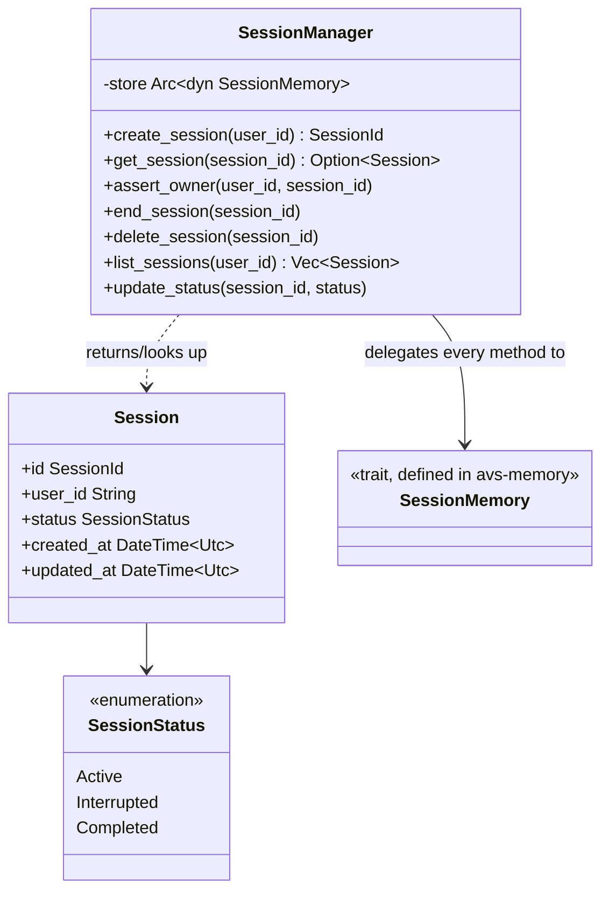

# Session

## Purpose

`avs-session` owns session **lifecycle**: the `Session`/`SessionId`/
`SessionStatus` model, `SessionManager` (create/end/delete/list a session and
transition its status), and ownership enforcement (`assert_owner`) — the
question of whether a given `user_id` is allowed to touch a given
`session_id`. It deliberately does not own *storage*: the `SessionMemory`
trait, its SQLite/Postgres implementations, and the transcript/watermark
mechanics that back every method `SessionManager` delegates to live in
[Memory](memory.md), which this crate depends on and re-exports from. The
split exists so a caller only needs one mental model — "when did this
conversation start, what state is it in, who owns it" — without needing to
know or care which database is durably holding its messages.

## Position in the System

`avs-session` (Layer 1 per `scripts/check-layering.sh`, alongside
`avs-memory`) consumes `agentverse` (`avs-core`, Layer 0) for the `Message`
type passed through `SessionManager::load_messages`/`append_message`/
`append_turn`, and consumes `agentverse-memory` (also Layer 1) for the
`SessionMemory` trait plus its `Session`, `SessionId`, `SessionStatus`,
`SessionMemoryError`, `InterruptedState`, and `SqliteSessionMemory` types,
which it re-exports so nothing in the dependency direction runs the other
way (`avs-memory` does not depend on `avs-session`).

It is consumed by [Agent](agent.md) (`avs-agent`, Layer 4), the only
Layer-4 crate holding a `SessionManager` directly: every `Agent` method that
takes a caller-supplied `session_id` (`get_session`, `end_session`,
`load_messages`, `resume`, `invoke`, `advance_phase`) calls
`SessionManager::assert_owner` first, and the `ConsolidationWorker`/
`CleanupWorker`/`HitlSweepWorker` background workers described in agent.md
operate on the `SessionMemory` methods `SessionManager` wraps.

## Architecture

`SessionManager` is a thin wrapper: it holds a single `Arc<dyn
SessionMemory>` and every one of its methods — `create_session`,
`get_session`, `end_session`, `delete_session`, `list_sessions`,
`load_messages`, `append_message`, `append_turn`, the skill-context and
interrupted-state accessors, `apply_phase_transition`, `update_status` — is a
direct pass-through to the identically-named (or closely named)
`SessionMemory` method, adding no business logic beyond `assert_owner`. It is
constructed once with a concrete `SessionMemory` backend (`SqliteSessionMemory`
in dev, `PostgresSessionMemory` from `avs-memory-pgvector` in production) and
handed to `Agent` as `Arc<SessionManager>`. `Session`, `SessionId` (a type
alias for `uuid::Uuid`), and `SessionStatus` (`Active`/`Interrupted`/
`Completed`, with `Display`/`FromStr` for the TEXT column that stores it) are
plain data types physically defined in `avs-memory/src/session/types.rs` but
conceptually owned here — `avs-session`'s `lib.rs` re-exports them (plus
`SessionMemory`, `SessionMemoryError`, `InterruptedState`,
`SqliteSessionMemory`) directly and under three submodule aliases
(`session::`, `sqlite::`, `store::`) purely so every import path that existed
before the storage code moved to `avs-memory` still compiles.

## Runtime Flows

**Session lifecycle** (create → active → interrupted/completed → deletion):
1. `SessionManager::create_session(user_id)` calls
   `SessionMemory::create(user_id)`, which constructs a `Session::new`
   (status `Active`) and persists it; only the `SessionId` is returned to the
   caller.
2. While `Active`, `Agent::invoke` drives `append_turn`/`append_message`
   through `SessionManager` on every turn (see agent.md's `invoke` flow).
3. `SessionManager::update_status` moves a session to `Interrupted` when
   `Agent` records a HITL approval request, or to `Completed` when
   `SessionManager::end_session` is called (`Agent::end_session` calls this,
   then separately evicts the session's L1 working-buffer entry — a cache
   concern, not `SessionManager`'s).
4. A terminal session (`Interrupted` or `Completed`) is never written to
   again — no code path appends messages to a non-active session — so its
   `updated_at` timestamp becomes a stable "time since ended" marker.
5. Deletion happens two ways, both via `SessionManager::delete_session` calling
   through to `SessionMemory::delete_session`: an age-gated bulk sweep
   (`delete_ended_sessions_before`, run by `CleanupWorker`) and an immediate
   per-session or per-user call (`Agent::delete_all_user_data`). The
   watermark/retention mechanics behind both are owned by
   [Memory](memory.md), not this page.

**Ownership enforcement** (`assert_owner` vs. the `list_by_user` trust model):
1. Every `Agent` method that receives an untrusted, caller-supplied
   `session_id` — `get_session`, `end_session`, `load_messages`, `resume`,
   `invoke`, `advance_phase` — calls `SessionManager::assert_owner(user_id,
   session_id)` before doing anything else.
2. `assert_owner` calls `SessionMemory::get(session_id)` (a lookup that is
   *not* scoped by `user_id`) and checks `session.user_id == user_id` itself;
   on a mismatch or missing session it returns
   `SessionMemoryError::NotFound(session_id)` — the same error either way, so
   a caller cannot distinguish "no such session" from "not yours."
3. Methods that only ever take a trusted `user_id` — `create_session`,
   `list_sessions` (backed by `SessionMemory::list_by_user`), and
   `Agent::delete_all_user_data`, which iterates `list_sessions(user_id)`'s
   own results — skip `assert_owner` entirely: the query is already scoped by
   the caller's own `user_id`, so there is no separate `session_id` to check
   against it.

## Key Decisions

### Session storage physically moved to `avs-memory`; `avs-session` reduced to lifecycle + re-exports
- **Decision** — `SessionMemory` and its implementations (`SqliteSessionMemory`,
  `PostgresSessionMemory`) moved out of `avs-session` into `avs-memory`;
  `avs-session` keeps only `SessionManager` plus re-exports of the moved
  types under their original import paths.
- **Context** — PR #30's body states the durable session tier "lived in a
  crate whose name doesn't say 'memory'" and describes the move as
  mechanical: "physically moved from avs-session, SQL byte-identical."
- **Alternatives rejected** — none recorded in PR #30's body; it frames this
  as a discoverability fix, not a design tradeoff.
- **Consequences** — `avs-session` gained a dependency on `avs-memory` (both
  remain Layer 1); per PR #30's body, "every existing consumer compiles
  unchanged" because the re-exports and submodule aliases in `lib.rs`
  preserve every pre-existing `agentverse_session::*` import path.
- **Ref** — 2026-07-06, PR #30.

### Background-maintenance visibility made status-independent
- **Decision** — `SessionMemory::list_all_active_sessions()` (which scoped
  worker visibility to `WHERE status = 'active'`) was replaced with
  `list_sessions_needing_maintenance()`, which surfaces a session based on
  whether it has pending work, regardless of `SessionStatus`.
- **Context** — PR #29's body identifies this as a "foundational,
  previously-undiscovered bug": the instant a session transitioned to
  `Completed` or `Interrupted` — "the normal end of every conversation, not
  an edge case" — it was permanently excluded from consolidation and
  cleanup. It traces to an unexamined oversight with no recorded design
  rationale (per the 2026-07-05-retention-e-design spec, introduced in an
  earlier commit, "no design doc, comment, or commit message anywhere
  justifies this scoping").
- **Alternatives rejected** — none; this was a bug fix, not a weighed
  design choice.
- **Consequences** — a session's `SessionStatus` no longer gates whether
  background workers can see it, only whether new messages can be appended
  to it (per Runtime Flows above); deletion eligibility
  (`delete_ended_sessions_before`) is kept as a deliberately separate,
  status-gated rule, per PR #29's body and the retention spec, "to avoid
  conflating 'does this session need its messages touched' with 'should
  this session be deleted outright.'"
- **Ref** — 2026-07-05, PR #29.

### Ownership enforced by `SessionManager`, not baked into every storage query
- **Decision** — `SessionMemory::get(session_id)` is not filtered by
  `user_id`; ownership is a separate, explicit check
  (`SessionManager::assert_owner`) the caller (`Agent`) invokes before using
  the result.
- **Context** — the 2026-05-23-multi-user-sessions-design spec states
  "ownership checks are performed by the top-level `Agent` through
  `SessionManager::assert_owner(user_id, session_id)` before loading or
  mutating a session"; PR #3's body lists per-user isolation ("Bob cannot
  access Alice's session even with a valid session UUID") among its key
  design decisions for the same multi-user session work.
- **Alternatives rejected** — filtering every storage-level read/write by
  `user_id` directly (pushing the check into `SessionMemory` itself) was not
  the chosen shape; the spec places the check at the `SessionManager`/`Agent`
  boundary instead.
- **Consequences** — any new `Agent` method that accepts a caller-supplied
  `session_id` must call `assert_owner` itself — the storage layer will not
  do it; `list_by_user`-scoped methods (`list_sessions`,
  `delete_all_user_data`) are exempt by construction, since they never take
  an untrusted `session_id` to check.
- **Ref** — 2026-05-24, PR #3.

## Implementation Notes

- `assert_owner` returns the identical `SessionMemoryError::NotFound` for
  both "no such session" and "session exists but belongs to someone else" —
  by design, so a caller can't use error variants to enumerate other users'
  session IDs.
- The three submodule aliases in `lib.rs` (`session::`, `sqlite::`,
  `store::`) exist solely for backward-compatible import paths; new code
  should use the top-level re-exports instead.
- Future work (not yet implemented, per memory.md's Implementation Notes):
  session-transcript compaction and a `WorkingMemory::evict_user` for atomic
  whole-user L1 purge both touch this page's lifecycle boundary but are
  designed and tracked against `avs-memory`/`avs-agent`, not this crate.

## Source Anchors

- `avs-session/src/lib.rs`
- `avs-session/src/manager.rs`
- `avs-memory/src/session/types.rs`
- `avs-session/` (crate)

## Related Pages

- [Memory](memory.md)
- [Agent](agent.md)
- [Core Runtime](core-runtime.md)
