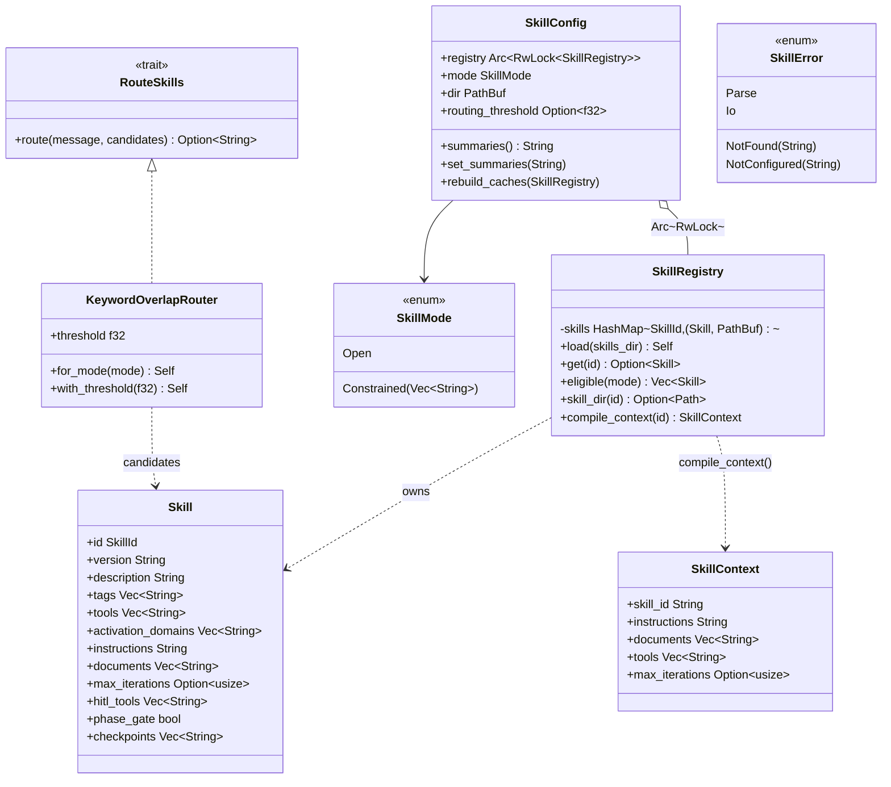

# Skill

## Purpose

`avs-skill` owns the SKILL.md file format, the on-disk skill registry, and the
routing strategy that selects a skill at runtime — the mechanism that lets one
`Agent` instance specialize its instructions, tool exposure, and iteration
budget per session without redeploying code or re-configuring the agent. It
loads skill packages from `system/` and `user/` directories with user skills
shadowing system skills of the same name, scores an incoming message against
the eligible set through a pluggable `RouteSkills` trait, and compiles the
winning skill into a serializable `SkillContext`. It is a Layer-0 crate in
`scripts/check-layering.sh` — it depends on no other `avs-*` crate — so a
SKILL.md file can be parsed, routed against, and unit-tested in complete
isolation from sessions, strategies, or the LLM runtime that eventually
consumes its output. It exists separately from `avs-agent` because "what a
skill is" (a parsed file plus a scoring function) is a distinct concern from
"how an agent uses one" (session binding, prompt assembly, phase-gate
approval), and the latter belongs to the crates that already own sessions and
HITL.

## Position in the System

`avs-skill` consumes nothing from the workspace — its only dependencies are
`serde`/`serde_yaml`/`serde_json`, `thiserror`, and `tokio` (the `sync`
feature only, for `RwLock` inside `SkillConfig`). It is consumed by
[Agent](agent.md) (`avs-agent`, Layer 4), which holds an `Option<SkillConfig>`
on its `Agent` struct, drives routing and registry reloads from `invoke`, and
owns the execution machinery — `advance_phase`, phase-opening-context
persistence, and phase-gate approval via [HITL](hitl.md) — that this page
does not re-describe. It is also consumed by
[Eval and Test Infra](eval-and-test-infra.md) (`avs-eval`), which builds real
skill-bearing `Agent`s in its test fixtures.

## Architecture

`Skill` (`types.rs`) is the parsed, in-memory form of one SKILL.md package —
`parser::parse_skill_file` turns YAML frontmatter plus a Markdown body into a
`Skill`, splitting on a `---`-delimited frontmatter block via
`split_frontmatter` and deserializing into an internal `SkillFrontmatter` /
`AgentverseExt` / `ActivationExt` struct tree. Only `name` and `description`
are required; everything else — `version`, `tags`, and the entire
`agentverse:` namespace (`tools`, `max_iterations`, `activation.domains`,
`hitl_tools`, `phase_gate`, `checkpoints`) — is optional and defaults per
field. `SkillRegistry` (`registry.rs`) owns a `HashMap<SkillId, (Skill,
PathBuf)>` built by `load`, which walks `<dir>/system/` then `<dir>/user/`;
each subdirectory containing a `SKILL.md` becomes one entry, and
`collect_supporting_files` eagerly reads every other file in that package
directory (recursively) into `Skill.documents` at load time, not at
activation time. `SkillMode` (`mode.rs`) is the agent-level policy —
`Open` makes every loaded skill routing-eligible, `Constrained(ids)` narrows
eligibility to a named allow-list — consumed by `SkillRegistry::eligible` and
by `KeywordOverlapRouter::for_mode` to pick a default threshold.
`SkillConfig` (`config.rs`) is the object `avs-agent` actually holds: it
wraps the registry in `Arc<RwLock<SkillRegistry>>` for atomic hot-reload,
carries the `SkillMode` and an optional threshold override, and precomputes
two caches behind `std::sync::Mutex` — a formatted `## Available Skills`
summaries block (`format_skill_summaries`) and a sorted list of eligible
ids — rebuilt via `rebuild_caches` whenever the registry is reloaded.
Routing is expressed as the `RouteSkills` trait (`router.rs`) so an
application can substitute its own scorer; `KeywordOverlapRouter` is the
built-in implementation, an explicit-name-match-then-keyword-overlap scorer.
`SkillError` (`error.rs`) is the crate's single error enum, propagated by
`avs-agent`'s `AgentError::Skill` variant.

## Runtime Flows

**Registry load (`system/` + `user/` slots):**
1. `SkillRegistry::load(skills_dir)` calls the internal `load_dir` helper
   first on `skills_dir.join("system")`, then on `skills_dir.join("user")`.
2. For each subdirectory with a `SKILL.md`, `parser::parse_skill_file` builds
   a `Skill`, then `collect_supporting_files` recursively reads every other
   file in the package directory into `Skill.documents`.
3. Skills are inserted into the map keyed by `id` (the frontmatter `name`);
   because `user/` is loaded second, a user skill with the same `id` as a
   system skill overwrites it in the map — this is the entire shadowing
   mechanism, there is no separate merge step.
4. `SkillConfig::load` wraps the resulting registry in `Arc<RwLock<>>` and
   computes `eligible(&mode)` once to build the initial `summaries()` string
   and sorted `ids` cache that `avs-agent`'s discovery-phase system prompt
   assembly reads (see [Agent](agent.md)'s `assemble_system`).

**Keyword-overlap routing, bound for session lifetime:**
1. `avs-agent`'s `invoke` (not this crate) checks the session's stored skill
   context first; only on a session's first invoke with none bound does it
   construct a router — `KeywordOverlapRouter::with_threshold` if
   `SkillConfig.routing_threshold` is set, else `KeywordOverlapRouter::for_mode(&mode)`
   (default `0.15` for `Open`, `0.08` for `Constrained`) — and calls
   `SkillRegistry::eligible(&mode)` for the candidate list.
2. `RouteSkills::route(message, candidates)`: an explicit whole-word match of
   a candidate's `id` against the lowercased message (punctuation-stripped,
   whitespace-tokenized to avoid substring false positives) wins outright,
   regardless of threshold; otherwise every candidate is scored by
   `keyword_overlap(message, "{id} {description}")` — the fraction of the
   message's own tokens that also appear in the target — and the highest
   scorer at or above `threshold` wins.
3. On a match, `SkillRegistry::compile_context(id)` clones the already-loaded
   `Skill` fields into a `SkillContext` (no disk I/O at this point —
   documents were read once at registry-load time). `avs-agent` serializes
   and persists that `SkillContext` on the session; from then on the stored
   context is deserialized as-is and the router never runs again for that
   session — binding is immutable for the session's lifetime. Nothing in
   `avs-skill` enforces that immutability; it holds only because `avs-agent`
   never calls the router again once a context is stored.

**Phase transition (`NEXT_SKILL:`/`SUMMARY:` → new `SkillContext`):**
This flow is executed by `avs-agent`'s `advance_phase` and
`phase_opening_context` persistence, not by this crate — see
[Agent](agent.md) and [HITL](hitl.md) for directive parsing, the phase-gate
approval check, and context injection on the next `invoke`. `avs-skill`'s
role is narrow: the active `SkillContext.skill_id` field names the
currently-bound skill (read by `HitlPolicy::requires_phase_gate(skill_id)`),
and `SkillRegistry::compile_context(next_skill)` resolves the skill named by
the `NEXT_SKILL:` directive into the replacement `SkillContext` that
`avs-agent` stores in place of the old one.

## Key Decisions

Newest first.

### `RouteSkills` trait extracted; `SkillRouter` renamed to `KeywordOverlapRouter`; `SkillConfig` moved into `avs-skill`
- **Decision** — routing became a trait (`RouteSkills`) with `KeywordOverlapRouter`
  as its built-in implementation (old name `SkillRouter` kept as a type
  alias), and `SkillConfig` — previously living in `avs-agent` — moved into
  `avs-skill` with its `summaries()`/`set_summaries()`/`rebuild_caches()`
  methods.
- **Context** — this shipped as 2 of "12 architecture hardening
  improvements" in one PR; no design doc or spec covers this refactor
  specifically.
- **Alternatives rejected** — no rationale for extracting a trait (versus
  keeping `KeywordOverlapRouter` as the sole concrete router) is recorded in
  the PR body; it is listed alongside unrelated hardening items (sqlx
  upgrade, HTTP `/v1` prefix, Docker packaging) as a mechanical improvement,
  not argued as a design tradeoff.
- **Consequences** — applications can now inject a custom scorer (the
  `avs-skill/tests/router_trait_test.rs` fixture demonstrates an
  `AlwaysNoneRouter`) via `Box<dyn RouteSkills>`; `SkillConfig` moving into
  `avs-skill` means the caches it precomputes (`summaries`, `ids`) are
  available to any consumer of this crate, not only `avs-agent`.
- **Ref** — 2026-06-14, PR #22.

### Single-agent multi-phase over multi-agent handoff
- **Decision** — a workflow with sequential skill phases (e.g. extractor →
  analyzer → summarizer) runs as one `Agent` instance and one session ID for
  its entire lifecycle, rather than one `Agent`/session per phase. Each
  phase's `SkillContext` is swapped on the same session via
  `SkillRegistry::compile_context`, driven by `NEXT_SKILL:`/`SUMMARY:`
  directives a skill appends to its own output.
- **Context** — the prior multi-agent-per-phase pattern (used by
  `doc-pipeline`'s three agents) fragmented Layer 2 session transcripts
  across phases, so Layer 3 long-term-memory distillation lost the causal
  chain between phases; see
  `docs/superpowers/specs/2026-06-12-single-agent-multi-phase-design.md`.
- **Alternatives rejected** — passing full conversation history at each
  transition was rejected for context bloat and "lost in the middle"; passing
  only the raw prior output (no summary) was rejected for losing the
  reasoning behind why the deliverable took its shape. The chosen middle
  ground is summary + deliverable, written by the phase that just finished
  because it "knows best what matters."
- **Consequences** — phase topology lives entirely inside skill files (the
  `NEXT_SKILL:` value), not in application code — a workflow's chain can be
  changed by editing a SKILL.md, no redeploy required. `avs-skill` itself
  gained no new types for this; it only had to make `compile_context`
  callable again mid-session to resolve the next phase's skill.
- **Ref** — 2026-06-12, PR #18.

### Lazy routing, bound for the session's lifetime
- **Decision** — automatic skill activation happens on a session's first
  `invoke` with no bound skill context, not at session creation. Once a
  `SkillContext` is persisted for a session, the router never runs again for
  it — `Constrained`/`Open` and threshold configuration only affect this
  one-time first-invoke decision.
- **Context** — the original skill system (PR #7) supported only explicit
  activation via `create_session_with_skill`; this closed the deferred
  "automatic activation" gap from that spec's §9, per
  `docs/superpowers/specs/2026-06-09-skill-discovery-and-routing-design.md`.
- **Alternatives rejected** — re-routing on every turn was rejected because
  the design spec treats skill binding as identity for a session ("skill
  binding is immutable for the session's lifetime... unchanged invariant from
  original spec §5"); large-scale retrieve-and-rerank routing (for 50+
  skills) was explicitly deferred as future work, not designed here.
- **Consequences** — `SkillRegistry::load` had to change its return type from
  `Arc<Self>` to plain `Self` so `avs-agent` could wrap it in
  `Arc<RwLock<SkillRegistry>>` for atomic hot-reload without invalidating
  outstanding `Arc<SkillRegistry>` handles; `SkillMode::Constrained` skills
  remain reachable via explicit `create_session_with_skill` even when
  excluded from automatic routing and the summaries block.
- **Ref** — 2026-06-10, PR #9.

### SKILL.md file format as the operator interface
- **Decision** — skills are authored as SKILL.md packages (YAML frontmatter
  + Markdown body), compatible with the agentskills.io open standard, with
  all AgentVerse-specific fields namespaced under `agentverse:` so other
  runtimes (Claude Code, Codex CLI, Gemini CLI) can read the same file and
  ignore that block.
- **Context** — before this PR, agent specialization (instructions, tool
  exposure, context loading) was "spread across prompts, configuration, and
  application code," per
  `docs/superpowers/specs/2026-06-09-skill-system-design.md` §1; the goal was
  a single, portable, operator-editable file.
- **Alternatives rejected** — no rationale is recorded for rejecting
  alternative formats (e.g. a bespoke TOML/JSON schema); the spec adopts
  agentskills.io compatibility as a given starting premise rather than
  arguing it against alternatives.
- **Consequences** — only `name` and `description` are mandatory; every
  AgentVerse extension field defaults to empty/absent when omitted, so a
  minimal two-field SKILL.md is always valid. Supporting files in a skill's
  own directory (besides `SKILL.md`) are the only way to attach reference
  material — there is no separate knowledge-pack registry.
- **Ref** — 2026-06-10, PR #7.

## Implementation Notes

- `tools: []` (present but empty) restricts a skill to zero tools; only the
  *absence* of a skill (`skill_ctx == None`) grants every registered tool.
  This distinction is load-bearing in `avs-agent`'s tool-intersection logic
  and was itself a fix (PR #8) for a bug where an empty list silently fell
  through to "all tools."
- `activation_domains` and `max_iterations` are parsed and stored on `Skill`
  and `SkillContext` but not yet applied — `activation_domains` is not used
  for routing (routing is keyword-overlap only), and `max_iterations` is not
  wired into any `RunStrategy`. Both are forward-compatible fields per the
  original design spec, not dead code slated for removal.
- `AgentverseExt.memory_scope` and `.output` are parsed and immediately
  dropped (typed as `serde_yaml::Value` with a comment noting this
  explicitly) — accepted for forward-compatibility with the SKILL.md schema,
  not currently read anywhere.
- `hitl_tools`, `phase_gate`, and `checkpoints` are meaningful only for
  system skills; a user-slot skill can set them, but the `HitlPolicy` builder
  in `avs-hitl` ignores user-skill values for these fields (see
  [HITL](hitl.md)).
- `split_frontmatter`'s delimiter rules are stricter than a naive `---` scan:
  the opening delimiter must be `---` alone on the first line, and a `---`
  appearing inside the body as a Markdown horizontal rule does not terminate
  the frontmatter block early — only a `---` that is alone on its own line
  after the opener counts as the closer. Windows line endings (`\r\n`) are
  normalized to `\n` before this scan runs.
- `SkillRegistry::compile_context` never re-reads the filesystem — documents
  were already loaded into `Skill.documents` at `load` time, so activation is
  a pure in-memory clone. Hot-reload (`avs-agent`'s `reload_skills`) is the
  only path that re-reads disk, and it does so on a `spawn_blocking` task to
  avoid blocking the Tokio executor.

## Source Anchors

- `avs-skill/src/lib.rs`
- `avs-skill/src/types.rs`
- `avs-skill/src/registry.rs`
- `avs-skill/src/router.rs`
- `avs-skill/src/parser.rs`
- `avs-skill/src/config.rs`
- `avs-skill/src/mode.rs`
- `avs-skill/src/error.rs`
- `avs-skill/` (crate)

## Related Pages

- [Agent](agent.md)
- [HITL](hitl.md)
- [Session](session.md)
- [Strategy](strategy.md)
- [Eval and Test Infra](eval-and-test-infra.md)
