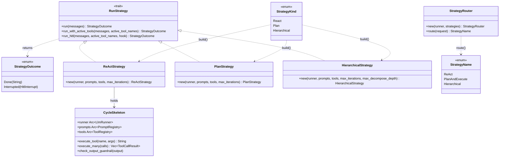

# Strategy

## Purpose

The strategy subsystem is where an assembled `Vec<Message>` becomes either a
final answer or a HITL interrupt. `avs-react` (`ReActStrategy`) and `avs-plan`
(`PlanStrategy`, `HierarchicalStrategy`) each implement one orchestration
algorithm — think-act-observe, plan-then-execute, and
decompose-then-plan-per-subgoal — against the same `RunStrategy` trait
defined in `avs-core`; `avs-router` (`StrategyRouter`) does not implement
`RunStrategy` itself, but instead selects a `StrategyName` for the caller to
build. `avs-strategy` is the umbrella crate: it re-exports all
three implementations and owns `build(StrategyKind, ...)`, the single factory
`avs-agent` uses to construct a strategy. Splitting orchestration out of
`avs-agent` keeps each algorithm independently testable and lets `Agent` treat
"how the model reasons and calls tools" as a pluggable `Arc<dyn RunStrategy>`
rather than a hardcoded loop. Strategy routing is explicit and opt-in:
without `AgentBuilder::with_strategy_router`, the caller-supplied fixed
strategy remains the execution path.

## Position in the System

Per `scripts/check-layering.sh`, `avs-strategy`, `avs-react`, `avs-plan`, and
`avs-router` all sit in the same Layer 3, one below [Agent](agent.md)
(`avs-agent`, Layer 4) and above [Tools](tools.md) and
[Guardrails](guardrails.md) (Layer 2). All four consume [Core Runtime](core-runtime.md)
(`avs-core`, Layer 0) for `RunStrategy`, `LlmRunner`, `PromptRegistry`,
`Message`, and `AgentError`. `avs-react` and `avs-plan` additionally consume
[Tools](tools.md) (`ToolRegistry`, `ActiveToolSet`) to execute tool calls, and
[Guardrails](guardrails.md) (`check_output`/`check_prompt`) to screen model
output and rendered prompts. `avs-router` consumes only `avs-core` and
`agentverse-guardrails` (to screen its own rendered routing prompt) — it does
not depend on `avs-react`/`avs-plan`/`avs-strategy` and holds no reference to
any strategy instance; it produces a `StrategyName`, not a constructed
strategy. [Agent](agent.md) is the sole consumer of `avs-strategy::build()`:
it accepts a fixed `Arc<dyn RunStrategy>` and calls `run`/
`run_with_active_tools`/`run_hitl` on it from `Agent::invoke`/
`invoke_stateless`. When configured through
`AgentBuilder::with_strategy_router`, session-aware `invoke` instead calls
`StrategyRouter::route` and uses `build()` to construct the selected strategy
for that invocation. `invoke_stateless` remains on the fixed strategy.

## Architecture

`RunStrategy` (`avs-core/src/strategy.rs`) is the contract every strategy
implements: `run` is the only required method; `run_with_active_tools` and
`run_hitl` have default bodies that delegate down to `run`, so a minimal
strategy needs only `run`. `StrategyOutcome` is the return type for all three
methods — `Done(String)` for a final answer, `Interrupted(HitlInterrupt)`
when a tool call was intercepted by a `HitlHook` and needs external approval
before the strategy can resume. `ReActStrategy` is a thin wrapper around
`CycleSkeleton`, a struct shared by `avs-react` alone (despite the doc
comment above it describing a "shared cycle skeleton used by all
orchestration strategies," `PlanStrategy` and `HierarchicalStrategy` do not
use `CycleSkeleton` — they call `LlmRunner::invoke` and `ToolRegistry::execute`
directly). `CycleSkeleton` holds the three resources every ReAct iteration
needs (`Arc<LlmRunner>`, `Arc<PromptRegistry>`, `Arc<ToolRegistry>`) plus
`max_iterations`, and exposes helpers (`execute_tool`, `execute_many`,
`build_tools_str_active`, `check_output_guardrail`) that `ReActStrategy::run_with_active_tools`
and `run_hitl` call from their loops. A shared ReAct helper also resolves the
active names through `ToolRegistry::tool_definitions_for` and selects the
appropriate `LlmRunner` entry point. `parse_response` (`avs-react/src/parse.rs`)
turns raw model text into a `CycleAction` (`Continue`, `ToolCall`, `ToolCalls`,
`Done`, `Error`) that the loop matches on. `PlanStrategy` and
`HierarchicalStrategy` share `planner::generate_plan`/`decompose_request`
(`avs-plan/src/planner.rs`), which render a prompt, call `LlmRunner::invoke`,
and parse the JSON response into a `Plan`/`Vec<PlanStep>` — neither strategy
overrides `run_hitl`, so both fall back to the trait's default (see Key
Decisions). `StrategyKind` and `build()` (`avs-strategy/src/lib.rs`) are the
single construction path: `avs-agent` matches no strategy type by name
anywhere else in the workspace. `StrategyRouter` (`avs-router/src/router.rs`)
is a separate, self-contained mechanism: it asks the LLM to pick a
`StrategyName` given a request and a `strategy_description`, but returns only
the name. `avs-agent` owns the non-cyclic conversion to `StrategyKind` and,
when routing is explicitly configured, builds the corresponding runnable
strategy from its existing runner, prompts, and tools for each invocation.

## Runtime Flows

**`RunStrategy` contract, as `Agent::invoke` drives it (see [Agent](agent.md)):**
1. `Agent::invoke`/`invoke_stateless` assemble a `Vec<Message>` (system
   prompt, long-term/session context, user input) and pass it to the
   strategy — the strategy never touches `SessionManager` or memory itself.
2. If a `HitlConfig` is present, `Agent::invoke` wraps a `HitlContext` in
   `Arc<dyn HitlHook>` and calls `strategy.run_hitl(messages, active_tool_names, hook)`;
   otherwise it calls `strategy.run_with_active_tools(messages, active_tool_names)`.
   `invoke_stateless` always calls the plain `strategy.run(messages)`.
3. The strategy returns `Result<StrategyOutcome, AgentError>`. On
   `Ok(StrategyOutcome::Done(text))`, `Agent` persists the turn and returns
   `text`. On `Ok(StrategyOutcome::Interrupted(interrupt))`, `Agent` persists
   `interrupt.history`/`pending_calls` and surfaces the approval instead of a
   final answer — `invoke_stateless` treats `Interrupted` as an error, since
   there is no session to persist the suspended state into.
4. On resume, `Agent` reconstructs the message buffer from the persisted
   `HitlInterrupt.history` and calls `run_hitl` again with the same
   `active_tool_names`. A router-enabled HITL session reconstructs ReAct for
   this continuation; without a router, resume keeps using the supplied fixed
   strategy.

**ReAct loop (`ReActStrategy::run_with_active_tools`, `avs-react/src/react.rs`):**
1. `prepare_buffer_with_active` inserts a one-time ReAct preamble (tool
   descriptions rendered as prose by `CycleSkeleton::build_tools_str_active`,
   plus few-shot examples from `PromptRegistry::get_examples("react_examples")`)
   before the first non-system message, but only if a `react.j2` template is
   registered (`PromptRegistry::has_react_template`).
2. Each iteration resolves `active_tool_names` through
   `ToolRegistry::tool_definitions_for`. A non-empty result is sent through
   `LlmRunner::invoke_with_tools`; an empty result uses `LlmRunner::invoke`,
   preserving `GenerateRequest.tools: None` instead of `Some([])`.
3. The response path remains text-only: `check_output_guardrail` screens the
   content and `parse_response` turns the existing
   `Thought:`/`Action:`/`Action Input:`/`Answer:` format into a `CycleAction`.
4. `CycleAction::Continue` appends the thought and a nudge message telling
   the model to call a tool or answer; if a `Continue` follows another
   `Continue`, the saved thought is returned as the answer (nudge fallback)
   instead of looping forever.
5. `CycleAction::ToolCall`/`ToolCalls` execute one tool (`CycleSkeleton::execute_tool`)
   or many concurrently (`CycleSkeleton::execute_many`) and append the
   result(s) as a `User`-role observation message.
6. `CycleAction::Done` returns `StrategyOutcome::Done(answer)`;
   `CycleAction::Error` (empty model output) returns `AgentError::Model`.
7. The loop errors with `ModelError::Timeout` once `iteration` reaches
   `max_iterations`.

**ReAct loop with HITL (`ReActStrategy::run_hitl`):** uses the same active-tool
request helper and text response parser as the plain loop, but tool dispatch
goes through `ToolRegistry::execute_many_hitl(calls, &hook)`
instead of `execute_tool`/`execute_many`. A history snapshot is taken
*before* the assistant's tool-call message is pushed, so a suspended
`HitlInterrupt.history` never contains a dangling tool call with no
observation. If `execute_many_hitl` returns `Err(HitlInterruptResult)`, the
loop returns `StrategyOutcome::Interrupted` immediately with the snapshot,
the pending calls, and `active_tool_names`, so the exact same tool-call set
can be re-submitted on resume.

**Plan-and-Execute (`PlanStrategy::run_with_active_tools`, `avs-plan/src/plan.rs`):**
1. `planner::generate_plan` renders the `strategies.plan_and_execute` prompt
   template with tool summaries and full conversation text, calls
   `LlmRunner::invoke` once, and parses the JSON response into a `Plan`
   (`Vec<PlanStep>`).
2. Each `PlanStep` executes in order up to `max_iterations`: if it names a
   tool in `active_tool_names`, `execute_tool` runs it; otherwise the step is
   recorded as a reasoning-only line. Steps beyond `max_iterations` are
   dropped, not deferred.
3. A synthesis call (`LlmRunner::invoke`) receives the plan description and
   every step's result and produces the final answer text, which is
   guardrail-checked (`check_output`) and returned as `StrategyOutcome::Done`.

**Hierarchical (`HierarchicalStrategy::run_with_active_tools`, `avs-plan/src/hierarchical.rs`):**
same three-phase shape as Plan-and-Execute, with an extra decomposition
phase first: `planner::decompose_request` renders `strategies.hierarchical.decompose`
and returns a `Vec<String>` of sub-goals (capped at `max_decompose_depth`);
`generate_plan` then runs once per sub-goal, and a single final synthesis
call answers the original request from all sub-goal results.

**StrategyRouter selection (`StrategyRouter::route`, `avs-router/src/router.rs`):**
1. Builds a `strategy_list` string from `strategy_description` for each
   `StrategyName` the router was constructed with.
2. If a `PromptRegistry` was supplied (`with_registry`), renders the
   `router` template with `conversation`/`tools` context and runs it through
   `check_prompt` (prompt-injection screening) before appending an
   instruction to respond with only the strategy name; otherwise falls back
   to a hardcoded prompt string.
3. `LlmRunner::invoke` is called once with that system message plus the
   user's request; the lower-cased, trimmed response is matched against
   `"react"`/`"plan_and_execute"`/`"plan-and-execute"`/`"hierarchical"`.
4. An unrecognized response returns `AgentError::Model(ModelError::InvalidResponse)`
   rather than defaulting to a strategy. A recognized name that is absent from
   the router's configured `available_strategies` returns the same error;
   model output cannot expand that allowlist.
5. `Agent::invoke` converts the result to `StrategyKind` and calls `build()`
   with `DEFAULT_ROUTED_STRATEGY_MAX_ITERATIONS` (10). This happens on every
   routed invocation; the strategy object is not cached across sessions or
   turns. Construction receives a `ToolRegistry` restricted exactly to
   `active_tool_names`, including a truly empty registry for an empty set, and
   the same names continue through `run_with_active_tools`/`run_hitl`.
6. With configured HITL, only routed ReAct is allowed. Plan-and-Execute and
   Hierarchical do not override `run_hitl`, so `Agent` returns
   `RoutedStrategyDoesNotSupportHitl` before executing either one rather than
   silently discarding the interception hook.

## Key Decisions

### Typed `StrategyOutcome`/`HitlInterrupt` transport replaces the base64 error-channel encoding
- **Decision** — `RunStrategy::run`/`run_with_active_tools`/`run_hitl` return
  `Result<StrategyOutcome, AgentError>` (`Done(String) | Interrupted(HitlInterrupt)`)
  instead of `Result<String, AgentError>` with a HITL interrupt smuggled
  through `AgentError::Memory` as a colon-delimited, base64-encoded string.
- **Context** — the prior scheme (`HitlWire`/`HitlWireError`, introduced to
  replace three independent hand-rolled base64 implementations in
  `avs-react`/`avs-agent`) still overloaded the error channel to carry a
  successful-but-suspended result, which is not an error.
- **Alternatives rejected** — keeping `HitlWire` as a shared codec on top of
  the error channel (rejected — still conflates "strategy failed" with
  "strategy is waiting for approval"); PR body records `HitlWire`/
  `HitlWireError` and the `base64` dependency as deleted outright, "fully
  superseded, not left as unused scaffolding."
- **Consequences** — every `RunStrategy` implementor and every caller
  (`Agent::invoke`, `invoke_stateless`, `resume`) matches on `StrategyOutcome`
  directly; new tests were added asserting the `Interrupted` path in both
  `avs-react` and `avs-agent` because the typed-transport work "found a
  design-spec requirement [the implementing] plan had omitted."
- **Ref** — 2026-07-04, PR #26.

### `run_hitl`'s default implementation is a documented security trap, not a safe no-op
- **Decision** — `RunStrategy::run_hitl`'s default body ignores the `HitlHook`
  entirely and delegates to `run_with_active_tools`, with a doc comment
  warning that any strategy which doesn't override it "will execute all tool
  calls without HITL interception, even when the agent has a `HitlConfig`
  configured." `ReActStrategy` is called out as "the reference implementation."
- **Context** — a strategy loop can only intercept tool calls at the point it
  dispatches them; a trait default that silently no-ops is safer to write
  than to review, since a new strategy compiles and passes tests without
  ever wiring the hook in.
- **Alternatives rejected** — making `run_hitl` non-defaulted (would force
  every non-tool-using strategy to implement a method it has no use for);
  panicking in the default (rejected in favor of a compile-time-visible doc
  warning plus fallback behavior, per the current source).
- **Consequences** — `PlanStrategy` and `HierarchicalStrategy` currently rely
  on the default and do not intercept tool calls under HITL — only
  `ReActStrategy` overrides `run_hitl`. No PR or spec records a decision to
  leave Plan/Hierarchical HITL-unaware; it is observed current state.
- **Ref** — 2026-06-12, commit `8c70ae2` (`avs-core/src/strategy.rs`, docstring
  added ahead of PR #26's `StrategyOutcome` change; unchanged since).

### Strategies are pure, stateless `Vec<Message>` → `StrategyOutcome` transformers, with no `Memory` coupling
- **Decision** — no strategy struct (`ReActStrategy`, `PlanStrategy`,
  `HierarchicalStrategy`) holds a memory reference; each is constructed from
  only `Arc<LlmRunner>`, `Arc<PromptRegistry>`, `Arc<ToolRegistry>`, and
  iteration limits, and `RunStrategy::run` takes the fully assembled message
  history as its only input.
- **Context** — the strategy-unification design spec (untracked) called for
  strategies to hold `Arc<Mutex<dyn Memory>>` so multi-step strategies could
  "query memory per-step to augment intermediate prompts." The same-day
  commit `f8a32f5` ("drop dead memory param from all strategies and build()
  factory") went further and removed the memory parameter from every
  strategy constructor and from `avs-strategy::build()` entirely, rather than
  keeping it as an unused `dyn Memory` reference.
- **Alternatives rejected** — the spec's `Arc<Mutex<dyn Memory>>`-per-strategy
  form was not carried into implementation; no PR or spec records why the
  parameter was dropped instead of wired up — it is observed current state.
- **Consequences** — [Agent](agent.md) is the sole owner of memory priming
  (before assembling messages) and storage (after `StrategyOutcome::Done`);
  a strategy cannot query long-term memory mid-loop today, so `PlanStrategy`/
  `HierarchicalStrategy`'s per-step prompts carry only the conversation and
  tool summaries, not retrieved memory.
- **Ref** — 2026-05-25, commit `f8a32f5`.

### `StrategyKind` + `build()` is the single construction path
- **Decision** — `avs-strategy::build(kind: StrategyKind, runner, prompts,
  tools, max_iterations) -> Arc<dyn RunStrategy>` is the only place in the
  workspace that matches on strategy type to construct one; `avs-agent`
  imports `StrategyKind`/`build` and never names `ReActStrategy`/
  `PlanStrategy`/`HierarchicalStrategy` directly.
- **Context** — the unification spec's stated goal for `avs-strategy` was
  that it be "the single dependency `avs-agent` needs for strategy
  selection," owning the factory and re-exporting all strategy types so
  `avs-agent` has no direct dependency on `avs-react`/`avs-plan`.
- **Alternatives rejected** — `avs-agent` constructing `ReActStrategy::new(...)`
  etc. directly per call site (rejected by the spec's goal of a single access
  point; would also put `avs-react`/`avs-plan` in `avs-agent`'s dependency
  graph, one layer closer than `check-layering.sh`'s layer map allows for
  a clean umbrella boundary).
- **Consequences** — adding a fourth strategy means adding a `StrategyKind`
  variant and a `build()` match arm in one place; the current `StrategyKind`
  enum (`React`, `Plan`, `Hierarchical`) has no `Router` variant, unlike the
  spec's four-variant proposal. `StrategyRouter` is not itself something
  `build()` constructs; it selects the kind that `Agent::invoke` asks the
  factory to build when routing is enabled.
- **Ref** — 2026-05-25, commit `f8a32f5` (same commit that simplified `build()`'s
  signature down to its current parameters).

## Implementation Notes

- PR #31 verification follow-ups wire request-side native definitions into
  both ReAct loops (`9b3e717`, `c06a94f`, `75cc734`) and make dynamic routing
  opt-in, allow-listed, tool-scoped, resume-stable, and fail-closed under
  unsupported HITL strategies (`9cbb02f`, `92fbf2a`).
- **ReAct has request-side native tool definitions, not full native tool
  calling.** Its normal and HITL loops send non-empty active registry
  definitions through `LlmRunner::invoke_with_tools`, while empty or
  all-unknown active sets use `invoke` and retain `tools: None`. The existing
  prose schemas from `CycleSkeleton::build_tools_str_active` remain as a text
  fallback, and replies still go through `parse_response`; native tool-call
  response parsing is explicitly deferred. `PlanStrategy` and
  `HierarchicalStrategy` still call `LlmRunner::invoke` and do not send native
  definitions.
- `CycleAction::ToolCalls` (plural) lets one model turn request several
  tools at once; `CycleSkeleton::execute_many` runs them concurrently and the
  observations are joined back into a single `User` message in call order —
  this is the closest the current ReAct loop gets to "parallel tool calling,"
  and it is still driven by parsing multiple `Action:`/`Action Input:` pairs
  out of one text response, not a native tool-call array.
- `parse_response` gives `ToolCall`/`ToolCalls` priority over `Answer:` even
  when both appear in the same response, specifically to avoid returning a
  hallucinated answer that a larger model sometimes emits alongside a
  fabricated `Observation:` line.
- `PlanStrategy`/`HierarchicalStrategy` drop any `PlanStep` whose `id`
  exceeds `max_iterations` silently (`break`, not an error) — a plan with
  more steps than the iteration budget just executes a truncated prefix.
- `avs-router`'s `StrategyRouter` is opt-in through
  `AgentBuilder::with_strategy_router`; no router means the required fixed
  strategy behaves exactly as before. Routed strategies are built per
  session-aware invocation with a max-iteration default of 10. There is no
  dedicated router wiki page; this page and [Agent](agent.md) document the
  composition boundary.

## Source Anchors

- `avs-core/src/strategy.rs`
- `avs-strategy/src/lib.rs`
- `avs-react/src/react.rs`
- `avs-react/src/cycle.rs`
- `avs-react/src/parse.rs`
- `avs-plan/src/plan.rs`
- `avs-plan/src/hierarchical.rs`
- `avs-plan/src/planner.rs`
- `avs-router/src/router.rs`

## Related Pages

- [Core Runtime](core-runtime.md)
- [Agent](agent.md)
- [Tools](tools.md)
- [Guardrails](guardrails.md)
- [HITL](hitl.md)
- [Eval and Test Infra](eval-and-test-infra.md)
- [Skill](skill.md)
- [SubAgent](subagent.md)
