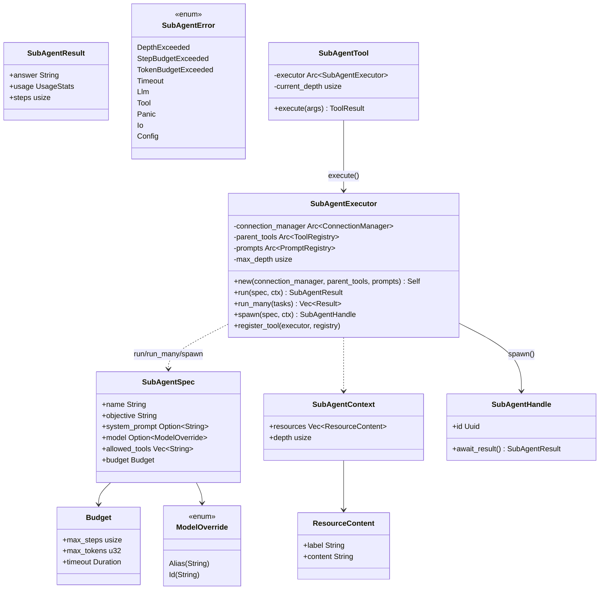

# SubAgent

## Purpose

`avs-subagent` provides `SubAgentExecutor` — a way for an application to run
a temporary, isolated ReAct worker on the side of a parent `Agent`, then feed
its single final answer back in as a tool observation. It exists as a
separate crate because a SubAgent is deliberately *not* an `Agent`: it has no
session, no persisted memory, no independent identity, and cannot itself
spawn further SubAgents. The crate's entire job is enforcing that narrower
contract — context isolation (a SubAgent sees only what the caller explicitly
hands it), permission scoping (a per-spec allow-list carved out of the
parent's tool set), and independent budgets (steps, tokens, wall-clock) — so
that fan-out to cheap, disposable workers doesn't leak state or cost back
into the parent's context or its `RunStrategy`.

## Position in the System

`avs-subagent` consumes [Core Runtime](core-runtime.md) (`avs-core`, for
`ConnectionManager`, `LlmRunner`, `PromptRegistry`, `Message`, `UsageStats`,
`AgentError`), [Tools](tools.md) (`avs-tools`, for `ToolRegistry` and the
`SPAWN_SUBAGENT_TOOL_NAME` constant it registers under), and
[Strategy](strategy.md)'s ReAct building blocks (`avs-react`'s
`CycleSkeleton` and `parse_response`/`CycleAction`) to drive its own inner
loop. It depends on nothing from `avs-skill` or `avs-agent`.

`avs-agent` carries a real, non-dev `Cargo.toml` dependency on
`agentverse-subagent` and exposes a high-level integration point:
`AgentBuilder::with_subagent_executor(Arc<SubAgentExecutor>)`. The application
still constructs the executor alongside the agent, then passes it to the
builder; `build` atomically registers one root-depth `spawn_subagent` tool into
the builder's `ToolRegistry` before constructing `Agent` when that name is
absent. An existing registration wins. The registered `SubAgentTool` owns the
executor `Arc`, so `Agent` does not. The lower-level
`SubAgentExecutor::register_tool` path remains supported when callers manage
registry setup independently, as in `examples/business-report/src/main.rs`.
`scripts/check-layering.sh` places `agentverse-subagent` in Layer 3 (peer to
`agentverse-react`, `agentverse-plan`, `agentverse-router`,
`agentverse-strategy`) and `agentverse-agent` alone in Layer 4, so this
dependency direction is permitted.

## Architecture

`SubAgentSpec` (`spec.rs`) is the immutable description of one run: an
objective, optional system prompt, optional `ModelOverride` (`None` inherits
the parent's model), a `allowed_tools` allow-list, and a `Budget`
(`max_steps`, `max_tokens`, `timeout`). `SubAgentContext` (`context.rs`) is
the caller-supplied input — a flat `Vec<ResourceContent>` of labeled text
blocks plus a `depth` counter; there is no automatic retrieval from the
parent's memory. `SubAgentExecutor` (`executor.rs`) is the engine: it holds
an `Arc<ConnectionManager>`, the parent's `Arc<ToolRegistry>` (scoped down
per call, never mutated), an `Arc<PromptRegistry>`, and a fixed `max_depth`
of `1`. Its three public entry points — `run`, `run_many`, `spawn` — all
funnel through the same private `run_cycle` inner loop. `SubAgentResult`
and `SubAgentError` (`result.rs`) are the outputs: a successful run returns
only `answer` (the text the parent LLM sees), `usage`, and `steps`; budget or
structural violations return a typed `SubAgentError` variant so the caller
can decide whether to retry, degrade, or surface the failure. `SubAgentHandle`
(`handle.rs`) wraps a `tokio::spawn`-ed task with a `oneshot::Receiver` and
its `JoinHandle`; `await_result` consumes it once, and `Drop` aborts the
task if the handle is discarded before that. `SubAgentTool` (`tool.rs`) is
the sole bridge between the `Tool` trait and `SubAgentExecutor` — it is
registered under the constant `SPAWN_SUBAGENT_TOOL_NAME` (`"spawn_subagent"`,
defined in `avs-tools`), deserializes `SubAgentArgs` into a `SubAgentSpec` +
`SubAgentContext`, calls `executor.run`, and returns only the `answer` string
as the `ToolResult` — the parent LLM never sees a SubAgent's intermediate
thoughts or tool calls. `load_skill_subagent_spec` (`skill.rs`) parses an
optional `subagent.yaml` file (name, objective, model, allowed tools, budget)
from a skill directory into a `SubAgentSpec`, independent of `avs-skill`'s
own `Skill`/`SkillRegistry` types.

## Runtime Flows

**`run()` — blocking, single SubAgent:**
1. `SubAgentExecutor::run` checks `ctx.depth >= self.max_depth` and returns
   `SubAgentError::DepthExceeded` if so — a defense-in-depth check, since
   `ToolRegistry::filter_by_names` (step 2) already excludes
   `spawn_subagent` from any scoped registry it builds.
2. `parent_tools.filter_by_names(&spec.allowed_tools)` builds a fresh
   `Arc<ToolRegistry>` containing only the named tools, permanently omitting
   `SPAWN_SUBAGENT_TOOL_NAME` — this is the structural guarantee that a
   SubAgent cannot spawn a sub-SubAgent.
3. The runner is resolved: `spec.model == None` reuses the parent's
   `LlmRunner`/`ConnectionManager`; `Some(ModelOverride)` resolves an alias
   (`"haiku"`/`"sonnet"`/`"opus"`, or an unrecognized string passed through
   as a raw model ID with a `tracing::warn!`) and builds a new
   `ConnectionManager::with_model` before wrapping it in `LlmRunner::new`.
4. `build_initial_messages` constructs a fresh message buffer — an optional
   `System` message from `spec.system_prompt`, then one `User` message
   combining `spec.objective` with each `ctx.resources` entry rendered as a
   labeled block. No parent conversation history is included.
5. `run_cycle` executes inside `tokio::time::timeout(spec.budget.timeout,
   ...)`; a timeout produces `SubAgentError::Timeout`.
6. Inside `run_cycle`, each iteration first checks the accumulated
   `UsageStats` against `budget.max_tokens` (`TokenBudgetExceeded` if over)
   and the step counter against `budget.max_steps`
   (`StepBudgetExceeded` if at the limit) *before* invoking the LLM, then
   calls `skeleton.runner.invoke`, accumulates `response.usage`, and
   dispatches on `parse_response`'s `CycleAction` (`Done` returns
   `SubAgentResult`; `Continue` and `ToolCall`/`ToolCalls` append to the
   buffer and loop; `Error` maps to `SubAgentError::Llm`).

**`run_many()` — concurrent fan-out:**
1. `SubAgentExecutor::run_many` takes `Vec<(SubAgentSpec, SubAgentContext)>`
   and spawns one `run()` call per task into a `tokio::task::JoinSet`.
2. Results are collected as tasks complete — in completion order, not input
   order — and a task panic is converted to `SubAgentError::Panic` rather
   than aborting the remaining tasks. Callers that need to correlate a
   result back to its input must encode an identifier in the spec's `name`
   or `objective`.

**`spawn()` + `await_result()` — background, non-blocking:**
1. `SubAgentExecutor::spawn` creates a `oneshot::channel`, `tokio::spawn`s a
   task that calls `run()` and sends the result down the channel, and
   returns a `SubAgentHandle` immediately (the parent's own loop is not
   blocked).
2. The caller later calls `SubAgentHandle::await_result`, which takes the
   `oneshot::Receiver` and awaits it (unwrapping a dropped sender into
   `SubAgentError::Panic`). If the handle is dropped without ever calling
   `await_result`, `Drop` aborts the underlying `JoinHandle` so the task
   doesn't run to completion unobserved.

**LLM-driven dispatch via `spawn_subagent`:**
1. An application can use the high-level builder path:
   `AgentBuilder::with_subagent_executor(executor)`. During `build`, it calls
   `SubAgentExecutor::register_tool_if_absent`, which atomically inserts into
   the tool map and adds the first search document only when the builder's
   registry does not already contain `SPAWN_SUBAGENT_TOOL_NAME`; the existing
   registration wins. Callers that manage a registry independently can instead
   call the lower-level `register_tool` replacement method directly; both paths
   construct a root-depth `SubAgentTool`.
2. The parent's ReAct loop calls it like any other tool: `Action:
   spawn_subagent` with a `SubAgentArgs` JSON body (`name`, `objective`,
   optional `system_prompt`/`model`/`max_steps`/`max_tokens`/`timeout_secs`,
   `allowed_tools`, `resources`).
3. `SubAgentTool::execute` builds a `SubAgentSpec` (defaulting `max_steps` to
   10, `max_tokens` to 20000, `timeout_secs` to 120 when omitted) and a
   `SubAgentContext` at `self.current_depth`, then calls `executor.run`.
4. On success it logs `tracing::info!` (`name`, `steps`, total tokens) and
   returns `result.answer` as the `ToolResult`; on failure it logs
   `tracing::warn!` and returns a `ToolError::Execution` built from the
   `SubAgentError`'s `Display` text. Either way, the parent LLM's next
   observation is a single string — it never sees the SubAgent's inner
   steps.

## Key Decisions

Newest first.

### Multi-agent examples added: `run_many` pipelines and `spawn_subagent` orchestration
- **Decision** — three new crates (`agentverse-demo-tools`,
  `example-project-feasibility`, `example-business-report`) were added to
  demonstrate the two dispatch styles this crate supports: a programmatic
  `run_many()` fan-out of parallel analyst SubAgents followed by a synthesis
  step, and an LLM-driven `spawn_subagent` orchestration where a skill
  decides when to delegate.
- **Context** — PR #11 shipped the executor and the tool bridge but no
  end-to-end example; this closed that gap.
- **Alternatives rejected** — none recorded; the PR body describes only what
  was added, not alternatives considered.
- **Consequences** — `examples/business-report/src/main.rs` is the reference
  pattern for wiring `SubAgentExecutor` alongside (not inside) an `Agent`:
  domain tools go to the executor's `parent_tools`, only `spawn_subagent`
  goes to the agent's own registry via `register_tool`.
- **Ref** — 2026-06-11 (merge), PR #13.

### Fifteen code-review findings addressed post-merge
- **Decision** — following an `ultra`-level review of PR #11, PR #12 fixed
  15 findings in the same crate: added `#[serde(default)]` on
  `SubAgentArgs::resources` (its absence previously caused a deserialization
  error), made `SubAgentHandle` store its `JoinHandle` and abort it on
  `Drop` to prevent task leaks, replaced a TOCTOU `exists()` +
  `read_to_string` pattern in `load_skill_subagent_spec` with a direct read
  matched on `ErrorKind::NotFound`, added `SubAgentError::Io` and
  `SubAgentError::Config` variants (previously misused as `Panic`), extracted
  the `SPAWN_SUBAGENT_TOOL_NAME` constant into `avs-tools` for use in both
  `registry.rs` and `tool.rs`, added a `tracing::warn!` for unknown model
  aliases, and made the float-seconds `duration_secs` deserializer accept
  both integer and float JSON numbers.
- **Context** — the review found these as concrete defects in the initial
  implementation, not architectural disagreements.
- **Alternatives rejected** — none — these are bug fixes and hardening, not
  design choices with rejected alternatives.
- **Consequences** — the code as it exists in `avs-subagent/src/` today
  already reflects all fifteen fixes; there is no remaining pre-PR-#12
  behavior to describe.
- **Ref** — 2026-06-11, PR #12.

### SubAgent runtime remains independent with builder and direct integration paths
- **Decision** — SubAgent execution is a new, independent crate
  (`avs-subagent`) providing `SubAgentExecutor`. Applications can pass an
  already-built executor to `AgentBuilder::with_subagent_executor`, which
  atomically registers the tool bridge before it constructs `Agent` when no
  bridge is already present, or call `SubAgentExecutor::register_tool` directly
  for lower-level replacement setup. At the builder boundary, the first
  registration wins even when builders share a registry concurrently.
  Isolation is enforced by giving each run a scoped `ToolRegistry`
  (`filter_by_names`, which always excludes `spawn_subagent`) and a fresh
  message buffer built from `spec.objective` + `ctx.resources`, with no access
  to the parent's session or memory. Budgets (`max_steps`, `max_tokens`,
  `timeout`) are enforced every iteration before the next LLM call.
- **Context** — the subagent-runtime design spec (untracked) frames this as
  adding "temporary, task-specialized workers" without introducing
  multi-agent coordination, modeled on "Claude Code's proven subagent model
  (2026): communication is pure request-response through a tool result,
  context isolation is enforced at the infrastructure layer not by
  prompting, and intermediate observability uses tracing not an event bus."
- **Alternatives rejected** — the spec explicitly rejects
  `ContextPolicy::Inherited` (parent history auto-visible to the SubAgent) as
  contradicting the isolation goal, and defers `ContextPolicy::Relevant`
  auto-retrieval, typed result variants, cross-SubAgent aggregation
  strategies, and depth > 1 nesting to a v2 that had not shipped as of this
  page.
- **Consequences** — the builder owns the integration timing but does not
  retain the executor: the registered tool owns its `Arc`. Direct registration
  remains available, and the depth limit is enforced twice — structurally
  (SubAgentTool is never in a scoped registry) and defensively
  (`ctx.depth >= max_depth` check in `run`) — so a bug in either mechanism
  alone cannot enable recursive spawning.
- **Ref** — 2026-06-11, PR #11; 2026-07-16, Task 14.

## Implementation Notes

- `max_depth` is fixed at `1` inside `SubAgentExecutor::new` — there is no
  constructor parameter or builder method to change it. Nesting beyond one
  level is a v2, not-yet-implemented capability per the subagent-runtime
  design spec (untracked); currently the only way to reach `DepthExceeded`
  is by constructing a `SubAgentContext` with `depth >= 1` directly, since
  `SubAgentTool::new` is always registered at `current_depth = 0` by
  `register_tool` and the tool itself is never present in the scoped
  registry a SubAgent runs with.
- `run_cycle`'s message buffer uses `buf.clone()` on every iteration before
  calling `skeleton.runner.invoke`; this is `O(n)` in conversation length,
  documented in the source as acceptable for realistic budgets
  (`max_steps` in the tens) and flagged as future work if budgets grow much
  larger.
- `CycleAction::ToolCalls` (parallel tool calls in one step) soft-degrades
  individual tool errors into observation text rather than aborting the
  step, while `CycleAction::ToolCall` (a single call) aborts the whole cycle
  on error — an intentional asymmetry: a batch of parallel calls shouldn't
  fail entirely because one tool in the batch errored.
- `run_many`'s results are in completion order, not input order — callers
  needing to correlate a result to its originating spec must encode an
  identifier into `SubAgentSpec.name` or `.objective` themselves; there is no
  paired-result type.
- `ModelOverride::Alias` resolution (`resolve_model_name`) only recognizes
  `"haiku"`, `"sonnet"`, and `"opus"`; any other string is treated as a raw
  model ID and passed through with a `tracing::warn!`, not rejected.
- `load_skill_subagent_spec` reads `subagent.yaml` directly from a skill
  directory path — it does not go through `avs-skill`'s `SkillRegistry` or
  `Skill` type at all, so a SubAgent template's model/budget/tool-list
  config lives in a file format entirely separate from SKILL.md's own
  `agentverse:` frontmatter block.

## Source Anchors

- `avs-subagent/src/lib.rs`
- `avs-subagent/src/executor.rs`
- `avs-subagent/src/spec.rs`
- `avs-subagent/src/context.rs`
- `avs-subagent/src/result.rs`
- `avs-subagent/src/handle.rs`
- `avs-subagent/src/tool.rs`
- `avs-subagent/src/skill.rs`
- `avs-subagent/` (crate)

## Related Pages

- [Core Runtime](core-runtime.md)
- [Tools](tools.md)
- [Strategy](strategy.md)
- [Agent](agent.md)
- [Skill](skill.md)
