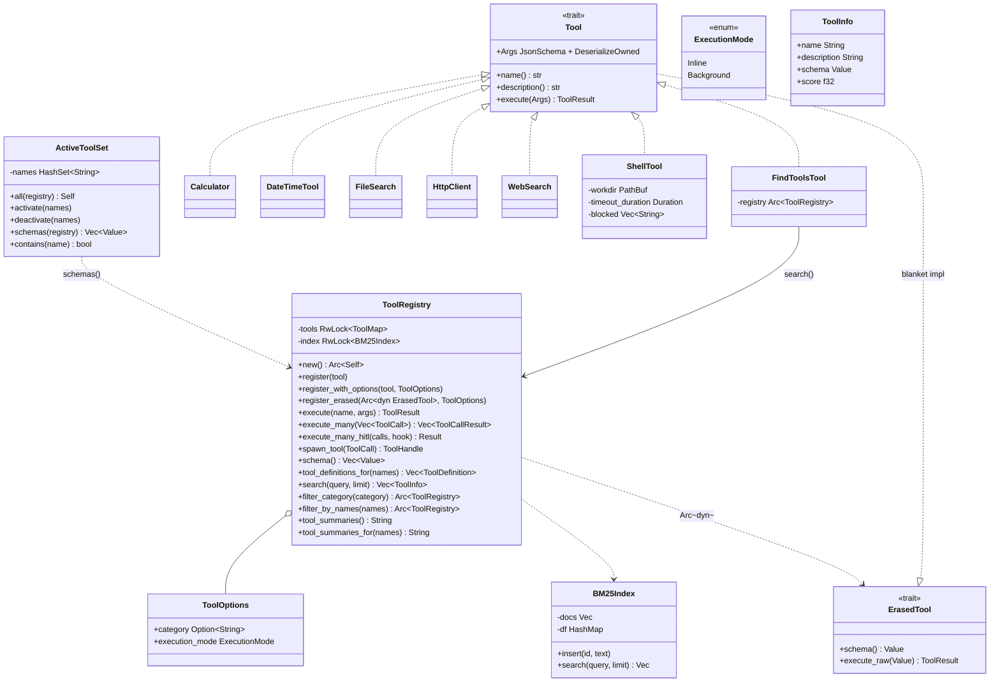

# Tools

## Purpose

`avs-tools` (crate `agentverse-tools`) is where every capability an agent can
invoke — arithmetic, wall-clock time, filesystem globbing, HTTP calls, web
search, shell execution, and meta-discovery over the tool set itself — is
implemented and exposed through one registry. It turns `avs-core`'s
`Tool`/`ErasedTool` trait pair into a concrete runtime: `ToolRegistry` is the
single place a `Tool` implementation becomes callable by name and describable
to an LLM as a JSON schema or native `ToolDefinition`, with async dispatch
(single and parallel), BM25
keyword search for on-demand discovery via `FindToolsTool`, per-invocation
schema filtering via `ActiveToolSet`, and (with `avs-hitl`) approval
interception before a risky call executes. It sits in Layer 2 alongside
`avs-guardrails` and `avs-mcp`, so every reasoning strategy above it shares
one tool-calling contract regardless of which loop drives it.

## Position in the System

`avs-tools` consumes [Core Runtime](core-runtime.md) (`avs-core`) for the
`Tool`/`ErasedTool` trait pair, `ToolError`/`ToolResult`,
`ToolCall`/`ToolCallResult`/`ToolHandle`, and the `metrics` facade it records
tool-call outcomes through, and [HITL](hitl.md) (`avs-hitl`, via
`agentverse::hitl::HitlHook`) for the approval hook `execute_many_hitl` checks
before dispatch. It depends on nothing else in the workspace.

It is consumed by: [Strategy](strategy.md) (`avs-react`'s `CycleSkeleton`/
`ReActStrategy` and `avs-plan` hold an `Arc<ToolRegistry>` and construct an
`ActiveToolSet` per invocation to scope which schemas reach the prompt);
[SubAgent](subagent.md) (`SubAgentExecutor` calls `ToolRegistry::filter_by_names`
to build a scoped registry per run, and registers `SubAgentTool` under the
`SPAWN_SUBAGENT_TOOL_NAME` constant this crate defines); [MCP](mcp.md)
(`avs-mcp`'s `McpToolAdapter` implements `ErasedTool` directly and registers
via `register_erased`, and `McpServer` serves a registry's `schema()`/
`execute()` back out over the MCP protocol); and [Agent](agent.md)
(`avs-agent`, the top-level holder of the `Arc<ToolRegistry>` built at
`AgentBuilder` time). [Skill](skill.md) documents the other half of
`ActiveToolSet`'s story — how a `Skill`'s `tools: Vec<String>` field becomes
the `active_tool_names` slice `avs-agent`'s `invoke` passes into
`RunStrategy::run_with_active_tools`; this page covers only the type itself
and how it filters `schema()`.

## Architecture

`Tool` (`avs-core/src/tool.rs`) is the trait every built-in tool implements:
an associated `Args` type (`JsonSchema + DeserializeOwned`), and `execute`
taking the already-typed `Args`. Because a trait with an associated type
isn't object-safe, `ErasedTool` is the sealed, object-safe shadow the registry
actually stores — a blanket `impl<T: Tool> ErasedTool for T` derives `schema()`
from `T::Args` via `schemars::gen::SchemaGenerator` and implements
`execute_raw` by deserializing the incoming `Value` into `T::Args` (returning
`ToolError::InvalidArgs` on failure) before calling `Tool::execute`. Tool
authors never implement `ErasedTool` directly.

`ToolRegistry` (`registry.rs`) owns a `RwLock<HashMap<String, (Arc<dyn
ErasedTool>, ToolOptions)>>` plus a `RwLock<BM25Index>` kept in sync on every
insert. `ToolRegistry::new()` returns an `Arc<Self>` with `FindToolsTool`
already registered against that same `Arc`, so `find_tools` is present in
every registry without caller action. `register`/`register_with_options`
accept any `T: Tool`, erase it, and index `"{name} {description}"` into the
BM25 index; `register_erased` takes a pre-erased `Arc<dyn ErasedTool>` for
non-`Tool` implementors such as `avs-mcp`'s `McpToolAdapter`. `ToolOptions`
carries an optional `category` string (consumed only by `filter_category`)
and an `ExecutionMode` (`Inline` or `Background`) attached at registration
time, not on the tool implementation — the same tool type can be registered
inline in one registry and background in another. `execute` looks up one
tool and calls `execute_raw`; `execute_many` fans a `Vec<ToolCall>` out over
a `tokio::task::JoinSet` and collects `ToolCallResult`s in completion order;
`execute_many_hitl` layers a `HitlHook::check_tool` pre-check in front of
`execute_many` (see [HITL](hitl.md)) and returns `Err(HitlInterruptResult)`
before executing anything if any call in the batch needs approval.
`filter_category` and `filter_by_names` both build a fresh `ToolRegistry`
sharing the same `Arc<dyn ErasedTool>` instances — `filter_by_names`
additionally always excludes `SPAWN_SUBAGENT_TOOL_NAME`, which is how
`avs-subagent` guarantees a SubAgent can never spawn a nested SubAgent.
`tool_definitions_for(names)` walks the requested names in caller-provided
order, ignores unknown names, and structurally maps each selected
`ErasedTool::schema()` object's `name`, `description`, and `input_schema` into
an `avs-core` `ToolDefinition`. ReAct's normal and HITL request paths pass
these definitions to `LlmRunner::invoke_with_tools` when at least one active
name resolves. `tool_summaries_for` remains available to text-only callers,
and ReAct retains its existing `build_tools_str_active` prose fallback and
text response parser; native tool-call response parsing is deferred.

`ActiveToolSet` (`active.rs`) is a plain `HashSet<String>` wrapper independent
of `ToolRegistry`'s own storage: `schemas(&registry)` calls
`registry.schema()` (every registered tool's schema) and filters it down to
names in the set. `ToolRegistry::execute`/`execute_many` do not consult
`ActiveToolSet` at all — it only controls what the LLM *sees* in its next
prompt, not what it is allowed to call.

`BM25Index` (`search.rs`) is a from-scratch BM25 implementation (`k1=1.5`,
`b=0.75`) over tokenized `"{name} {description}"` text, with no external
search dependency. `FindToolsTool` (`find_tools.rs`) wraps `registry.search`
behind the `Tool` trait so the LLM can call it like any other tool; it takes
`{query, limit}` (`limit` defaulting to 5) and returns each hit as a
`ToolInfo` (`name`, `description`, `score`).

`ShellTool` (`shell.rs`) runs commands via `sh -c` inside a fixed `workdir`
under a `tokio::process::Command`, wrapped in `tokio::time::timeout` with
`kill_on_drop(true)`, after splitting the command with `shell_words::split`
to reject an empty command and check the first token against a
caller-supplied `blocked` list. The other five built-ins —
`Calculator` (`calculator.rs`), `DateTimeTool` (`datetime.rs`), `FileSearch`
(`file_search.rs`, glob-based), `HttpClient` (`http_client.rs`, scheme-checked
async reqwest), and `WebSearch` (`web_search.rs`, DuckDuckGo HTML scrape plus
page-text fetch via `scraper`) — are each a single `struct` plus a
`#[derive(Deserialize, JsonSchema)] Args` struct, no shared base type beyond
`Tool` itself.

## Runtime Flows

**Typed `Tool<Args>` → `ErasedTool` dispatch:**
1. A tool author implements `Tool` for their struct with a
   `#[derive(Deserialize, JsonSchema)]` `Args` type; the blanket `ErasedTool`
   impl gives it `schema()` and `execute_raw()` for free.
2. `ToolRegistry::register` erases the tool into `Arc<dyn ErasedTool>`,
   inserts it into the map keyed by `name()` alongside a `ToolOptions`, and
   indexes `"{name} {description}"` into the `BM25Index`.
3. `ToolRegistry::execute(name, args)` clones the `Arc`, calls
   `execute_raw(args)` (which deserializes `args` into the concrete `Args`
   type and calls `Tool::execute`), and records the outcome via
   `agentverse::metrics::record_tool_call`. `execute_many` does the same for
   a batch, dispatched concurrently through a `JoinSet` rather than routing
   through `execute` at all.

**`ActiveToolSet` filtering per invocation:**
1. A strategy builds an `ActiveToolSet` fresh for each call —
   `ActiveToolSet::all(&registry)` for the full set, or `default()` plus
   `activate(&active_tool_names)` for a name-restricted set (this is how
   `avs-react`'s `run_with_active_tools` turns the `Vec<String>` `avs-agent`
   passes in — ultimately a skill's `tools` field, see [Skill](skill.md) —
   into a schema filter).
2. `ActiveToolSet::schemas(&registry)` computes the registry's full
   `schema()` list and filters it to names present in the set; only those
   schemas are rendered into the text prompt. ReAct also calls
   `tool_definitions_for(active_tool_names)` for the provider request.
3. When at least one requested name resolves, ReAct sends the definitions via
   `LlmRunner::invoke_with_tools`. An empty or all-unknown set uses
   `LlmRunner::invoke`, so `GenerateRequest.tools` remains `None`.
4. This is a prompt-shaping filter only: `ToolRegistry::execute`/
   `execute_many` accept any registered tool name regardless of whether it is
   in the caller's `ActiveToolSet`. Restricting what the LLM can actually
   *do* — as opposed to what it is shown — is `filter_by_names`'s job
   (building a smaller registry), not `ActiveToolSet`'s.

**`find_tools` progressive discovery:**
1. `ToolRegistry::new()` registers `FindToolsTool` against the registry it
   returns, before any caller-supplied tool — every registry has `find_tools`
   from construction.
2. The LLM calls `find_tools` with `{query, limit}`; `FindToolsTool::execute`
   calls `registry.search(query, limit)`, which delegates to
   `BM25Index::search` over the name+description text indexed at each
   `register` call.
3. Results come back as `ToolInfo` (`name`, `description`, `score`) in the
   tool's `ToolResult` — the LLM reads them from its next observation and can
   call a newly-learned tool name by name in a subsequent turn.
   `find_tools`'s results do not automatically add anything to the caller's
   `ActiveToolSet`; execution succeeds regardless, since `execute` never
   consults it.

## Key Decisions

Newest first.

### `ToolRegistry` instrumented at three sites, not one, after discovering `execute_many` bypasses `execute`
- **Decision** — `ToolRegistry::execute`, `execute_many`, and the HITL
  interception path in `execute_many_hitl` are each instrumented separately
  with `agentverse::metrics::record_tool_call`, recording `"<unknown>"`
  rather than the raw name for not-found calls.
- **Context** — while instrumenting the three stable crate boundaries
  (LLM connection, tool registry, HITL queues), the PR discovered that
  `execute_many` "does **not** funnel through `execute`" — missing this
  "would have silently under-counted every agent-driven tool call, since
  `avs-agent` only calls the `_many` variants."
- **Alternatives rejected** — recording the raw, potentially
  LLM-hallucinated tool name on not-found paths was identified as "an
  unbounded-cardinality violation of the facade's own rule" during a
  whole-branch review and fixed before merge, not shipped and revisited.
- **Consequences** — `agentverse.tool.calls` and `agentverse.tool.duration`
  carry a bounded `tool.name` label set and an `outcome` label including
  `hitl_intercepted`; a tool-call metric now exists regardless of which
  dispatch path (`execute`, `execute_many`, or the HITL-checked variant) an
  agent-driving strategy uses.
- **Ref** — 2026-07-04, PR #25.

### `find_tools` excluded from `McpServer`'s `tools/list`
- **Decision** — `avs-mcp`'s `McpServer` filters `find_tools` out of its
  `tools/list` response even though `ToolRegistry::new()` auto-registers it.
- **Context** — `find_tools` searches the *local* registry; before this fix,
  an MCP client connecting to an AgentVerse-backed `McpServer` would discover
  3 tools when the operator had only registered 2, because `find_tools`
  "is meaningless to an MCP client and should never cross the MCP boundary."
- **Alternatives rejected** — none recorded; the PR body states the fix
  directly rather than weighing alternatives (e.g. not auto-registering
  `find_tools` for MCP-exposed registries).
- **Consequences** — a `ToolRegistry`'s tool count as seen by a local LLM
  (which does see `find_tools`) and as seen by a remote MCP client (which
  does not) legitimately differ by exactly one; no other filtering is
  applied to the MCP-exposed tool list.
- **Ref** — 2026-06-02, PR #6.

### BM25 keyword search behind a semantic-search-shaped interface
- **Decision** — tool discovery is BM25 keyword search implemented from
  scratch in `avs-tools`, exposed as `ToolRegistry::search(query, limit) ->
  Vec<ToolInfo>` and wrapped in the `FindToolsTool` meta-tool, which
  `ToolRegistry::new()` registers automatically.
- **Context** — the tools-architecture-refactor design spec (untracked)
  frames this as solving "no dynamic tool discovery" as the tool count
  grows, so the agent isn't forced to receive every tool schema at session
  start.
- **Alternatives rejected** — the spec does not implement embedding-based
  search now, but states the interface is "intentionally identical to what
  a semantic/embedding-backed search would expose — the implementation can
  be swapped without changing callers," i.e. a deliberate placeholder rather
  than a considered-and-rejected alternative.
- **Consequences** — `BM25Index` indexes only `"{name} {description}"` text
  at registration time (no re-indexing hook), and callers depending on
  `ToolInfo.score` ordering are coupled to BM25's ranking today even though
  the function signature would tolerate a different ranking method later.
- **Ref** — 2026-05-27, PR #5.

### `Tool<Args>` associated-type trait + `ErasedTool` shim replaces `AsyncTool`
- **Decision** — the single `AsyncTool` trait (hand-written `parameters()`
  returning `serde_json::Value`) was replaced by `Tool` with an associated
  `Args: JsonSchema + DeserializeOwned` type, schemas derived automatically
  via `schemars`, plus a sealed `ErasedTool` trait (blanket-implemented for
  any `T: Tool`) to keep the registry's storage object-safe.
- **Context** — the tools-architecture-refactor design spec (untracked)
  states the prior approach was "verbose, error-prone, and disconnected from
  the tool's actual argument parsing," since every tool hand-built its JSON
  schema.
- **Alternatives rejected** — the spec explicitly rules out reintroducing a
  separate sync-tool trait or adapter: "The framework remains async-only...
  No `SyncTool` trait, no `SyncToolAdapter`," citing Rig (described in the
  spec as "the leading Rust agent framework") as taking the same approach.
- **Consequences** — every built-in tool now pairs a `#[derive(Deserialize,
  JsonSchema)]` `Args` struct with its `Tool` impl instead of a manual
  `parameters()` method; malformed LLM-supplied arguments surface as the new
  `ToolError::InvalidArgs` variant from inside the blanket `execute_raw`
  rather than an ad hoc extraction error per tool.
- **Ref** — 2026-05-27, PR #5.

### `ShellTool`'s sandbox is a working-directory jail plus a blocklist, not a filesystem sandbox
- **Decision** — `ShellTool` enforces exactly three things: commands start in
  a configured `workdir`, a per-call timeout, and a caller-supplied
  `blocked` binary-name list. It does not prevent a command from leaving
  `workdir` once running.
- **Context** — an early revision's doc comment overstated this as a
  "sandboxed shell tool" with a "workdir jail"; a follow-up commit corrected
  the docs to state plainly that `workdir` "is NOT a filesystem sandbox —
  absolute paths, symlinks, and `cd` commands inside the shell can still
  access the full filesystem," recommending pairing with OS-level isolation
  for stronger guarantees.
- **Alternatives rejected** — no rationale is recorded for not implementing
  a real filesystem/kernel sandbox (e.g. containers, seccomp, chroot) at this
  layer; the commit's scope was correcting the documentation and adding
  `kill_on_drop(true)`, not redesigning enforcement.
- **Consequences** — `ShellTool` is suitable only for trusted-model,
  dev-tool-style deployments per its own doc comment; any operator relying on
  `workdir` alone as an escape-proof boundary is relying on behavior the tool
  explicitly disclaims.
- **Ref** — 2026-05-18, commit `199407d`.

## Implementation Notes

- `ToolRegistry` uses `std::sync::RwLock`, not `tokio::sync::RwLock` — every
  lock acquisition (`self.tools.read().unwrap()`, etc.) is synchronous and
  held only across a `HashMap` operation or an `Arc` clone, never across an
  `.await`.
- `filter_category` has no call site outside `avs-tools/tests/` — examples
  pass a `category` into `ToolOptions`, but nothing in `avs-agent`,
  `avs-react`, or `avs-plan` calls `filter_category` to act on it.
  `filter_by_names` (used by `avs-subagent`) is the filtering path actually
  exercised in production code.
- `ExecutionMode::Background` and `ToolRegistry::spawn_tool`/`ToolHandle`
  exist as a defined-but-unused fire-and-forget interface — the tools
  design spec (untracked) describes this as "defined now, implemented
  later"; no strategy in the workspace currently dispatches through
  `spawn_tool` or checks `ExecutionMode` before calling `execute`/
  `execute_many`.
- `tool_summaries`/`tool_summaries_for` build a required-args hint string by
  reading `schema()["input_schema"]["properties"]`/`["required"]` directly
  rather than through a typed schema model — this is the format
  `avs-react`'s non-templated prompt path renders into the system prompt
  when no `react` Jinja template is configured.
## Source Anchors

- `avs-tools/src/lib.rs`
- `avs-tools/src/registry.rs`
- `avs-tools/src/active.rs`
- `avs-tools/src/search.rs`
- `avs-tools/src/find_tools.rs`
- `avs-tools/src/shell.rs`
- `avs-tools/src/calculator.rs`
- `avs-tools/src/datetime.rs`
- `avs-tools/src/file_search.rs`
- `avs-tools/src/http_client.rs`
- `avs-tools/src/web_search.rs`
- `avs-core/src/tool.rs`
- `avs-tools/` (crate)

## Related Pages

- [Core Runtime](core-runtime.md)
- [HITL](hitl.md)
- [Strategy](strategy.md)
- [SubAgent](subagent.md)
- [MCP](mcp.md)
- [Skill](skill.md)
- [Agent](agent.md)
- [Observability](observability.md)
